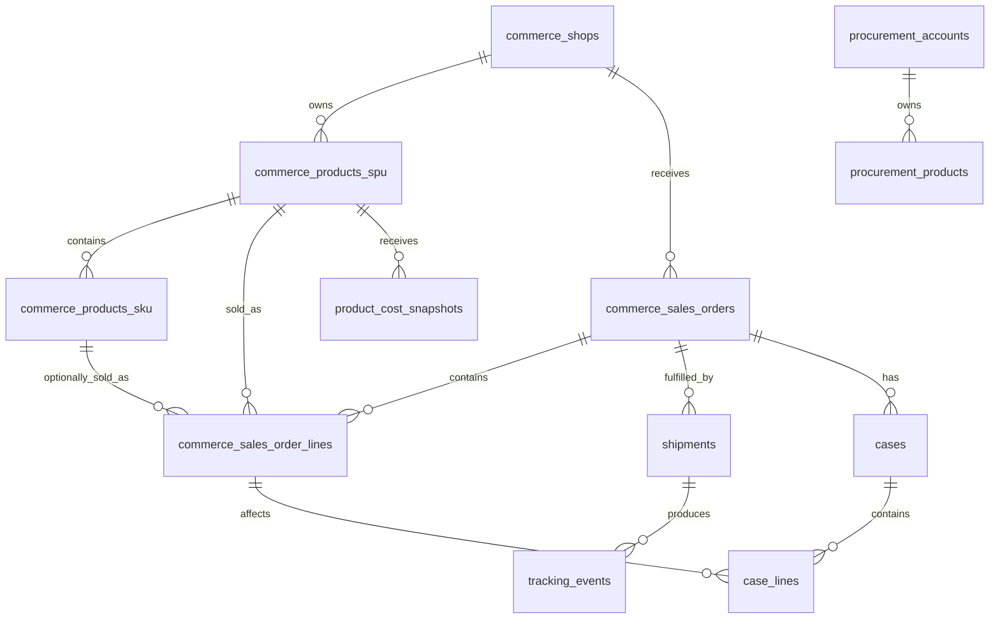

# TikTok Shop 销售与妙手采购数据模型重构方案

版本：V3  
状态：领域模型方案（**已落地并持续收敛**；2026-09-30 migration 0044 删除未接通的 linkage 层）
系统定位：TikTok Shop 销售数据与妙手采购数据的整合分析系统

## 1. 系统定位

本系统不是完整 ERP，也不拥有独立的商品、采购或库存主数据。

系统的职责是：

- 同步 TikTok Shop 的商品、订单、物流、售后和财务数据；
- 同步妙手的采购商品、采购订单和采购成本数据；
- 通过双方已同步主档中的同一 TikTok SPU 外部 ID 连接销售与采购商品；
- 以 TikTok 商品为连接点分析销售、采购、成本和利润；
- 为经营报表提供稳定、可解释的数据口径。

## 2. 数据所有权

| 数据事实 | 权威来源 |
| --- | --- |
| TikTok 店铺 | TikTok Shop |
| TikTok 商品/SPU与SKU | TikTok Shop |
| TikTok 订单与订单行 | TikTok Shop |
| TikTok 物流、退货、取消、结算 | TikTok Shop |
| 妙手采购商品与规格 | 妙手 |
| 妙手采购订单与采购行 | 妙手 |
| 采购商品与 TikTok 商品的关系 | 同步主档中的 TikTok SPU 外部 ID |
| 成本、利润和经营指标 | 本系统派生 |

核心原则：

> TikTok Shop 是销售业务主干；妙手是采购事实来源，并提供采购商品与 TikTok 商品之间的桥梁。

妙手不负责 TikTok 订单与采购订单之间的关联，因此系统不能建立这样的来源事实。

## 3. 业务主链

真实数据关系是：

```text
妙手采购订单
  └─ 妙手采购行
      └─ 妙手采购商品（external_product_id = TikTok spu_id）
          └─ TikTok 商品/SPU
              ├─ TikTok SKU
              └─ TikTok 订单行
                  ├─ 物流
                  ├─ 售后
                  └─ 财务结算
```

注意：

- TikTok 订单行和 TikTok 商品的关系来自 TikTok Shop。
- 妙手采购行和妙手采购商品的关系来自妙手。
- 妙手采购商品和 TikTok 商品通过已同步的 TikTok SPU 外部 ID 直接匹配。
- 采购订单与销售订单之间不存在直接事实关系。
- 销售成本只能根据商品关系和成本方法推导，不能表述为精确采购批次归因。

## 4. 数据分层

### 4.1 原始接入层

Schema：

```text
integration
```

建议表：

```text
credentials
raw_records
sync_jobs
sync_cursors
sync_issues
```

职责：

- 保存 TikTok 和妙手原始 JSON；
- 支持重复同步、乱序数据和重新解析；
- 管理同步游标、分页状态和运行日志；
- 原始表允许暂时没有业务外键。

### 4.2 规范化事实层

Schema：

```text
commerce
procurement
fulfillment
after_sales
finance
```

职责：

- 将来源数据转为结构化关系模型；
- 每张表仍保留外部平台 ID；
- 核心关系使用数据库外键；
- 来源原始状态和标准状态同时保留。

### 4.3 商品关联规则

不再维护独立 schema。采购侧 `procurement_products.external_product_id` 保存 TikTok
`spu_id` 时，直接与 `commerce.products_spu.spu_id` 匹配。妙手搬家任务只作为
`integration.raw_records` 原始审计，不再生成第二套关联状态。

### 4.4 分析层

Schema：

```text
reporting
```

职责：

- 生成采购成本快照；
- 聚合商品销量和采购数据；
- 计算估算成本和利润；
- 保存计算方法和版本；
- 所有结果均可由事实表重建。

---

# 5. 销售域模型

> **2026-09-05 rename (ADR-0003 §2.6 + D1)**：本章字段名按 ADR-0003 拍板的
> 「一个词一个意思」基准线给出（live DB 已应用，migration 0007）：
>
> - 指向某张表**主键**的外键列 = `<业务名>_pk`（如 `shop_pk` 里装的就是 `commerce.shops.id`
>   的 314 这类内部号）；上游平台给的**业务文本 id** = `<业务名>_id`
>   （`shop_id` / `order_id` / `spu_id` / `sku_id` = TikTok 的 19 位文本串）；
> - 涉及范围 = commerce 域 5 张表（§5.1-§5.5） + 跨 8 个模型文件的 FK 列；
> - `source_*` 时间列在 sales_orders 上**仅本表**做了语义改名（`source_created_at → order_time`、
>   `source_updated_at → order_modify_time`，即 D1）；
>   products_spu / products_sku 等保留 `source_created_at` / `source_updated_at`
>   （与 ADR-0001 时间列约定保持一致）；
> - procurement / miaoshou / credentials 同名词保留 `external_account_id` /
>   `external_product_id` / `external_variant_id`（见 §6 / §4.1）—— ADR-0003 范围仅限 commerce；
> - DB 对象名（约束 / 索引）保持原名（`uq_channel_accounts_platform_ext` 等历史约束名不变）。

## 5.1 `commerce.shops`

表示 TikTok Shop 店铺账户。

```text
id bigint PK
platform text
shop_id text                       -- 2026-09-05 前 = external_account_id
account_name text
region text
seller_type text
status text
credential_id bigint FK
source_updated_at timestamptz
synced_at timestamptz
updated_at timestamptz             -- 触发器自动更新（fn_touch_updated_at）
```

约束：

```text
UNIQUE (platform, shop_id)
```

OAuth Token 不应存放在店铺表中，而应属于 `integration.credentials`（经 `credential_id` 关联）。

## 5.2 `commerce.products_spu`

表示 TikTok Shop 商品/SPU。

这不是系统内部商品主数据，而是 TikTok 商品的规范化副本。

```text
id bigint PK
shop_pk bigint FK                  -- 2026-09-05 前 = channel_account_id
spu_id text                        -- 2026-09-05 前 = external_product_id
title text
category_id text
status text
main_image_url text
source_created_at timestamptz     -- 时间列语义保持 ADR-0001 约定
source_updated_at timestamptz
raw_record_id bigint
synced_at timestamptz
updated_at timestamptz
```

约束：

```text
UNIQUE (shop_pk, spu_id)
```

## 5.3 `commerce.products_sku`

表示 TikTok SKU。

```text
id bigint PK
spu_pk bigint FK                   -- 2026-09-05 前 = channel_product_id
sku_id text                        -- 2026-09-05 前 = external_variant_id
seller_sku text
variant_name text
attributes jsonb
image_url text
status text
source_updated_at timestamptz
raw_record_id bigint
synced_at timestamptz
updated_at timestamptz
```

约束：

```text
UNIQUE (spu_pk, sku_id)
```

## 5.4 `commerce.sales_orders`

```text
id bigint PK
shop_pk bigint FK                  -- 2026-09-05 前 = channel_account_id
order_id text                      -- 2026-09-05 前 = external_order_id
status text
currency text
payment_amount numeric(20,4)
total_amount numeric(20,4)
fulfillment_type text
order_time timestamptz             -- D1：2026-09-05 前 = source_created_at
order_modify_time timestamptz      -- D1：2026-09-05 前 = source_updated_at
paid_at timestamptz
shipped_at timestamptz
delivered_at timestamptz
cancelled_at timestamptz
raw_record_id bigint
synced_at timestamptz
updated_at timestamptz
```

约束：

```text
UNIQUE (shop_pk, order_id)
```

## 5.5 `commerce.sales_order_lines`

```text
id bigint PK
order_pk bigint FK                  -- 2026-09-05 前 = sales_order_id
external_line_id text               -- 订单行外键仍用 external_* 前缀（行是订单来源实体的一部分）
spu_pk bigint FK NULL              -- 2026-09-05 前 = channel_product_id
sku_pk bigint FK NULL              -- 2026-09-05 前 = channel_product_variant_id
external_product_id_snapshot text
external_variant_id_snapshot text
product_name_snapshot text
variant_name_snapshot text
image_url_snapshot text
quantity numeric(20,4)
unit_price numeric(20,4)
currency text
line_status text
raw_record_id bigint
synced_at timestamptz
updated_at timestamptz
```

约束：

```text
UNIQUE (order_pk, external_line_id)
```

订单行同时关联 TikTok 商品和 SKU。

如果同步订单时商品尚未同步完成，允许正式外键暂时为空，但必须保留外部 ID，并写入 `integration.sync_issues`。后续通过精确外部 ID 补齐，不允许通过标题自动绑定。

> **API 层（D3）**：sales_order_lines 的响应字段同步改名
> （`channel_product_id → spu_pk`、`channel_product_variant_id → sku_pk`）；
> 但 `external_line_id` / `external_product_id_snapshot` 等 `external_*`
> 快照列保留原名（与 ADR-0003 §2.6 范围一致——快照列属业务命名，不在本轮）。

---

# 6. 妙手采购域模型

## 6.1 `procurement.procurement_accounts`

```text
id bigint PK
provider text
external_account_id text
account_name text
status text
credential_id bigint FK
source_updated_at timestamptz
synced_at timestamptz
```

约束：

```text
UNIQUE (provider, external_account_id)
```

## 6.2 `procurement.procurement_products`

表示妙手中的采购商品或 SPU。

```text
id bigint PK
procurement_account_id bigint FK
external_product_id text
product_type text
title text
source_platform text
source_item_id text
source_item_url text
status text
raw_record_id bigint
source_updated_at timestamptz
synced_at timestamptz
```

约束：

```text
UNIQUE (procurement_account_id, external_product_id)
```

`product_type` 可以区分：

```text
COLLECTED_PRODUCT
PROCUREMENT_PRODUCT
SPU
```

采购域只保留妙手账号、商品主档和人工成本；规格级和采购单投影因上游未提供可用数据，在 migration 0046 删除。

---

# 7. 商品关联模型（已收敛）

原设计的 `linkage` schema（账号、商品、SKU、证据、人工覆盖和异常队列）从未形成
生产有效关联，只有 `link_evidence` 被写入。migration 0044 已将其整体删除。

当前规则只有一条：

```text
commerce.products_spu.spu_id
= procurement.procurement_products.external_product_id
```

该等值关系用于查询货源价。若没有直接身份匹配，则使用人工成本；
系统不再维护自动猜测、人工 override、SKU 级映射或采购单投影。

---

# 8. 物流模型

现有模型隐含“一单一物流”，需要改为包裹模型。

## 8.1 `fulfillment.shipments`

```text
id bigint PK
order_pk bigint FK
external_package_id text
tracking_number text
provider_id text
provider_name text
status text
shipped_at timestamptz
delivered_at timestamptz
raw_record_id bigint
synced_at timestamptz
```

## 8.2 `fulfillment.tracking_events`

```text
id bigint PK
shipment_id bigint FK
external_event_key text
action_code integer
event_at timestamptz
description text
location text
synced_at timestamptz
```

运单行和跟踪汇总投影均未接通，已由 migration 0046 删除；读取侧直接使用 shipments 与 tracking_events。

---

# 9. 售后模型

## 9.1 `after_sales.cases`

统一取消、仅退款和退货退款业务入口。

```text
id bigint PK
shop_pk bigint FK
order_pk bigint FK
external_case_id text
case_type text
status text
reason_code text
reason_text text
created_at_source timestamptz
updated_at_source timestamptz
raw_record_id bigint
synced_at timestamptz
```

`case_type`：

```text
CANCELLATION
REFUND_ONLY
RETURN_AND_REFUND
```

## 9.2 `after_sales.case_lines`

```text
id bigint PK
case_id bigint FK
sales_order_line_id bigint FK
external_case_line_id text
quantity numeric(20,4)
refund_amount numeric(20,4)
currency text
should_replenish_stock boolean NULL
```

当前藏在 JSON 中的 `return_line_items` 和 `cancel_line_items` 必须拆出，否则无法计算商品级退款和退货率。

---

# 10. 财务模型

## 10.1 核心表

```text
finance.payouts
finance.settlement_statements
finance.settlement_transactions
finance.settlement_components
```

关系：

```text
payout
  └─ settlement_statement
      └─ settlement_transaction
          └─ settlement_component
```

`settlement_transactions` 可选关联：

```text
order_pk
sales_order_line_id
after_sales_case_id
```

## 10.2 金额组成

现有 `statement_transactions` 的 58 个金额字段保留在 TikTok 原始接入层。

规范化财务表采用：

```text
settlement_components
├─ transaction_id
├─ component_code
├─ amount
└─ currency
```

例如：

```text
GROSS_SALES
SELLER_DISCOUNT
PLATFORM_COMMISSION
SHIPPING_COST
REFUND
SETTLEMENT_AMOUNT
```

这样平台增加费用类型时无需不断增加列。

---

# 11. 分析与成本模型

## 11.1 不能建立的关系

系统不得建立：

```text
purchase_order_line
    → sales_order_line
```

因为妙手没有提供该关系。

也不能声称：

```text
订单 A 由采购单 B 履约
```

## 11.2 可以计算的关系

通过双方主档中相同的 TikTok SPU 外部 ID，可以计算：

```text
TikTok 商品销量
↔ procurement_products.external_product_id
↔ 采购数量和采购金额
```

允许的分析包括：

- 商品销量；
- 商品采购数量；
- 最近采购价；
- 期间平均采购价；
- 加权平均采购价；
- 估算销售成本；
- 估算商品毛利；
- 采购销售数量差异；
- 商品退货率和退款率。

## 11.3 `reporting.product_cost_snapshots`

```text
id bigint PK
spu_pk bigint FK
cost_method text
unit_cost numeric(20,4)
currency text
valid_from timestamptz
valid_to timestamptz
calculation_version integer
calculated_at timestamptz
```

`cost_method`：

```text
MANUAL_ENTRY  -- 人工填写（本系统事实源，优先级最高）
SOURCE_PRICE  -- 货源价兜底估算
```

> 2026-09-06 决策（配合 `miaoshou.common_collect_box` job）：用户在拍板
> “货源价就是我们的采购价格”后，公共采集箱挂牌价（`procurement_products.source_unit_cost`）
> 作为 **SOURCE_PRICE 估算兜底** 落账（优先级低于人工），method 区分开，
> 报表只能叫“估算成本”。
>
> 2026-09-07 补充（`miaoshou.sync_source_cost_to_master` 6h job）：
> TK 侧 `procurement_products` 行（`external_product_id` 是 spu_id）原本
> 只有 `source_item_id`，不填 cost——需要 read-time 按 offer 桥到公共采集箱行
> 取价。本 job 把公共采集箱的 `source_unit_cost/min/max` 按
> `source_item_id` latest-by-`synced_at` 回填到 TK 侧行（`IS DISTINCT FROM`
> 守卫幂等），所以 `spu_id → source_price` 变成直读、reporting 的
> `_source_cost_lookup` 首步直接命中；bridge 仍保留作为 fallback。

注意：1688 采集标价严格说**不是**成交成本（标价 ≠ 实际采购价，TK 采集箱
originPrice 曾被实测差 7×）；SOURCE_PRICE 只作估算兜底。无人工、无
货源价的 SPU 不生成成本快照，进入异常/待填队列。

## 11.4 利润口径

```text
estimated_cogs
= sold_quantity × applicable_unit_cost
```

```text
estimated_gross_profit
= sales_revenue
- estimated_cogs
- platform_fees
- shipping_cost
- refunds
```

必须在字段和报表名称中使用“估算成本”“估算利润”，不能包装成精确订单利润。

## 11.5 防止重复计算

成本解析按单个 SPU 独立执行，并只输出一条当前成本快照：

```text
MANUAL_ENTRY
→ SOURCE_PRICE
→ reporting.product_cost_snapshots
→ reporting.product_profit_daily
```

生产数据已验证 `procurement_products.external_product_id` 当前无重复；若未来出现重复，
同步问题队列应单独告警，而不是猜测成本来源。

---

# 12. 总体关系图

> **2026-09-05 rename（ADR-0003 §2.6）**：图中的 `CHANNEL_ACCOUNT` /
> `CHANNEL_PRODUCT` / `CHANNEL_VARIANT` 对应 commerce 域新表名
> `commerce.shops` / `commerce.products_spu` / `commerce.products_sku`
> （`channel_*` 前缀已由 ORM 类 `ChannelAccount` / `ChannelProduct` /
> `ChannelProductVariant` 保留作为 Python 类名，DB 表名去前缀）。
> PROCUREMENT_* 对应 procurement schema 原表名。



---

# 13. 现有表迁移映射

| 现有表 | 目标模型 |
| --- | --- |
| `shops` | `commerce.shops` |
| `orders` | `commerce.sales_orders` |
| `order_items` | `commerce.sales_order_lines` |
| 缺失的 TikTok 商品数据 | `commerce.products_spu` |
| 缺失的 TikTok SKU 数据 | `commerce.products_sku` |
| `order_shippings` | `fulfillment.shipments` |
| `logistics_tracking_events` | `fulfillment.tracking_events` |
| `logistics_tracking` | retired; read tracking facts from `fulfillment.tracking_events` |
| `logistics_sync_targets` | `integration.sync_cursors/targets` |
| `returns` | `after_sales.cases/case_lines` |
| `cancellations` | `after_sales.cases/case_lines` |
| `payments` | `finance.payouts` |
| `statements` | `finance.settlement_statements` |
| `statement_transactions` | 原始镜像 + `finance.settlement_transactions/components` |
| `miaoshou_shops` | `procurement.procurement_accounts` |
| `miaoshou_collect_box_details` | `procurement.procurement_products` 或原始采集表 |
| `miaoshou_move_collect_tasks` | `integration.raw_records` 原始审计 |
| 妙手采购订单 / 行 | retired; upstream payload is not projected into a purchase-order model |
| `analytics_*` | `integration` 接入状态 + 独立广告分析模型 |
| `oauth_tokens` | `integration.credentials` |
| `sync_log` | `integration.sync_jobs` |
| `api_keys` | `security.api_keys` |

---

# 14. 数据库规范

- 内部代理主键使用 `bigint generated always as identity`。
- TikTok 和妙手外部 ID 全部使用 `text`。
- 时间统一转换为 `timestamptz`。
- 金额统一使用 `numeric(20,4)`，并显式保存币种。
- 原始 JSON 只承担追溯和低频扩展，不承担核心关系。
- 规范化事实表使用真实外键。
- 接入原始表可以不设置业务外键。
- 所有外部对象设置账户范围内的唯一约束。
- 订单行保留名称、价格和图片历史快照。
- 业务数据默认禁止级联删除。
- 跨系统商品身份只使用明确的外部 SPU ID，不允许使用标题、图片 URL 或店铺名称猜测。
- 派生数据必须保存计算方法和版本。

---

# 15. 重构实施顺序

## 阶段一：补齐 TikTok 销售主干

1. 建立 `shops`。
2. 同步 TikTok 商品。
3. 同步 TikTok SKU。
4. 将订单行关联到 TikTok 商品和 SKU。
5. 检查未解析订单行。

完成标准：

```text
订单行商品解析率接近 100%
订单行 SKU 解析率可量化
不存在通过标题绑定的订单行
```

## 阶段二：建立妙手采购模型

1. 导入妙手账户。
2. 导入妙手采购商品主档与货源价。
3. 校验采购主档中 TikTok SPU 外部 ID 的完整性。

## 阶段三：校验商品身份

1. 确认 TikTok SPU 已同步到 `commerce.products_spu`。
2. 确认采购主档的 `external_product_id` 保存同一 TikTok `spu_id`。
3. 监控缺失或重复外部 ID，不建立第二套关联状态。

## 阶段四：规范化物流、售后和财务

1. 将订单物流改为多包裹模型。
2. 拆出退货和取消行项目。
3. 将财务宽表拆成交易和金额组成。
4. 校验订单、退款和结算金额。

## 阶段五：建立成本与利润报表

1. 确定采购成本计算方法。
2. 生成商品成本快照。
3. 生成商品日销量和采购量。
4. 计算估算成本和利润。
5. 对多采购来源商品设置冲突规则。

## 阶段六：切换

1. 新旧模型并行。
2. 建兼容视图支持旧接口。
3. 对比数量、金额和关联覆盖率。
4. 查询切换到新模型。
5. 旧表降级为只读镜像。

不建议直接修改现有表并一次性切换。

---

# 16. 验收指标

重构后至少应持续监控：

```text
TikTok订单行商品解析率
TikTok订单行SKU解析率
妙手采购行商品解析率
TikTok商品采购关联覆盖率
商品关联冲突率
SKU级关联覆盖率
可计算成本的销售额占比
不可计算成本的销售额占比
财务结算金额一致率
售后行项目解析率
物流包裹解析率
```

其中最核心的指标是：

```text
商品采购关联覆盖率
= 已关联妙手采购商品的 TikTok 商品数
  / 有销售记录的 TikTok 商品总数
```

以及：

```text
可计算成本销售额占比
= 能取得有效成本快照的销售额
  / 总销售额
```

---

# 17. 最终架构结论

本系统的核心不是内部 SPU，也不是订单与采购单撮合，而是三类数据：

1. TikTok Shop 提供的销售事实；
2. 妙手提供的采购事实；
3. 妙手提供的采购商品与 TikTok 商品关系。

最终分析链路是：

```text
TikTok订单行
→ TikTok商品/SPU
→ 妙手商品关联
→ 妙手采购商品
→ 妙手采购记录
→ 商品级成本与利润分析
```

系统可以形成商品级经营分析，但在没有订单—采购批次关系的情况下，不应声称能够追踪某个订单的真实采购批次或精确成本。

---

## 附录 A：As-built 补记（落地后与正文的差异）

正文 §5-§11 的核心表结构已按本文落地。2026-09-30 进一步收敛：migration 0044
删除未接通的 `linkage` schema 及其 view，采购成本改为按 TikTok SPU 外部 ID 直接匹配。
实施过程中新增了两张正文未含的表：

1. **`procurement.manual_product_costs`**（2026-08-29，refactor plan V2 §3.2 / 决策 12）：
   人工填写的 SPU 成本——`id identity PK、spu_pk FK、unit_cost numeric(20,4)、
   currency、valid_from、valid_to NULL、note、created_by、created_at`；同一 SPU 同时只有
   一条有效记录（新提交自动关闭上一条的 `valid_to`），填写历史全保留。成本口径中
   `MANUAL_ENTRY` 优先级最高。
2. **`procurement.spu_images`**（2026-08-31，`docs/archive/procurement-ui-redesign.md` §4）：
   SPU 参考图（MinIO 对象键 + 状态机 `awaiting_upload/ready/failed` + 软删 `deleted_at`），
   配合 `/v2/spu-images/*` 端点与人工成本填写页使用。

另：未接通的 shipment tracking 汇总投影已在 migration 0046 删除；读取侧直接使用
`fulfillment.tracking_events`。
