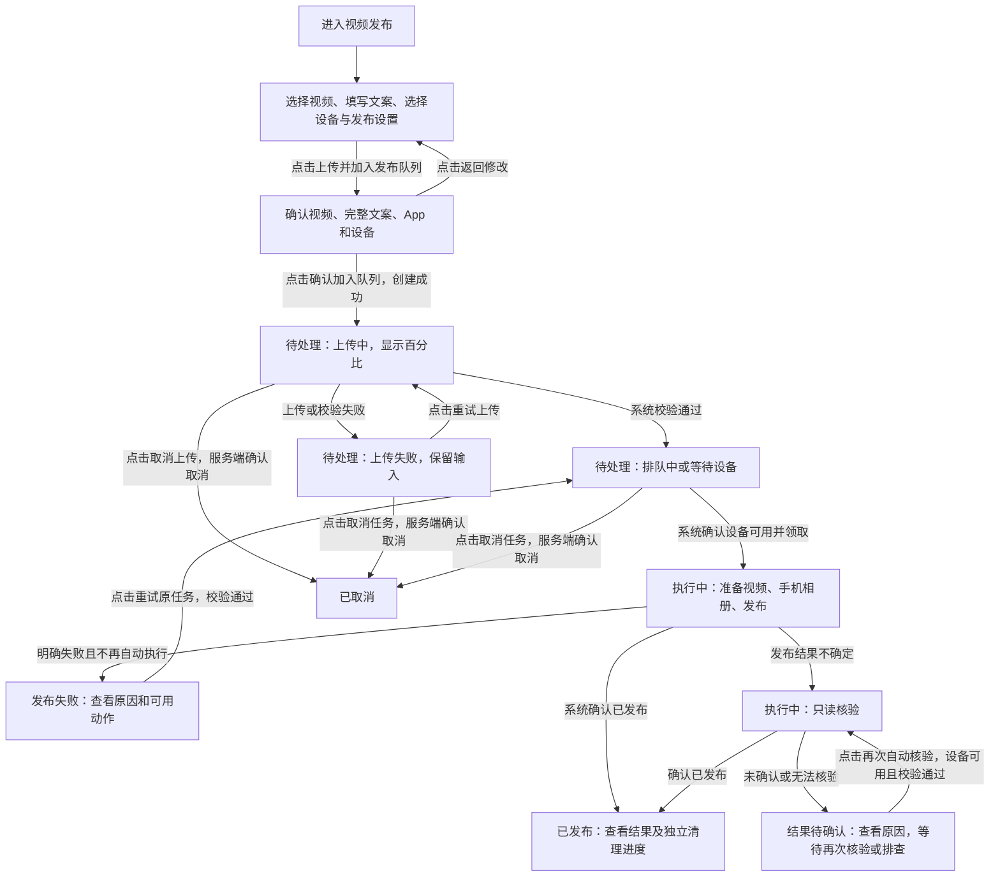
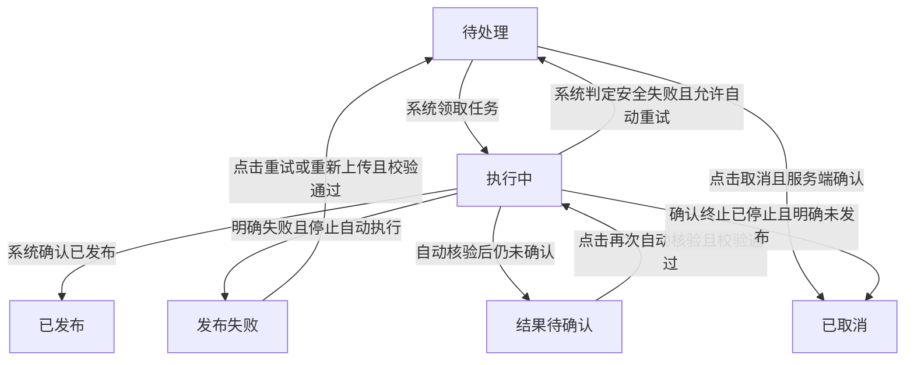
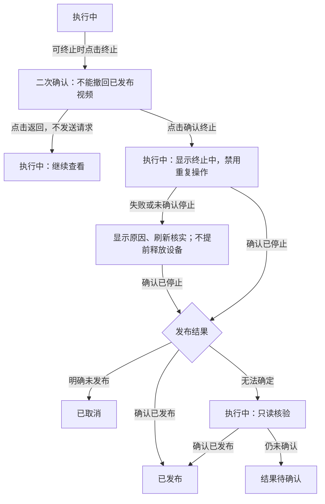

# 《TikTok 视频发布》产品方案

> [产品方案](01-product-proposal.md) · [技术设计](02-technical-design.md) · [实施计划](03-implementation-plan.md) · [测试计划和结果](04-test-plan-and-results.md)
>
> 版本：2026-10-07 重写稿。状态：**可供评审的完整草案，未批准、未达到上线条件**。
> 本文描述用户操作、业务规则与验收，不代表功能已实现。除明确标注的事实外，功能规格均是首版目标；建议和未决项不得直接当作已批准要求。

## 1. 决策摘要

**背景与问题**：内容运营要把一个视频和一份文案发布到指定手机上的 TikTok，并知道是否发布成功。手机执行结束并不必然等于视频已发布；遇到断网、设备不可用或结果不确定时，还要判断能否继续，避免重复发布。

**目前已知的处理方式**：现有资料描述了“上传视频 → 系统安排手机执行 → 查看任务与执行记录”的路径。代码已有发布、核验和清理逻辑，但仍是全局串行；还没有记录现场人员怎么做、花多久、多少任务需要人工处理，不能据此宣称效率已经提升。

**目标用户与结果**：获授权的内容运营，在 ttsERP 一个入口提交任务、查看结果、处理异常。正常任务由系统完成，不需要逐条人工审核；异常任务明确说明原因、下一步动作和设备是否还能接下一单。

**首版范围与取舍**：每个任务只发布一个视频；每台设备串行，多台设备并行。保留上传、队列、结果、核验、取消/终止、清理和执行历史；不允许强制跳过核验或成功提交后的参数修改。建议暂不扩展批量/定时发布。宁可暂留“结果待确认”，也不冒险重复发视频。

**如何判断有价值**：先验证用户能独立走完正常路径及主要异常路径，再观察确认发布比例、人工异常干预比例和处理耗时。目前没有实测数据，先记录首轮试用的实际表现。还要说清楚：一直不知道发没发出去时怎么办、视频和记录留多久、试用后怎么判断好不好用。两台手机能否真正同时发布，由研发按 §7.2 验证。

## 2. 事实、目标与边界

### 2.1 已确认信息及来源

| 类型 | 信息 | 来源与限制 |
| --- | --- | --- |
| 已确认需求 | 一任务一视频一文案；单设备串行、多设备并行；默认每 5 秒刷新，可关闭或手动刷新 | 当前对话及原产品方案；是目标约束，不是已实现能力 |
| 已确认需求 | 普通运营可在成功提交 Artemis 前编辑 Prompt、App package、设备序列号；成功提交后只读，但可终止 | 当前对话；提交中的短暂锁定见 R-003 |
| 已确认需求 | 只要能进入视频发布页面，就能查看和操作全部设备、所有人的任务及完整业务执行记录；不按创建人或角色进一步分权 | 用户在当前对话确认；仍须遵守任务状态、参数校验和凭据隔离规则，尚未代表实现已对齐 |
| 已确认事实 | 当前有 6 个业务主状态；上传失败、取消中、终止中不额外增加主状态 | [状态定义](../../tts_erp_v2/publishing/domain.py)及[技术设计](02-technical-design.md) |
| 已确认事实 | 当前领取任务仍有全局运行任务及设备清理互斥，不等于“按设备独立调度” | [当前领取规则](../../tts_erp_v2/publishing/repository.py)的 `claim_one()`；多设备目标仍需实现对齐 |
| 已确认事实 | 普通取消仅支持未运行任务；运行中终止是待补齐的目标能力 | [技术设计](02-technical-design.md)及现有状态/动作定义 |
| 已确认事实 | 现有测试记录不能证明真实设备、外部服务及完整发布链路已通过 | [测试计划和结果](04-test-plan-and-results.md)的“当前结论”；不是本稿的新测试结果 |
| 待验证假设 | 外部手机执行器能按目标设备独立执行，多设备目标在真实链路上可行 | 当前缺少真实并行证据；必须验证，不自行假定支持或降级首版目标 |
| 待验证假设 | 统一任务视图和异常恢复入口能减少人员反复检查与重复操作 | 尚无运营访谈或实测数据；由试用验证，不写提升百分比 |

### 2.2 定性目标

| 目标 | 用户能够观察到的结果 |
| --- | --- |
| 一处完成发布任务 | 提交视频、文案与设备后，能沿同一任务看到上传、等待、执行和最终结果 |
| 看得懂状态与下一步 | 能区分“上传失败”“发布失败”“结果待确认”，知道该重试、核验还是等待 |
| 异常可恢复且不重复发布 | 重试沿用原任务；结果不确定先核验；终止不被误解为撤回视频 |
| 设备有序、结果可追溯 | 同设备不同时执行两单；不同设备可并行；每次执行的参数、结果和完整 Artemis ID 可追查 |

### 2.3 定量目标与度量口径

**已确认的功能验收约束**：一任务 1 个视频、1 份文案；单设备同时执行任务数 ≤1；至少两台不同设备能并行；自动刷新默认设置为 5 秒。它们是功能验收标准，不能替代业务效果评估。

下表是业务效果的度量草案。目标值、样本量和观察周期未经确认；建议先观察一个完整运营周，再按设备可用性、任务量和异常类型判断是否需要延长，不用小样本宣称提升。

| 指标 | 怎么计算或检查 | 现在的实际表现 | 希望达到什么结果 | 看多久 | 从哪里取数据 |
| --- | --- | --- | --- | --- | --- |
| M-01 确认发布比例 | 同批首次入队的去重任务中，已确认发布数/任务总数；同时列出未结束、失败、已取消、结果待确认的数量 | 待验证；先记录现有任务同口径结果 | 待验证；先记录第一批实际结果，不把点击提交当成功 | 建议首轮一个运营周，任务结果还不确定时延长跟踪 | 首次入队及确认发布记录、任务最终状态；外部作品抽查需授权 |
| M-02 人工异常干预比例 | 同批已创建任务中，因异常使用重试上传、手动发布重试、再次核验或人工排查的去重任务数/总数；正常创建、改设置、主动取消不算 | 待验证；记录当前异常处理过程 | 待验证；期望减少不必要干预，不减少必要安全核验 | 与 M-01 同批任务 | 人工恢复操作记录及试用排查记录 |
| M-03 发布处理耗时 | 首次入队至确认发布的耗时，报告中位数并区分设备等待、执行、核验；未结束任务单列，不隐去长等待 | 待验证；先采集起止时点 | 待验证；不承诺固定秒数或提升比例 | 与 M-01 同批任务 | 入队、阶段和结果时点；重试不能重置首次起点 |
| M-04 状态理解 | 在正常、失败、结果待确认场景中，用户能否独立说清“当前发生什么、下一步做什么、是否影响下一单”；记录人数和误解项 | 待验证；当前对话已暴露状态含义不清，但不是运营调研样本 | 建议消除关键误判；可接受标准及样本量待确认 | 草案评审及首轮试用 | 场景走查、用户复述和反馈记录 |

### 2.4 首版边界

- **包含**：单条上传、按设备排队、多设备并行、参数编辑与锁定、任务结果、失败恢复、只读核验、取消/终止、独立清理、历史和刷新。
- **排除**：一个任务多个视频、成功提交后修改参数、强制跳过核验重发、通过 TikTok Shop Open API 发帖、任意 ADB 命令、保证设备/TikTok 不可用时零人工介入。
- **方案建议**：首版只做当前任务链，不增加批量或定时发布。只有试用证明重复创建/排程是主要成本，且本链路的安全和可靠性已验证后，再评估扩展。
- **还没说清楚的规则**：一直不知道发没发出去时怎么办、视频和记录留多久，见 §8；双设备发布及运行环境由研发验证，见 §7.2。页面统一权限、多设备、参数编辑和终止须与技术/实施/测试文档对齐。本稿不批准实现或上线。

## 3. 场景与方案选择

### 3.1 核心场景

| 场景 | 用户动机与限制 | 成功结果 |
| --- | --- | --- |
| 正常发布 | 有视频和文案，指定目标手机；设备可能忙，不能同时在同手机操作两单 | 系统确认已发布，记录留存，设备可继续接下一单 |
| 多设备待发布 | 多台手机各有任务，不希望一台离线让其他手机一起等待 | 各设备独立排队；可用设备继续执行 |
| 上传/执行异常 | 不知道中断后是否要重新创建，也担心视频重复发布 | 原任务可恢复，错误及下一步明确；不确定结果先核验 |
| 改变计划 | 尚未提交时要改设置或取消；已开始执行时要停止 | 修改/取消/终止有明确确认结果，不把停止误当撤回视频 |

不再比较新技术方案：用户已确认“手机 UI 发布、按设备排队”的方向。产品上的关键取舍是**安全核验优先于立即重发**，以及**等待结果确认不等于一直占住设备**。

### 3.2 需求清单

P0：缺失会中断核心任务链或造成安全风险。P1：首版已确认的操作效率能力，交付顺序可后置，但不得默默删除。下表均属于 v1 目标，不表示实现已完成。

| 需求编号 | 用户任务或问题 | 对应能力 | 优先级 | 优先级理由 | 依赖 | 所属版本 |
| --- | --- | --- | --- | --- | --- | --- |
| R-001 | 提交一个视频，上传失败后继续 | 创建、校验、上传进度、重试原任务上传 | P0 | 发布链起点与防重复建单 | 页面授权、上传服务及配置 | v1 |
| R-002 | 等待指定手机发布，多台手机互不拖累 | 按设备排队、串行/并行、设备原因提示 | P0 | 决定任务能否安全开始 | 真实跨设备执行能力、可用性及安全占用判断 | v1 |
| R-003 | 提交前调整发布参数，提交后避免误改 | Prompt/App/设备编辑与提交后锁定 | P0 | 已确认操作需求及执行一致性 | 参数校验、提交结果和执行快照 | v1 |
| R-004 | 知道任务进度、结果和执行过什么 | 六状态、设备轨道、任务详情及执行历史 | P0 | 用户必须看得懂结果 | 可靠的任务/执行状态 | v1 |
| R-005 | 失败后恢复，不确定时防止重复发布 | 安全重试、再次自动核验、待确认提示 | P0 | 恢复与重复发布风险 | 结果判断、剩余次数、核验能力 | v1 |
| R-006 | 取消待执行任务或终止正在执行的任务 | 确认、过程反馈及结果收敛 | P0 | 停止控制与设备安全 | 停止确认、结果核验能力 | v1 |
| R-007 | 发布后释放临时视频，清理失败不误判结果 | 三处独立清理、失败重试及记录保留 | P0 | 影响下一单及结果可信度 | 资源归属和安全收尾 | v1 |
| R-008 | 不手动反复刷新，也能暂停刷新 | 默认 5 秒、开关、立即刷新 | P1 | 降低查看成本，不改变发布判断 | 查询能力与响应顺序保护 | v1 |
| R-009 | 多任务中定位问题并提供执行编号 | 状态/设备筛选、完整 ID 一键复制 | P1 | 便于运营定位和沟通 | 任务列表、执行历史 | v1 |
| R-010 | 进入页面后查看和操作全部设备与任务，不泄露服务凭据 | 统一页面授权、全量业务可见与操作、凭据隔离 | P0 | 已确认的统一访问规则 | 页面及接口授权、服务端状态和参数校验 | v1 |

## 4. 用户路径与产品结构

### 4.1 从进入到得到结果



图中取消箭头只表达**确认后的最终状态**；请求中显示“取消中”，失败/未确认时显示原因并读取真实状态。运行中终止另见 §5.6，不在主流程里重复展开。

### 4.2 页面组织（方案建议）

只保留一个视频发布页面和任务详情，不新增重复摘要面板。以下是文字布局，不是已有原型或已实现界面。

```text
视频发布
  正在执行：每台设备一条轨道 · 当前视频/阶段 · [查看详情]
  新建任务：视频预览 → 文案 → 设备 → 可展开的发布设置 → [上传并加入发布队列]
  任务记录：[状态筛选] [设备筛选]  自动刷新[开/关] 每5秒 [立即刷新]
            视频 · 设备 · 状态及阶段/反馈 · 创建时间 · 主要动作
```

| 区域 | 职责与入口 | 出口或关系 |
| --- | --- | --- |
| 新建任务 | 输入内容，提交前复核；选文件不自动上传 | 创建后继续上传原任务，确认校验通过后进入记录 |
| 设备轨道 | 每台被占用设备显示一个任务，步骤为“准备视频 → 手机相册 → 发布 → 确认结果” | 安全释放后收起；等待结果确认不永久挂在运行轨道 |
| 任务记录 | 找到当前/历史任务、按状态和设备筛选、执行主要动作 | 点击查看进入详情；队列位置仅针对目标设备 |
| 任务详情 | 完整发布内容、结果原因、允许动作、每次执行 ID/快照/清理结果 | 桌面侧栏、移动端全屏；关闭后保留筛选和滚动位置 |

业务上“结果待确认”仍待处理，但不等于页面必须停在详情；用户可返回列表操作其他任务。

## 5. 功能规格

所有界面状态及按钮资格以服务端为准。点击成功、上传百分比到 100%、执行器返回结束，都不能由浏览器自行判定“已发布”。

### 5.1 页面权限（R-010）

**已确认规则：只要能进入这个页面，就可以操作所有、看到所有。**

- 已登录且获 `page:video-publish` 页面授权的用户，可查看全部设备、所有人创建的任务、完整发布内容、执行参数快照、Artemis ID 和执行输出；不按创建人或角色进一步分权，不做逐人设备分配。
- 所有进入者均可使用全部设备，执行本页提供的创建、上传、修改设置、取消、终止、重试、核验及清理操作；服务端仍检查任务状态、设备占用、剩余次数和参数合法性。能操作不等于能修改已提交参数、强制重发不确定结果或绕过设备串行规则。
- 未获页面授权的用户，页面和相关接口均拒绝查看、操作；不能只隐藏菜单而放行接口。该授权只针对视频发布功能，不提升用户在其他模块的权限。
- 服务凭据不属于可见业务数据；所有用户查看的执行输出均须屏蔽敏感认证内容。浏览器不获取服务凭据，不直接操作设备或输入任意 ADB 命令。

任务保留创建人用于追溯，不用它划分访问或操作范围。视频是临时媒资，任务、文案和执行记录不是清理对象。本次仅确认产品规则；后续需对齐页面及相关接口的鉴权实现，不代表现有代码已支持统一权限。

| 验收编号 | 需求编号 | 前置条件 | 操作或触发事件 | 可观察的预期结果 |
| --- | --- | --- | --- | --- |
| AC-001 | R-010 | 用户未获页面授权 | 打开页面或直接调用查看/操作接口 | 页面与接口均拒绝，不返回任务内容，不修改数据 |
| AC-002 | R-010 | 两名已获页面授权的用户，任务由不同人创建 | 分别查看全部设备/任务/快照，并对另一人的任务执行合法动作 | 两人均能看到完整业务数据、使用全部设备及操作另一人的任务；不因创建人或角色额外拒绝，非法状态动作仍被拒绝 |
| AC-003 | R-010 | 已获页面授权的用户查看执行详情 | 加载完整参数快照、执行输出或含特殊字符的内容 | 不另设诊断角色门槛；敏感认证内容屏蔽，文件名、文案、Prompt、错误及输出按纯文本展示，不泄露凭据或执行脚本 |

### 5.2 提交与发布设置（R-001、R-003）

入口：新建任务。填写表单时尚无业务任务；服务端创建成功后才进入“待处理”。

| 输入 | 必填、默认与校验 | 失败提示/处理 |
| --- | --- | --- |
| 视频 | 1 个 MP4、大小大于 0；上限从服务端配置读取并在选择处显示；提供文件名、大小、静音预览和可读取的时长/分辨率 | 指出类型/大小问题，不提交；服务端重新检查实际对象，不能只信本地元数据 |
| 文案 | 1 份非空文案；字符上限取服务端配置，显示计数；保留换行、emoji 和标签，不改写 | 指出空值/超限，不截断后偷偷提交 |
| 设备 | 必选目标设备，显示名称、可用性和队列信息；序列号来自选定设备，可在允许窗口编辑 | 无设备则禁用提交；校验失败指出目标问题；设备忙/离线允许排队但说明等待原因 |
| Prompt | 默认使用发布模板；普通运营可按允许动作编辑；明确 App、视频来源、原文案和成功/失败条件 | 失败指出具体字段，保留输入；文案是待发布内容，不当作控制指令 |
| App package | 默认来自配置，可在允许窗口编辑 | 不接受空值/不符合服务端规则的参数；规则细节在开发交付前与配置契约对齐 |

| 用户操作/事件 | 界面反馈与业务规则 |
| --- | --- |
| 点击“上传并加入发布队列” | 弹出完整视频/文案/App/设备复核；可返回修改；提示空闲设备可能立即执行 |
| 点击“确认加入队列” | 禁用重复确认；同一次确认及请求重发最多创建 1 个任务；服务端确认创建后开始上传 |
| 上传进行中/完成 | 显示真实百分比和“取消上传”；100% 后先显示“上传校验中”，校验通过才排队，之后清空创建表单 |
| 上传失败 | 仍为待处理，不是发布失败；保留文件/文案，显示原因及“重试上传”“取消任务”；不自动重试上传 |
| 点击“重试上传” | 复用原任务，不新建；重新取得有效上传许可，再上传并校验 |
| 刷新/离开后回来 | 离开前提醒上传未完成；仍离开后，回来需重新选择原文件继续，或取消任务。浏览器不能恢复本地文件，须重新校验，不假装恢复旧文件选择 |
| 提交前改设置 | 在服务端允许的窗口修改 Prompt、App、设备；成功变更设备后重新核对该设备队列位置；已确认视频/文案不随参数修改改变 |
| 正在提交/提交成功 | 提交中短暂锁定；成功后永久只读，后续重试也不解锁；提交结果不确定时先核实，不重复提交 |
| 保存时任务状态已变化 | 拒绝不再合法的修改，显示最新状态及允许动作；不得覆盖已提交的执行参数 |

| 验收编号 | 需求编号 | 前置条件 | 操作或触发事件 | 可观察的预期结果 |
| --- | --- | --- | --- | --- |
| AC-004 | R-001 | 合法视频/文案/设备 | 确认提交并完成上传校验 | 只创建一个任务；待处理从上传反馈转为排队，记录显示原内容，表单清空 |
| AC-005 | R-001 | 无效文件、空/超限文案，或对象实际大小不匹配 | 选择/提交/确认上传 | 指明字段或对象问题；不进入发布队列，不把失败请求当成功 |
| AC-006 | R-001 | 上传中断或上传许可失效 | 点击重试上传，或刷新后重新选择文件 | 原任务重新上传/校验，新增任务数为 0；未点击时不自动重试 |
| AC-007 | R-001 | 同一次确认正在处理 | 重复点击或重发创建请求 | 返回/保留同一任务，不产生第二单 |
| AC-008 | R-003 | 未成功提交且允许编辑，或已成功提交 | 修改 Prompt/App/设备并保存 | 前者保存并更新目标信息；后者只读且写入被拒绝；每次执行保留实际参数快照 |
| AC-009 | R-003 | 编辑时另一操作已使任务进入提交/成功提交 | 保存旧页面参数 | 修改被拒绝，展示真实状态；不改写已提交参数、不静默换设备 |

### 5.3 设备队列与占用（R-002）

任务按进入目标设备队列的先后等待；不可领取的任务须显示设备/清理/重试等待原因。队列位置表达真实可执行顺序，不把其他设备任务混入，也不把尚未完成上传的任务算作可发布任务。设备不可用时保留任务，不快速消耗发布次数。

- 同一任务不能同时执行两次，同一设备只能被一个发布或核验任务占用。
- 不同设备按首版目标独立运行；一台离线、锁屏或等待设备清理，不应阻塞其他可用设备。
- 当前执行已确认结束、该设备必要清理/安全隔离完成后，下一单才能占用。仅本地/MinIO 后台清理不应锁住已安全释放的设备。
- “结果待确认”本身不是占用原因；若仍有执行未停止、正在核验或设备安全收尾未完成，显示这些真实原因，而不是“等人工审核”。

| 验收编号 | 需求编号 | 前置条件 | 操作或触发事件 | 可观察的预期结果 |
| --- | --- | --- | --- | --- |
| AC-010 | R-002 | 同设备排两单 | 第一单开始并结束安全收尾 | 同时执行数 ≤1；第二单只在设备释放后开始 |
| AC-011 | R-002 | 两台可用设备各有任务，其中一台后来离线 | 调度并刷新页面 | 可用时能并行；离线设备任务等待，另一设备继续；各自位置不混计 |
| AC-012 | R-002 | 某设备执行未停止或必要清理失败 | 下一单等待 | 不提前占用；页面说明占用/清理原因，其他已可用设备不受该设备影响 |
| AC-013 | R-002 | 原任务结果待确认，执行已结束且设备安全释放 | 同设备下一单进入队列 | 下一单可执行，不要求先完成原任务人工处理 |

### 5.4 结果、历史与查看（R-004、R-008、R-009）

**方案建议**：将 `needs_review` 的页面名称由“需核验”改为“结果待确认”，编码不变，以免被理解为所有任务都要人工审核。正文和图统一使用建议名称。

| 主状态编码 | 页面名称 | 用户应理解的含义 | 主要下一步 |
| --- | --- | --- | --- |
| `pending` | 待处理 | 尚未开始发布；阶段可为待上传、排队中、等待设备 | 按阶段继续/重试上传、编辑设置、取消或等待 |
| `running` | 执行中 | 正在准备视频、写入相册、提交/操作 TikTok 或核验 | 查看进度；符合条件时可终止，不能再次提交发布 |
| `succeeded` | 已发布 | 已确认发布成功；清理可以仍在后台进行 | 查看结果，清理失败时重试清理，不再次发布 |
| `failed` | 发布失败 | 本轮发布执行结束且不再自动执行，不是上传失败 | 看原因；允许时重试原任务或重新上传视频 |
| `needs_review` | 结果待确认 | 本轮自动处理已结束，但发布真假未确认，不代表失败或必需人工审批 | 再次自动核验或排查；不能直接重发 |
| `cancelled` | 已取消 | 服务端确认未运行任务取消，或确认停止且明确未发布 | 查看记录；不能恢复原执行，不代表撤回已发布视频 |

主状态共 6 个。**阶段**解释正在做什么；**反馈**解释一次操作是否正在请求或失败，两者均不增加主状态。例如上传失败仍为待处理；取消中保持最新已确认状态；终止中不提前改为已取消；清理失败不改写已发布。



详情按“结果及下一步 → 发布内容 → 执行历史 → 清理”排列。历史保留每次发布/核验的类型、结果、设备、起止时间、错误和实际参数快照；每次已创建 session 的完整 Artemis ID 均可复制，未创建时明确提示，不仅保存最近一次 ID。执行输出折叠显示，所有进入者均可展开查看；仅屏蔽敏感认证内容，不按人员角色隐藏业务信息。

自动刷新默认开启，**前一轮请求结束后等待 5 秒**再刷新各设备轨道、任务列表和已打开详情，不提供智能模式；可关闭并保留立即刷新，只记住开关偏好，不把任务内容或凭据写入本地偏好。页面隐藏暂停定时刷新；恢复可见且已开启时立即刷新。失败保留旧状态和上次成功刷新时间，提示数据可能过期；不清空输入、不抢焦点、不重叠请求、不让旧响应覆盖新状态。状态筛选用上述六名称，设备筛选独立保留。

初次查询显示“正在读取任务”，不是业务执行中；成功但无记录时显示“还没有发布任务”及有权限的新建入口。筛选无匹配时显示“没有符合条件的任务”，保留筛选调整入口。初次读取失败显示“任务读取失败，请重试”和“立即刷新”，不能把读取失败当成无任务。

| 验收编号 | 需求编号 | 前置条件 | 操作或触发事件 | 可观察的预期结果 |
| --- | --- | --- | --- | --- |
| AC-014 | R-004 | 发布有确认成功结果 | 刷新/查看详情 | 显示已发布，无需人工批准；清理、历史及主状态分区，不把执行结束直接当成功 |
| AC-015 | R-004 | 列表初次读取/无匹配，或已有执行记录 | 加载、筛选、失败重读、查看详情 | 加载、空记录、筛选无匹配与读取失败可区分；执行类型及未创建 session 有提示；上传失败/取消中/终止中不成为第七个主状态 |
| AC-016 | R-008 | 页面可见且自动刷新开启 | 请求结束、关闭开关、立即刷新、隐藏后返回 | 默认按结束后 5 秒轮询；关闭/隐藏停定时请求，手动仍有效，返回且已开启时刷新，无重叠请求 |
| AC-017 | R-008 | 已有旧数据显示或存在并发查询 | 刷新失败或旧响应迟到 | 保留数据与成功刷新时间，提示过期；旧响应不覆盖新结果，输入/焦点不被破坏 |
| AC-018 | R-009 | 多设备/多状态任务及多个执行 ID | 筛选、开关详情、复制 ID | 按选择范围显示，关闭详情保持位置和筛选；复制值等于完整 ID，不是截断值 |

### 5.5 失败恢复与“结果待确认”（R-005）

| 情况 | 系统处理与用户动作 |
| --- | --- |
| 可证明未发生最终发布动作，且剩余次数允许 | 系统可自动重试，说明原因和等待；明确失败且不再自动执行时显示“发布失败” |
| 点击发布后失联、可能已经发布 | 不直接重发；先核实原执行是否结束，再做只读核验；查询等待超时本身不等于发布失败 |
| 自动核验确认已发布 | 自动进入已发布，不需要人工批准 |
| 核验未找到作品、无法完成或仍无法判断 | 进入结果待确认；可能是平台延迟，不能把一次未找到当作允许重发的证据 |
| 用户点击“重试原任务” | 二次确认原因及已用/上限，服务端重新校验对象、次数和状态；通过后原任务排队，新增执行历史但不新增任务 |
| 原视频对象丢失/已清理 | 允许时显示“重新上传”，先恢复原任务视频并校验；不创建必然失败的新执行 |

发布次数按服务端的正式发布预算计算，上限由配置提供；核验、重复查询和纯设备等待不当作正式发布次数，执行记录总数不等于已用发布次数。手动重试按重新入队计算顺序，不抢占已在执行的任务。单次正式发布执行最多做一次最终发布动作；网络重放与恢复查询沿用原执行记录/ID，不制造第二次执行。

**不是所有任务都要人工 review。** 正常成功自动结束；仅异常且自动处理无法确认结果时需要排查。结果待确认可由用户点击“再次自动核验”；核验只看作品/草稿，不进入上传或点击发布。它重新占用目标设备，忙时说明原因而不是冒充已开始。一直无法确认时，人工怎么查、查完怎么继续处理，见 Q-02；v1 不提供“人工点通过就成功”或强制重发入口。

进入结果待确认后，**本轮执行结束不等于业务结果已确认，但也不必一直占着设备**。设备已安全释放即可执行下一单；没有人工处理不构成永久队列门禁。必要的停止、核验或设备收尾仍会占用该设备。

| 验收编号 | 需求编号 | 前置条件 | 操作或触发事件 | 可观察的预期结果 |
| --- | --- | --- | --- | --- |
| AC-019 | R-005 | 明确失败且服务端允许重试 | 确认重试，或状态/次数在确认期间变化 | 通过后原任务排队且历史不丢；不允许时说明原因并刷新，不新建任务 |
| AC-020 | R-005 | 最终发布可能已发生，或一次核验未见作品 | 系统处理结果 | 不自动/直接再次发布；先核验，仍未确认显示结果待确认及原因 |
| AC-021 | R-005 | 结果待确认且允许核验，或设备正忙 | 点击再次自动核验 | 可执行时转为执行中/核验中，确认发布后成功，否则回到待确认；设备忙时拒绝并说明原因，不启动第二条执行 |
| AC-022 | R-005 | 可重试但原视频对象不可用 | 选择重新上传并校验 | 同一任务先回待上传，通过后排队；不在无有效视频时启动发布 |

### 5.6 取消与终止（R-006）

- **取消**用于待处理任务。“取消上传”先停止本地上传并请求取消任务；“取消任务”用于未运行任务。服务端确认后才显示已取消。
- **终止**用于已成功提交且仍在运行、服务端允许终止的任务。二次确认提示：“终止不能撤回已经发布的视频”。点击返回不发送终止请求。
- 两者处理中禁用重复操作。超时/拒绝显示原因并刷新真实状态，不把请求失败直接改成发布失败，也不提前宣布已取消。
- 终止进度须在刷新/重进后可恢复。确认执行停止前不释放设备；已发布保持成功，不确定先核验。普通取消遭遇任务已开始时说明已开始，并按最新允许动作提供终止入口。



| 验收编号 | 需求编号 | 前置条件 | 操作或触发事件 | 可观察的预期结果 |
| --- | --- | --- | --- | --- |
| AC-023 | R-006 | 上传/排队任务尚未运行 | 点击取消；或取消过程中已开始执行 | 确认取消才显示已取消；已开始则拒绝普通取消并展示最新状态/动作；请求未确认不伪造结果 |
| AC-024 | R-006 | 可终止的运行任务 | 点击终止后返回，或确认后请求超时/拒绝 | 返回不发请求；确认后显示终止中，超时/拒绝显示原因且核实状态；不重复请求、不提前释放 |
| AC-025 | R-006 | 终止已接收或页面已刷新 | 确认停止及发布结果 | 进度可恢复；已发布保持成功，明确未发布才已取消，不确定先核验；不是撤回作品 |

### 5.7 资源清理与保存（R-007）

手机视频、本地临时文件、视频存储对象（MinIO）分别显示未开始/处理中/成功/失败；失败项提供服务端允许的“重试清理”。不增加“清理中”业务主状态。

| 发布结果/资源 | 保存与处理规则 |
| --- | --- |
| 已发布 | 清理三处临时视频，任务、文案、执行历史和结果保留；视频清理后不能假装仍可预览原文件 |
| 明确失败且可重试 | 手机/本地按安全收尾处理，存储视频保留供原任务恢复 |
| 结果待确认 | 保留存储视频及执行证据；手机视频需完成核验或安全隔离后才释放，不能为了下一单冒险删除仍被使用的资源 |
| 未运行任务已取消 | 清理临时视频/未完成上传的残留；取消不删除审计记录 |
| 清理失败 | 后台可重试；失败不把已发布改成失败。设备清理影响本设备下一单，本地/存储后台重试不阻塞已安全释放的设备 |

失败或待确认的视频、任务和执行记录留多久，到期怎么办，见 Q-03；具体时间还未确定，不承诺自动删除时间。清理只处理该任务拥有的临时资源，不清除用户其他视频或源业务记录。

| 验收编号 | 需求编号 | 前置条件 | 操作或触发事件 | 可观察的预期结果 |
| --- | --- | --- | --- | --- |
| AC-026 | R-007 | 确认已发布 | 清理三处资源，其中一处失败 | 三处结果独立，业务仍为已发布；任务/文案/执行历史不消失，失败项有原因和允许的重试入口 |
| AC-027 | R-007 | 设备未安全清理，或仅本地/存储清理失败 | 下一单调度并重试清理 | 前者不提前接同设备下一单；后者不阻塞已释放设备；重试只处理允许的失败资源 |
| AC-028 | R-007 | 任务失败、待确认或已取消 | 查看/执行清理与恢复 | 失败/待确认保留恢复证据，取消按安全规则收尾；不清除非本任务资源，不改变业务结果 |

## 6. 质量要求与效果验证

### 6.1 必须验证的质量边界

| 方面 | 要求 | 验证方式 |
| --- | --- | --- |
| 可靠性 | 重复请求不重复建单/发布；浏览器关闭不等于取消后台执行；恢复查询沿用原执行记录 | 重放请求、中途退出、刷新重进、重启与外部超时场景；核对任务/执行数量和状态 |
| 兼容与操作 | 桌面与移动端完成同一任务链；键盘可选文件、提交、打开/关闭详情；状态不只靠颜色 | 多视口、键盘和读屏走查；具体浏览器/版本支持矩阵待真实验证，不能把 mock 通过当兼容证明 |
| 可访问性 | 关键状态有文字，上传有数值，弹窗焦点可进入并返回；尊重减少动画偏好 | 无鼠标流程、焦点恢复、状态播报及减少动画设置检查 |
| 隐私与安全 | 已获页面授权的用户全量查看和操作；未授权用户不能读取或写入；内容按纯文本，敏感认证内容屏蔽 | 未授权页面/接口访问、跨创建人合法操作、特殊字符、缓存/响应凭据泄露检查 |
| 性能与刷新 | 默认 5 秒是轮询设置，不是发布完成或页面响应 SLA；关闭不阻止手动查询 | 慢请求/失败/隐藏页验证；记录真实响应及发布耗时后再确定 SLA，不伪造预算 |

### 6.2 最小必要统计（方案建议，尚未证明已具备）

优先利用已有任务与执行记录，只补充无法还原的时点/人工异常操作。以下事件是统计需求，不指定新平台或实现架构；页面统计沿用本页统一授权，按同批任务统计，不按创建人另设可见范围。用户点按钮不等于任务完成。

| 对应指标 | 事件 | 触发条件 | 必要属性 | 去重或统计口径 |
| --- | --- | --- | --- | --- |
| M-01、M-02 | 任务创建确认 | 服务端创建业务任务成功 | 任务标识、确认时点 | 同一任务一次；客户端重复点击不重复计 |
| M-01、M-03 | 首次入队确认 | 上传校验通过且第一次入队 | 任务标识、设备引用、入队时点 | 同一任务一次；重试不重置首次起点 |
| M-01、M-03 | 发布确认/状态收敛 | 服务端确认已发布或进入其他结果状态 | 任务标识、结果、状态变更时点、错误分类 | 状态转换去重；多次刷新不产生多次成功；待确认后转成功保留前后记录但成功任务只计一次 |
| M-02 | 人工异常恢复操作 | 服务端接收重试/再次核验等异常恢复动作；人工排查由试用记录补充 | 任务标识、动作、接收结果、异常分类、时点 | 一次动作不因重发重复计；比例按任务去重，主动取消与正常编辑不计干预 |
| M-04 | 场景理解反馈 | 试用者完成状态复述/操作走查 | 场景、匿名反馈标识、误解项 | 按参与者/场景统计，不把重复点击当理解成功 |

不为这些指标收集视频、原文案、完整 Prompt、凭据或原始执行输出。业务记录与页面统计结果均沿用本页授权；数据不足或结果未收敛时，报告缺口，不给“有效/无效”的确定结论。

## 7. 交付与后续决策

### 7.1 交付阶段

| 相对阶段 | 依赖与阶段产物 | 完成条件 |
| --- | --- | --- |
| 评审定版 | 业务/产品确认范围、页面名称、Q-02 和 Q-03；技术与测试对齐已确认的统一页面权限、多设备、编辑/终止、设备清理及次数规则 | 核心规则不矛盾，需求与验收可逐项执行；当前草案尚未满足 |
| 核心链开发交付 | R-001～R-007、R-010；优先打通正常任务，再覆盖异常和跨设备安全 | 对应正常/失败验收有真实证据；不能以当前全局串行代替多设备验收 |
| 查看与操作完善 | R-008、R-009、响应式与可访问性 | 刷新、筛选、ID、键盘/移动端均可用；首版已确认能力不遗漏 |
| 授权试用 | 获授权的账号/设备及运营人员，真实发布另需明确授权；先小范围，不虚构人数或排期 | 核对实际作品、重复发布/越权风险，记录 M-01～M-04 的首次实测结果；真实依赖未验证不能标为通过 |
| 扩大、修正或暂停 | 复核安全验收、业务指标和用户反馈 | 结果与异常均可解释、无未解决安全阻塞，再评估扩大；效果不明延长观察/改流程；发生重复发布或越权等严重问题暂停新任务并排查 |

### 7.2 研发验证项（不是产品未决）

**产品要求已经确定：两台手机可以同时发布，一台出问题时不拖住另一台。** 是否能真正做到，由研发和测试验证，不再要求用户重复决定是否支持多设备。

| 验证内容 | 通过标准 |
| --- | --- |
| 双设备真实发布（R-002、AC-010～AC-013） | 使用获真实发布授权的 TikTok 账号和手机，验证同设备串行、不同设备同时执行；一台忙或离线，另一台仍能继续。Artemis 操作手机的能力也须实测，不能只凭模拟结果判定通过 |
| 手机、TikTok 界面和浏览器环境 | 在拟支持的实际环境走通提交、查看结果和异常恢复，记录支持范围及问题；不把准备测试账号/设备当作新增人员权限规则 |

验证证据写入[测试计划和结果](04-test-plan-and-results.md)。若发现无法满足已确认要求，研发先报告具体限制和解决方案再评审，不默默降级为全局串行。移出未决事项只改变归类，不表示能力已实现或已验证通过。

建议在一个完整运营周后复盘：用户是否能独立完成任务、异常干预花在哪里、哪种等待占用耗时。证据不足不硬设增长目标；先修正问题再观察。暂停/回退停止新任务投递并核实在途执行，不删除历史、伪造结果或自动撤回已经发布的作品。

[实施计划](03-implementation-plan.md)负责实际批次与部署，[测试计划和结果](04-test-plan-and-results.md)记录执行证据；本次只重写 PRD，不改技术实现或把旧测试结果搬成新验收结论。

## 8. 未决事项与文档维护

### Q-02 一直不知道发没发出去，怎么办？

比如：手机执行中断，系统自动检查后仍无法确定视频有没有发布。

- **还要约定**：谁去人工检查、具体检查作品/登录/设备的哪些信息、怎么记录检查结果、查完后任务接下来怎么处理。由运营、产品和研发确认具体做法，具体人员待安排。
- **已经确定**：不能因为没找到视频就盲目重发，也不增加“人工点通过就成功”的按钮。设备已经安全释放时，可以执行下一单，不用一直等这个任务的人工处理。“谁来检查”是运营分工，不是另设人员权限。
- **影响**：对应 R-005。人工检查这一步还没说清楚，暂时不能把它当成已经定好的开发和验收规则；正常发布不因此增加人工审批。

### Q-03 视频文件和任务记录留多久？

失败或结果待确认的视频要留着，方便重试和检查；任务、文案、执行日志要留着，方便以后查原因。视频文件和这些记录不能按同一条规则一起清掉。

- **还要约定**：失败/待确认的视频留多久，任务和日志留多久，时间到了是提醒处理、归档还是按另行确认的规则处理。由运营、产品和负责存储/日志维护的人员确认，具体人员待安排。
- **已经确定**：成功视频的三处临时文件清理规则不重新讨论；清理视频不能顺带删除任务、文案和执行历史，也不能清理别的任务的资源。
- **影响**：对应 R-007。保存多久、到期怎么办还没定，不能先写一个自动删除时间或直接开发到期处理。

### Q-05 试用后，怎么看这个功能好不好用？

不只看用户有没有点“提交”，还要看视频是否真的发布、多少任务需要人工处理、从入队到确认发布花多久，以及用户是否看得懂状态。

- **还要约定**：试用多久、看多少个任务、什么表现算好用。由运营和产品确认；先按 M-01～M-04 记录首次实际结果，再决定期望达到的结果，不凭空写提升百分比。
- **影响**：不挡住创建、排队、发布等核心功能的开发；但在数据不够时，不能宣称效率已经提升，也不能据此确定扩大使用。

**修订记录**：已按八节结构重写并建立 R-001～R-010 与 AC-001～AC-028 的对应关系。本次根据用户确认，将本页统一为“进入者可看全部、操作全部”，更新 R-010、AC-001～AC-003 及相关描述，删除原 Q-01 权限未决项；本次按用户确认，将原 Q-04 移出产品未决事项，改列 §7.2 研发验证项。剩余 Q-02、Q-03、Q-05 已改成白话问题，并说明具体还要约定什么，原编号和业务规则不变；正文中的相关说法也同步改写。历史稿可从 Git 追查，不虚构评审记录。

**影响范围**：多设备、参数编辑、终止、清理门禁及本页统一权限的目标与现实现仍须对齐，需要后续更新技术/实施/测试契约；本页授权不改变其他模块的权限。完成本稿只表示草案已整理，不表示方案获批、开发可无条件开始或已具备上线条件。
