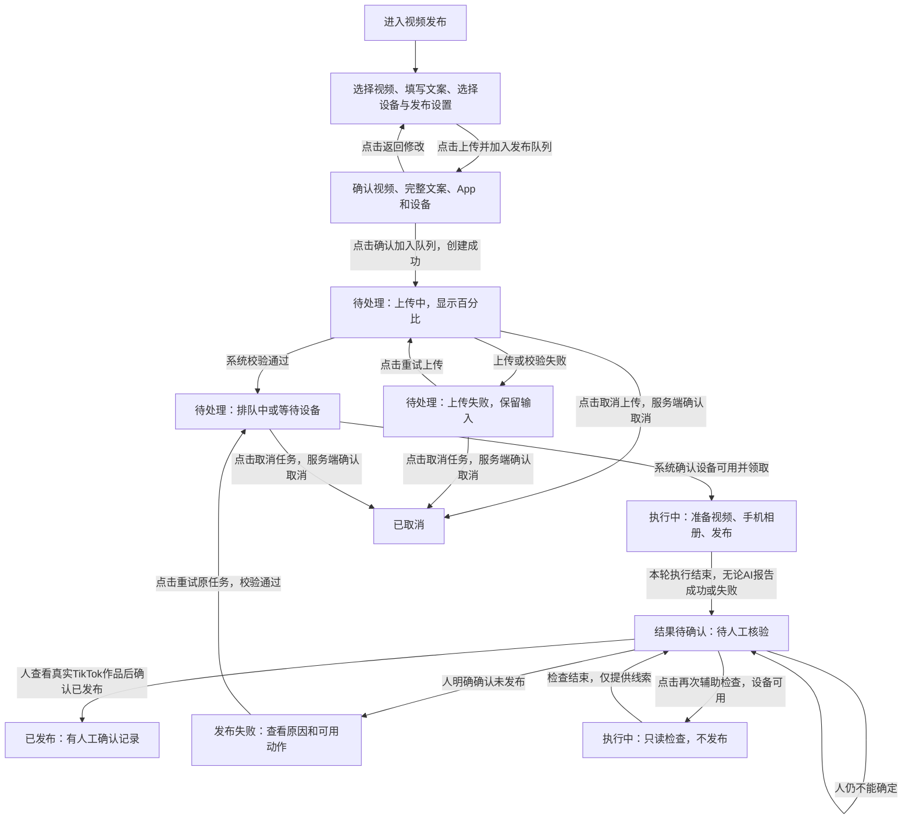
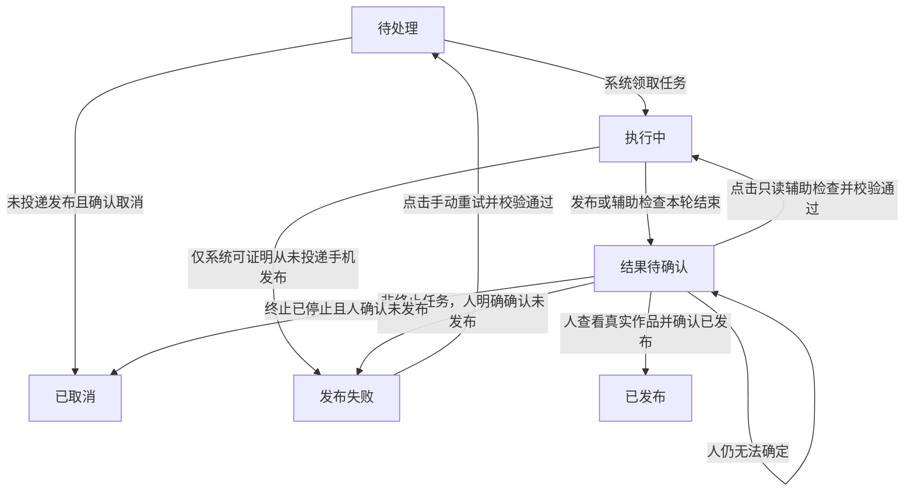
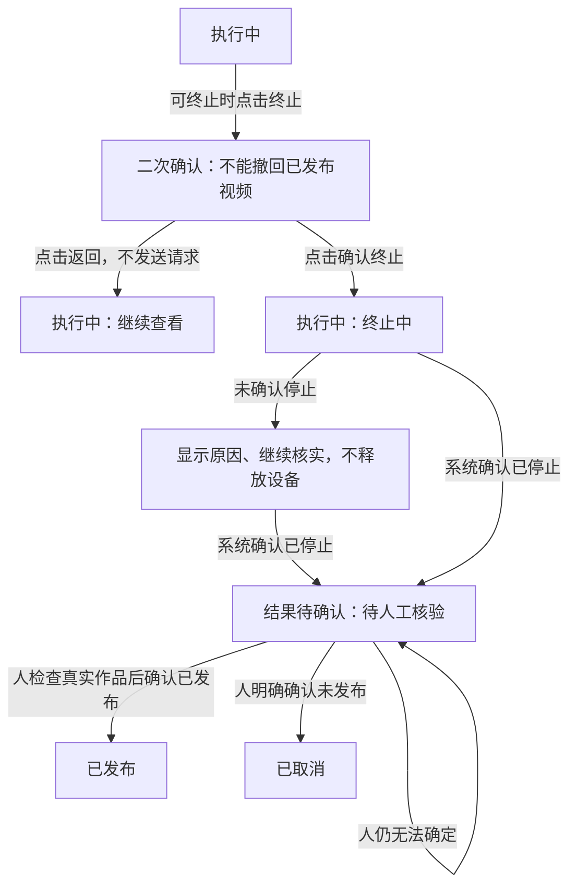

# 《TikTok 视频发布》产品方案

> [产品方案](01-product-proposal.md) · [技术设计](02-technical-design.md) · [实施计划](03-implementation-plan.md) · [测试计划和结果](04-test-plan-and-results.md)
>
> 版本：2026-10-08 系统原视频统一保留规则修订稿。状态：**可供评审的完整草案，未批准、未达到上线条件**。
> 本文描述用户操作、业务规则与验收，不代表功能已实现。除明确标注的事实外，功能规格均是首版目标；建议和未决项不得直接当作已批准要求。

## 1. 决策摘要

**背景与问题**：内容运营要把一个视频和一份文案发布到指定手机上的 TikTok，并知道是否发布成功。手机执行结束并不必然等于视频已发布；遇到断网、设备不可用或结果不确定时，还要判断能否继续，避免重复发布。

**目前已知的处理方式**：现有资料描述了“上传视频 → 系统安排手机执行 → 查看任务与执行记录”的路径。代码已有发布、核验和清理逻辑，但仍是全局串行；本稿中的新产品规则尚需后续实现，不能把现有代码当成已经交付。

**目标用户与结果**：获授权的内容运营，在一个入口提交任务、看手机执行情况，再亲自检查真实 TikTok 作品。**AI 报告执行成功不等于视频已发布；在没有明确、可靠且经过验证的机器特征之前，每条手机发布结果都必须人工核验。** 这不是发布前审批内容，而是发布后确认到底有没有发出去。

**首版范围与取舍**：一任务一视频，同设备串行、不同设备并行。系统负责执行和提供线索，人员负责核验真实结果；只有人员确认看到对应作品并登记后，任务才显示“已发布”。AI 报告失败或自动检查没找到作品，也不能直接据此重发。不确定就保留“结果待确认”；建议本版不扩展批量或定时发布。

**开发完成后怎么改进**：功能验证通过后实际使用，发现问题及时处理、修复并回测。不在方案里规定“好不好用”的定量评分，也不增加效果统计。系统存储（MinIO）里的原视频一律保留，不论任务成功、失败、待确认或取消都不删除；任务及日志暂不设置自动删除。

## 2. 事实、目标与边界

### 2.1 已确认信息及来源

| 类型 | 信息 | 来源与限制 |
| --- | --- | --- |
| 已确认需求 | 一任务一视频一文案；单设备串行、多设备并行；默认每 5 秒刷新，可关闭或手动刷新 | 当前对话及原产品方案；是目标约束，不是已实现能力 |
| 已确认需求 | 普通运营可在成功提交 Artemis 前编辑 Prompt、App package、设备序列号；成功提交后只读，但可终止 | 当前对话；提交中的短暂锁定见 R-003 |
| 已确认需求 | 只要能进入视频发布页面，就能查看和操作全部设备、所有人的任务及完整业务执行记录；不按创建人或角色进一步分权 | 用户在当前对话确认；仍须遵守任务状态、参数校验和凭据隔离规则，尚未代表实现已对齐 |
| 已确认需求 | 缺少明确、可靠的机器特征前，每条已发起手机发布的结果都要人工核验，包括 AI 报告成功的任务；AI 和自动核验报告只作线索 | 用户最新确认；尚未发起发布的上传失败或取消，不是发布结果核验 |
| 已确认需求 | 开发完成后实际使用，发现问题及时处理修复；不设置效果指标、试用评分或额外效果统计 | 用户最新确认；功能验收和必要业务记录仍保留 |
| 已确认需求 | 系统存储（MinIO）里的所有原视频都保留，不因成功、失败、待确认、取消或后续重试改变结果而删除 | 用户最新纠正；作废“成功或取消后删除原视频”的说法，仅手机/服务器临时副本可安全清理 |
| 已确认需求 | 任务、文案、执行日志及按钮操作记录暂不设置自动删除 | 用户最新确认；不设过期回收，不将“暂不自动删除”写成这些记录永久保留的新承诺 |
| 已确认事实 | 当前代码会根据执行结果 success 或自动核验 published 直接设为 succeeded 并安排成功清理，与本稿新目标不同 | [当前状态转换](../../tts_erp_v2/publishing/repository.py)的 `commit_publish_transition()`；本次未改代码，不能认为人工核验门槛已生效 |
| 已确认事实 | 当前有 6 个业务主状态；上传失败、取消中、终止中不额外增加主状态 | [状态定义](../../tts_erp_v2/publishing/domain.py)及[技术设计](02-technical-design.md) |
| 已确认事实 | 当前领取任务仍有全局运行任务及设备清理互斥，不等于“按设备独立调度” | [当前领取规则](../../tts_erp_v2/publishing/repository.py)的 `claim_one()`；多设备目标仍需实现对齐 |
| 已确认事实 | 普通取消仅支持未运行任务；运行中终止是待补齐的目标能力 | [技术设计](02-technical-design.md)及现有状态/动作定义 |
| 已确认事实 | 现有测试记录不能证明真实设备、外部服务及完整发布链路已通过 | [测试计划和结果](04-test-plan-and-results.md)的“当前结论”；不是本稿的新测试结果 |
| 待验证假设 | 外部手机执行器能按目标设备独立执行，多设备目标在真实链路上可行 | 当前缺少真实并行证据；必须验证，不自行假定支持或降级首版目标 |

### 2.2 定性目标

| 目标 | 用户能够观察到的结果 |
| --- | --- |
| 一处完成发布任务 | 提交后能看到上传、等待、执行、待人工核验和人工确认的结果 |
| 看得懂状态与下一步 | 明确区分“AI 报告执行成功”和“人工确认已发布”；未人工确认时不能显示已发布 |
| 异常可恢复且不重复发布 | 重试沿用原任务；结果不确定先核验；终止不被误解为撤回视频 |
| 设备有序、结果可追溯 | 同设备不同时执行两单；不同设备可并行；每次执行的参数、结果和完整 Artemis ID 可追查 |

### 2.3 功能验收要求

一任务 1 个视频、1 份文案；单设备同时执行任务数 ≤1；至少两台不同设备能并行；自动刷新默认设置为 5 秒；每条已发起手机发布的结果都需人工核验。具体检查条件见 §5。

这些是在检查功能是否按要求工作，不是给使用效果打分；不设置发布成功率、人工处理比例或提升百分比等效果目标。

### 2.4 首版边界

- **包含**：单条上传、按设备排队、多设备并行、参数编辑与锁定、逐条人工核验及记录、失败恢复、只读辅助检查、取消/终止、独立清理、历史和刷新。
- **排除**：直接凭 AI 报告判发布成功、自动检查后免人工确认、未确认就自动重发、一个任务多个视频、成功提交 Artemis 后修改参数、TikTok Shop Open API 发帖、任意 ADB 命令。未来即使找到机器特征，也须先验证和另行确认规则，不能悄悄跳过人工。
- **方案建议**：首版只做当前任务链，不增加批量或定时发布；后续是否扩展，按实际使用中的具体需求再讨论。
- **还没说清楚的规则**：人工确认按钮的具体作用仍待明确，见 §8；原视频和记录保存规则已确定，见 §5.7；双设备发布及运行环境由研发验证，见 §7.2。页面统一权限、多设备、参数编辑和终止须与技术/实施/测试文档对齐。本稿不批准实现或上线。

## 3. 场景与方案选择

### 3.1 核心场景

| 场景 | 用户动机与限制 | 成功结果 |
| --- | --- | --- |
| 正常发布 | 有视频和文案，指定手机；不能只信 AI 返回成功 | 执行结束后人工看到真实作品并登记已发布；设备安全收尾后可先接下一单 |
| 多设备待发布 | 多台手机各有任务，不希望一台离线让其他手机一起等待 | 各设备独立排队；可用设备继续执行 |
| 上传/执行异常 | 不知道中断后是否要重新创建，也担心视频重复发布 | 原任务可恢复，错误及下一步明确；不确定结果先核验 |
| 改变计划 | 尚未提交时要改设置或取消；已开始执行时要停止 | 修改/取消/终止有明确确认结果，不把停止误当撤回视频 |

不再比较新技术方案：用户已确认“手机 UI 发布、按设备排队”的方向。产品上的关键取舍是**安全核验优先于立即重发**，以及**等待结果确认不等于一直占住设备**。

### 3.2 需求清单

P0：缺失会中断核心任务链或造成安全风险。P1：首版已确认的操作效率能力，交付顺序可后置，但不得默默删除。下表均属于 v1 目标，不表示实现已完成。

| 需求编号 | 用户任务或问题 | 对应能力 | 优先级 | 优先级理由 | 依赖 | 所属版本 |
| --- | --- | --- | --- | --- | --- | --- |
| R-001 | 提交一个视频，上传失败后继续 | 创建、校验、上传进度、重试原任务上传 | P0 | 发布链起点与防重复建单 | 页面授权、上传服务及配置 | v1 |
| R-002 | 等待指定手机发布，多台手机互不拖累 | 按设备排队、串行/并行、设备原因提示 | P0 | 决定任务能否安全开始 | 真实跨设备执行能力、可用性及安全占用判断 | v1 |
| R-003 | 提交前调整发布参数，提交后避免误改 | Prompt/App/设备编辑与提交后锁定 | P0 | 已确认操作需求及执行一致性 | 参数校验、提交结果和执行快照 | v1 |
| R-004 | 知道任务进度、结果和执行过什么 | 六状态、设备轨道、任务详情及执行历史 | P0 | 用户必须看得懂结果 | 可靠的任务/执行状态 | v1 |
| R-005 | 人工确认失败后恢复，不确定时不重复发布 | 手动重试、只读辅助检查、未确认禁重发 | P0 | AI 报告不能证明发布与否 | 人工结论、停止确认、剩余次数 | v1 |
| R-006 | 取消待执行任务或终止正在执行的任务 | 确认、过程反馈及结果收敛 | P0 | 停止控制与设备安全 | 停止确认、结果核验能力 | v1 |
| R-007 | 保存所有系统原视频，安全清理临时副本 | MinIO 原视频不删除、手机/服务器临时副本清理、任务日志不自动删除 | P0 | 方便恢复且不误删素材 | 资源归属、保留策略和安全收尾 | v1 |
| R-008 | 不手动反复刷新，也能暂停刷新 | 默认 5 秒、开关、立即刷新 | P1 | 降低查看成本，不改变发布判断 | 查询能力与响应顺序保护 | v1 |
| R-009 | 多任务中定位问题并提供执行编号 | 状态/设备筛选、完整 ID 一键复制 | P1 | 便于运营定位和沟通 | 任务列表、执行历史 | v1 |
| R-010 | 进入页面后查看和操作全部设备与任务，不泄露服务凭据 | 统一页面授权、全量业务可见与操作、凭据隔离 | P0 | 已确认的统一访问规则 | 页面及接口授权、服务端状态和参数校验 | v1 |
| R-011 | 每条发布后亲自确认视频是否真实出现 | 人工核验、结论登记、核验人/时间/记录 | P0 | 用户明确：不能仅信 AI，自称成功也要查 | 执行结束、真实 TikTok 查看、服务端登记 | v1 |

## 4. 用户路径与产品结构

### 4.1 从进入到得到结果



图中取消箭头只表达**确认后的最终状态**；请求中显示“取消中”，失败/未确认时显示原因并读取真实状态。运行中终止另见 §5.6，不在主流程里重复展开。

### 4.2 页面组织（方案建议）

只保留一个视频发布页面和任务详情，不新增重复摘要面板。以下是文字布局，不是已有原型或已实现界面。

```text
视频发布
  正在执行：每台设备一条轨道 · 当前视频/阶段 · [查看详情]
  新建任务：视频预览 → 文案 → 设备 → 可展开的发布设置 → [上传并加入发布队列]
  任务记录：[状态筛选] [设备筛选]  自动刷新[开/关] 每5秒 [立即刷新]
            视频 · 设备 · 状态及阶段/反馈 · 创建时间 · 主要动作
```

| 区域 | 职责与入口 | 出口或关系 |
| --- | --- | --- |
| 新建任务 | 输入内容，提交前复核；选文件不自动上传 | 创建后继续上传原任务，确认校验通过后进入记录 |
| 设备轨道 | 每台设备一个任务，显示准备视频、手机相册和发布执行；不把 AI 的上报当成已发布证明 | 执行结束且安全释放后收起，不挂住待人核验任务 |
| 任务记录 | 用“结果待确认”筛选待人工核验任务；显示 AI 报告和人工结果，二者分开 | 点击详情检查/登记；队列位置仅针对目标设备 |
| 任务详情 | 原视频/文案、目标设备、AI 报告、人工核验动作和记录、执行 ID/参数/清理结果 | 桌面侧栏、移动端全屏；关闭后保留筛选和位置 |

业务上“结果待确认”仍待处理，但不等于页面必须停在详情；用户可返回列表操作其他任务。

## 5. 功能规格

所有界面状态及按钮资格以服务端为准。点击成功、上传百分比到 100%、执行器返回结束，都不能由浏览器自行判定“已发布”。

### 5.1 页面权限（R-010）

**已确认规则：只要能进入这个页面，就可以操作所有、看到所有。**

- 已登录且获 `page:video-publish` 页面授权的用户，可查看全部设备、所有人创建的任务、完整发布内容、执行参数快照、Artemis ID 和执行输出；不按创建人或角色进一步分权，不做逐人设备分配。
- 所有进入者均可使用全部设备，执行本页提供的创建、上传、修改设置、取消、终止、重试、辅助检查、人工核验登记及清理操作；服务端仍检查任务状态、设备占用、剩余次数和参数合法性。能操作不等于能修改已提交参数、强制重发不确定结果或绕过设备串行规则。
- 未获页面授权的用户，页面和相关接口均拒绝查看、操作；不能只隐藏菜单而放行接口。该授权只针对视频发布功能，不提升用户在其他模块的权限。
- 服务凭据不属于可见业务数据；所有用户查看的执行输出均须屏蔽敏感认证内容。浏览器不获取服务凭据，不直接操作设备或输入任意 ADB 命令。

任务保留创建人用于追溯，不用它划分访问或操作范围。MinIO 原视频是保留资料，不是临时清理对象；手机/服务器临时副本可安全清理，任务、文案和日志暂不自动删除。本次仅确认产品规则；后续需对齐页面及相关接口的鉴权实现，不代表现有代码已支持统一权限。

| 验收编号 | 需求编号 | 前置条件 | 操作或触发事件 | 可观察的预期结果 |
| --- | --- | --- | --- | --- |
| AC-001 | R-010 | 用户未获页面授权 | 打开页面或直接调用查看/操作接口 | 页面与接口均拒绝，不返回任务内容，不修改数据 |
| AC-002 | R-010 | 两名已获页面授权的用户，任务由不同人创建 | 分别查看全部设备/任务/快照，并对另一人的任务执行合法动作 | 两人均能看到完整业务数据、使用全部设备及操作另一人的任务；不因创建人或角色额外拒绝，非法状态动作仍被拒绝 |
| AC-003 | R-010 | 已获页面授权的用户查看执行详情 | 加载完整参数快照、执行输出或含特殊字符的内容 | 不另设诊断角色门槛；敏感认证内容屏蔽，文件名、文案、Prompt、错误及输出按纯文本展示，不泄露凭据或执行脚本 |

### 5.2 提交与发布设置（R-001、R-003）

入口：新建任务。填写表单时尚无业务任务；服务端创建成功后才进入“待处理”。

| 输入 | 必填、默认与校验 | 失败提示/处理 |
| --- | --- | --- |
| 视频 | 1 个 MP4、大小大于 0；上限从服务端配置读取并在选择处显示；提供文件名、大小、静音预览和可读取的时长/分辨率 | 指出类型/大小问题，不提交；服务端重新检查实际对象，不能只信本地元数据 |
| 文案 | 1 份非空文案；字符上限取服务端配置，显示计数；保留换行、emoji 和标签，不改写 | 指出空值/超限，不截断后偷偷提交 |
| 设备 | 必选目标设备，显示名称、可用性和队列信息；序列号来自选定设备，可在允许窗口编辑 | 无设备则禁用提交；校验失败指出目标问题；设备忙/离线允许排队但说明等待原因 |
| Prompt | 默认使用发布模板；普通运营可按允许动作编辑；明确 App、视频来源、原文案和成功/失败条件 | 失败指出具体字段，保留输入；文案是待发布内容，不当作控制指令 |
| App package | 默认来自配置，可在允许窗口编辑 | 不接受空值/不符合服务端规则的参数；规则细节在开发交付前与配置契约对齐 |

| 用户操作/事件 | 界面反馈与业务规则 |
| --- | --- |
| 点击“上传并加入发布队列” | 弹出完整视频/文案/App/设备复核；可返回修改；提示空闲设备可能立即执行 |
| 点击“确认加入队列” | 禁用重复确认；同一次确认及请求重发最多创建 1 个任务；服务端确认创建后开始上传 |
| 上传进行中/完成 | 显示真实百分比和“取消上传”；100% 后先显示“上传校验中”，校验通过才排队，之后清空创建表单 |
| 上传失败 | 仍为待处理，不是发布失败；保留文件/文案，显示原因及“重试上传”“取消任务”；不自动重试上传 |
| 点击“重试上传” | 复用原任务，不新建；重新取得有效上传许可，再上传并校验 |
| 刷新/离开后回来 | 离开前提醒上传未完成；仍离开后，回来需重新选择原文件继续，或取消任务。浏览器不能恢复本地文件，须重新校验，不假装恢复旧文件选择 |
| 提交前改设置 | 在服务端允许的窗口修改 Prompt、App、设备；成功变更设备后重新核对该设备队列位置；已确认视频/文案不随参数修改改变 |
| 正在提交/成功提交 Artemis | 提交中短暂锁定；成功提交 Artemis 后永久只读，尚未人工核验和后续重试都不解锁；这里的提交成功不是发布成功。提交结果不确定时先核实，不重复提交 |
| 保存时任务状态已变化 | 拒绝不再合法的修改，显示最新状态及允许动作；不得覆盖已提交的执行参数 |

| 验收编号 | 需求编号 | 前置条件 | 操作或触发事件 | 可观察的预期结果 |
| --- | --- | --- | --- | --- |
| AC-004 | R-001 | 合法视频/文案/设备 | 确认提交并完成上传校验 | 只创建一个任务；待处理从上传反馈转为排队，记录显示原内容，表单清空 |
| AC-005 | R-001 | 无效文件、空/超限文案，或对象实际大小不匹配 | 选择/提交/确认上传 | 指明字段或对象问题；不进入发布队列，不把失败请求当成功 |
| AC-006 | R-001 | 上传中断或上传许可失效 | 点击重试上传，或刷新后重新选择文件 | 原任务重新上传/校验，新增任务数为 0；未点击时不自动重试 |
| AC-007 | R-001 | 同一次确认正在处理 | 重复点击或重发创建请求 | 返回/保留同一任务，不产生第二单 |
| AC-008 | R-003 | 未成功提交且允许编辑，或已成功提交 | 修改 Prompt/App/设备并保存 | 前者保存并更新目标信息；后者只读且写入被拒绝；每次执行保留实际参数快照 |
| AC-009 | R-003 | 编辑时另一操作已使任务进入提交/成功提交 | 保存旧页面参数 | 修改被拒绝，展示真实状态；不改写已提交参数、不静默换设备 |

### 5.3 设备队列与占用（R-002）

任务按进入目标设备队列的先后等待；不可领取的任务须显示设备/清理/重试等待原因。队列位置表达真实可执行顺序，不把其他设备任务混入，也不把尚未完成上传的任务算作可发布任务。设备不可用时保留任务，不快速消耗发布次数。

- 同一任务不能同时执行两次，同一设备只能被一个发布或核验任务占用。
- 不同设备按首版目标独立运行；一台离线、锁屏或等待设备清理，不应阻塞其他可用设备。
- 当前执行已确认结束、该设备必要清理/安全隔离完成后，下一单才能占用。仅服务器临时副本后台清理、MinIO 原视频正常保留，不应锁住已安全释放的设备；不存在等待 MinIO 删除后才能接单的步骤。
- 等待人工核验本身不占设备；执行已停止且安全收尾完成，就可接下一单。AI 报告发布成功不能替代执行停止的系统确认。
- 只读自动辅助检查仍会占用对应设备。人工若要直接操作发布手机，也必须与发布/检查互斥，不能一边运行下一单一边手动点手机；核验终端及具体互斥方式见 Q-02。

| 验收编号 | 需求编号 | 前置条件 | 操作或触发事件 | 可观察的预期结果 |
| --- | --- | --- | --- | --- |
| AC-010 | R-002 | 同设备排两单 | 第一单开始并结束安全收尾 | 同时执行数 ≤1；第二单只在设备释放后开始 |
| AC-011 | R-002 | 两台可用设备各有任务，其中一台后来离线 | 调度并刷新页面 | 可用时能并行；离线设备任务等待，另一设备继续；各自位置不混计 |
| AC-012 | R-002 | 某设备执行未停止或必要清理失败 | 下一单等待 | 不提前占用；页面说明占用/清理原因，其他已可用设备不受该设备影响 |
| AC-013 | R-002 | 原任务结果待确认，执行已结束且设备安全释放 | 同设备下一单进入队列 | 下一单可执行，不要求先完成原任务人工处理 |

### 5.4 结果、历史与查看（R-004、R-008、R-009）

**两个结果必须分开**：“AI 报告执行成功”只显示在执行记录中；“已发布”表示人员已经查看真实 TikTok 作品并确认。`needs_review` 保持编码和名称“结果待确认”，页面明确提示“待人工核验”。

| 主状态编码 | 页面名称 | 用户应理解的含义 | 主要下一步 |
| --- | --- | --- | --- |
| `pending` | 待处理 | 尚未开始手机发布，可能待上传、排队或等待设备 | 继续上传、编辑允许的设置、取消或等待 |
| `running` | 执行中 | 正在准备/操作手机或做只读辅助检查 | 等本轮结束；符合条件时终止，不再次发布 |
| `succeeded` | 已发布 | 人已经在真实 TikTok 中核实对应作品，并登记确认 | 查看核验人和时间；成功清理失败可重试，不再次发布 |
| `failed` | 发布失败 | 人明确确认未发布，或系统能证明任务从未投递手机发布；不是 AI 自报失败 | 允许时手动重试原任务，不自动重新发布 |
| `needs_review` | 结果待确认 | 本轮手机发布已结束，结果必须由人核验；AI 成功、失败和辅助检查报告都不能直接结束此状态 | 人工查看后登记；仍不确定就保留，不能直接重发 |
| `cancelled` | 已取消 | 尚未投递手机发布就已取消；或终止已停止且人确认未发布 | 查看记录；不等于撤回作品 |

仍是 6 个主状态。上传失败、取消中、终止中和清理进度不另加主状态。`done` 阶段只表示本轮执行结束，不表示已经人工确认。**所有已发起手机发布的结果都须人工核验**；上传未完成、确定从未投递发布就取消的任务，不是“已发布视频待核验”。



详情按“人工核验及下一步 → 原视频/文案 → 执行历史 → 清理”排列。AI 返回值明确标为“AI 报告：成功/失败，尚未人工确认”，不能用绿色“已发布”替代。每次发布/辅助检查保留类型、结果、设备、起止时间、错误和实际参数快照，全部已创建 session 的完整 Artemis ID 可复制；未创建时说明。人工核验记录独立展示实际操作者、时间、结论和检查说明。执行输出所有进入者可展开，敏感认证内容屏蔽。

自动刷新默认开启，**前一轮请求结束后等待 5 秒**再刷新各设备轨道、任务列表和已打开详情，不提供智能模式；可关闭并保留立即刷新，只记住开关偏好，不把任务内容或凭据写入本地偏好。页面隐藏暂停定时刷新；恢复可见且已开启时立即刷新。失败保留旧状态和上次成功刷新时间，提示数据可能过期；不清空输入、不抢焦点、不重叠请求、不让旧响应覆盖新状态。状态筛选用上述六名称，设备筛选独立保留。

初次查询显示“正在读取任务”，不是业务执行中；成功但无记录时显示“还没有发布任务”及有权限的新建入口。筛选无匹配时显示“没有符合条件的任务”，保留筛选调整入口。初次读取失败显示“任务读取失败，请重试”和“立即刷新”，不能把读取失败当成无任务。

| 验收编号 | 需求编号 | 前置条件 | 操作或触发事件 | 可观察的预期结果 |
| --- | --- | --- | --- | --- |
| AC-014 | R-004 | 已有人工确认发布记录 | 刷新/查看详情 | 主状态已发布，并显示核验人/时间；AI 报告和人工结果分区，没有人工确认时不显示已发布 |
| AC-015 | R-004 | 列表初次读取/无匹配，或已有执行记录 | 加载、筛选、失败重读、查看详情 | 加载、空记录、筛选无匹配与读取失败可区分；执行类型及未创建 session 有提示；上传失败/取消中/终止中不成为第七个主状态 |
| AC-016 | R-008 | 页面可见且自动刷新开启 | 请求结束、关闭开关、立即刷新、隐藏后返回 | 默认按结束后 5 秒轮询；关闭/隐藏停定时请求，手动仍有效，返回且已开启时刷新，无重叠请求 |
| AC-017 | R-008 | 已有旧数据显示或存在并发查询 | 刷新失败或旧响应迟到 | 保留数据与成功刷新时间，提示过期；旧响应不覆盖新结果，输入/焦点不被破坏 |
| AC-018 | R-009 | 多设备/多状态任务及多个执行 ID | 筛选、开关详情、复制 ID | 按选择范围显示，关闭详情保持位置和筛选；复制值等于完整 ID，不是截断值 |

### 5.5 每条人工核验，再决定下一步（R-005、R-011）

**已确认原则**：在没有明确、可靠并经过验证的机器特征之前，AI 说“成功”“失败”或“没点发布”，都不算最终发布证据。每条手机发布结束后，人员都要查看真实 TikTok 账号里的对应作品，不能只看 AI 文字、截图或自动核验报告就确认。

**操作方案建议，供评审**：详情提供下面三个结论。人工确认动作本身不保证真实发布；它记录人员已经实际检查后作出的判断，不是空凭勾选通过。

| 人工看到的结果 | 建议动作与最终状态 |
| --- | --- |
| 实际账号有本任务对应作品，视频和文案符合任务 | 点击“确认已发布”，服务端保存核验人、时间、结论后进入已发布 |
| 检查后明确确认没有发布，且本轮执行已停止 | 点击“确认未发布”，保存检查说明后进入发布失败；若此前请求终止，则已取消。允许时另行手动重试，不自动重发 |
| 只是暂时没看到、信息不够，或作品与任务不一致 | 选择“仍无法确定”并说明原因，保持结果待确认，不提供直接发布重试 |

核验原视频和文案、执行报告与历史均可查看；**最后必须以人实际检查 TikTok 的结果为准**。检查依据可附真实作品链接或说明；是否要求固定证据及在哪个终端查看，见 Q-02。所有进入页面的人都能登记，不新增审核角色或任务归属限制。服务端拒绝过期/重复/冲突确认，不能覆盖已保存的最终结果或伪造其他人的核验记录。实际操作者来自本页的认证操作，AI/执行器回调不能凭上报的姓名或结论自动生成“人工已确认”记录。

“再次辅助检查”只看作品/草稿，不进入上传或点击发布；结束后仍回到结果待确认，由人决定。设备忙时说明原因，不启动冲突会话。执行未确认结束、发布请求接收结果不明时，先核实或停止，不因查询超时或 AI 报告失败创建第二次发布。

人工确认未发布后，点击“重试原任务”再次确认；服务端复核状态、停止情况、对象及剩余次数，通过后原任务重新排队。原视频丢失时先恢复原任务视频并校验，不能启动无视频的执行。单次正式发布最多做一次最终发布动作；恢复查询沿用原记录/ID。核验、查询、等待不消耗正式发布预算，核验记录也不增加发布次数。

**待人工核验不永久占设备**：执行已停止且必要设备收尾完成后可接下一单，MinIO 原视频仍保留。人工如果要实际操作发布手机，须与发布互斥；不能用“等待人工”一直锁住手机，也不能与正在执行的 AI 抢操作。

| 验收编号 | 需求编号 | 前置条件 | 操作或触发事件 | 可观察的预期结果 |
| --- | --- | --- | --- | --- |
| AC-019 | R-005 | 人已明确确认未发布或系统证明从未投递，且允许重试 | 确认手动重试，或状态/次数在确认期间变化 | 合法时原任务排队、历史保留；否则拒绝并说明，不新建任务、不自动发布 |
| AC-020 | R-005 | AI 报告失败、自动检查没找到或执行结果不明 | 处理报告、等待本轮结束 | 不直接判未发布或自动重发；本轮结束后待人工核验，暂时未见不能放行重试 |
| AC-021 | R-005 | 结果待确认且允许辅助检查，或设备忙 | 点击再次辅助检查 | 只读检查结束后仍待人工核验，即使报告发现作品也不自动成功；忙时拒绝冲突执行 |
| AC-022 | R-005 | 人已确认未发布并可重试，但原对象不可用 | 重新上传并校验 | 同一任务恢复视频后排队，不新建任务或在无有效视频时启动 |
| AC-029 | R-011 | 手机发布执行已结束，AI 报告成功 | 刷新任务与详情 | 主状态结果待确认，提示待人工核验；AI 报告单独展示，不自动已发布或触发成功对象清理 |
| AC-030 | R-011 | 用户实际查看对应 TikTok 作品后确认已发布 | 提交人工结论 | 服务端保存实际核验人、时间、结论/说明后显示已发布；重复提交不重复登记成功 |
| AC-031 | R-011 | 用户只是暂时未找到、或作品与任务不一致 | 登记仍无法确定或尝试重试发布 | 保持结果待确认、记录原因，不把未见当成未发布，不直接重发 |
| AC-032 | R-011 | 两名用户同时处理同一待核验任务 | 第一人保存后，第二人提交过期或相反结论 | 后者被拒绝并刷新，不覆盖最终结果，历史可追查；未授权确认仍被拒绝 |
| AC-033 | R-011 | 旧任务曾自动成功但没有人工核验记录 | 查看任务历史与核验来源 | 如实说明来源，不伪造核验人/时间，不把旧自动结果展示成人工已确认；业务记录可追查 |
| AC-034 | R-011 | AI/执行器返回成功并附带自称的人工核验字段 | 接收自动执行或检查回调 | 不生成虚假的人工核验记录，不自动已发布；实际用户的核验操作与执行器报告分开记录 |

### 5.6 取消与终止（R-006）

- **取消**用于待处理任务。“取消上传”先停止本地上传并请求取消任务；“取消任务”用于未运行任务。服务端确认后才显示已取消。
- **终止**用于已成功提交且仍在运行、服务端允许终止的任务。二次确认提示：“终止不能撤回已经发布的视频”。点击返回不发送终止请求。
- 两者处理中禁用重复操作。超时/拒绝显示原因并刷新真实状态，不把请求失败直接改成发布失败，也不提前宣布已取消。
- 终止进度须在刷新/重进后可恢复。确认执行停止前不释放设备；停止后也必须人工核验，不能凭 AI 报告立即已取消。普通取消遭遇任务已开始时说明已开始，按最新动作提供终止。



| 验收编号 | 需求编号 | 前置条件 | 操作或触发事件 | 可观察的预期结果 |
| --- | --- | --- | --- | --- |
| AC-023 | R-006 | 上传/排队任务尚未运行 | 点击取消；或取消过程中已开始执行 | 确认取消才显示已取消；已开始则拒绝普通取消并展示最新状态/动作；请求未确认不伪造结果 |
| AC-024 | R-006 | 可终止的运行任务 | 点击终止后返回，或确认后请求超时/拒绝 | 返回不发请求；确认后显示终止中，超时/拒绝显示原因且核实状态；不重复请求、不提前释放 |
| AC-025 | R-006 | 终止已接收或页面已刷新 | 系统确认停止，随后人工检查 | 停止后先待人工核验；人确认已发布才成功、人确认未发布才已取消，未知仍待确认；不提前释放或撤回作品 |

### 5.7 资源清理与保存（R-007）

**系统原视频不删除，清理只针对手机和服务器临时副本。** 成功、失败、待确认、取消都不改变这条规则；失败后重试成功或取消，原视频也继续保留。

| 资源 | 保存与处理规则 |
| --- | --- |
| 系统存储（MinIO）里的原视频 | 所有任务状态下都保留，不做成功删除、取消删除、过期回收或手动删除；重试/重新上传不能顺带删除已保存的原视频 |
| 手机上的临时视频 | 本轮执行确认结束、不再使用该副本后，可清理或安全隔离；不删除 TikTok 已发布作品，不清理其他任务或用户的视频 |
| 服务器上的临时文件 | 下载、处理等环节生成的临时副本，不再使用后可清理；不能把 MinIO 原对象当作服务器临时文件一起删除 |
| 任务、文案及日志 | 任务信息、执行报告、错误、重试和按钮操作记录继续保留，暂不设置自动删除时间或到期回收；不因清理副本而删除这些记录 |

手机/服务器副本分别显示未开始/处理中/成功/失败；允许重试的失败项提供“重试清理”。MinIO 显示“已保留（不删除）”，不显示等待删除或重试删除入口；保留原视频不阻塞已安全释放的设备。不增加“清理中”业务主状态。

副本清理失败不改写发布结果；设备未安全释放时同设备下一单仍须等待，仅服务器副本清理失败不阻塞已释放设备。MinIO 保留保护覆盖本页操作、后台任务和存储过期规则，不允许以管理员身份、存储压力、取消或重试成功绕过。本次仅确认产品规则，没有修改实际清理代码或存储配置。

| 验收编号 | 需求编号 | 前置条件 | 操作或触发事件 | 可观察的预期结果 |
| --- | --- | --- | --- | --- |
| AC-026 | R-007 | 已上传原视频，任务成功、失败、待确认或取消，包括重试后改变结果 | 清理手机/服务器副本，或尝试清理 MinIO 原视频 | MinIO 原视频始终保留，无删除入口且删除请求被拒绝；副本结果分别展示，失败不改发布结果，不删除已发布作品或其他任务资源 |
| AC-027 | R-007 | 设备未安全清理，或仅服务器副本清理失败、MinIO 正常保留 | 下一单调度并重试副本清理 | 前者不提前接同设备下一单；后者不阻塞已释放设备；只重试合法临时副本，不把保留原视频当清理失败 |
| AC-028 | R-007 | 已保存 MinIO 原视频、任务和执行/按钮操作日志 | 时间经过、后台回收或任务结果变化 | 所有状态下 MinIO 原视频均不删除；任务/文案/执行日志和按钮点击时间、操作人记录不因过期自动删除，不因清理副本丢失 |

## 6. 功能质量要求

### 6.1 必须验证的质量边界

| 方面 | 要求 | 验证方式 |
| --- | --- | --- |
| 可靠性 | 重复请求不重复建单/发布；浏览器关闭不等于取消后台执行；恢复查询沿用原执行记录 | 重放请求、中途退出、刷新重进、重启与外部超时场景；核对任务/执行数量和状态 |
| 兼容与操作 | 桌面与移动端完成同一任务链；键盘可选文件、提交、打开/关闭详情；状态不只靠颜色 | 多视口、键盘和读屏走查；具体浏览器/版本支持矩阵待真实验证，不能把 mock 通过当兼容证明 |
| 可访问性 | 关键状态有文字，上传有数值，弹窗焦点可进入并返回；尊重减少动画偏好 | 无鼠标流程、焦点恢复、状态播报及减少动画设置检查 |
| 隐私与安全 | 已获页面授权的用户全量查看和操作；未授权用户不能读取或写入；内容按纯文本，敏感认证内容屏蔽 | 未授权页面/接口访问、跨创建人合法操作、特殊字符、缓存/响应凭据泄露检查 |
| 性能与刷新 | 默认 5 秒为轮询设置；关闭不阻止手动查询，旧响应不能覆盖新状态 | 检查慢请求、失败、隐藏页面和开关操作，发现卡顿或错误及时修复 |

任务、执行、错误和人工核验记录是日常操作、问题排查所需的业务记录，继续保留；删除效果统计不删除核验人、时间、结论或执行历史，也不新增用于评分的采集和埋点。

## 7. 交付与后续决策

### 7.1 交付阶段

| 相对阶段 | 依赖与阶段产物 | 完成条件 |
| --- | --- | --- |
| 评审定版 | 业务/产品确认范围、页面名称及尚未明确的按钮作用；原视频保留、任务日志暂不自动删除已确认；技术与测试对齐已确认的统一页面权限、多设备、编辑/终止、设备清理及次数规则 | 核心规则不矛盾，需求与验收可逐项执行；当前草案尚未满足 |
| 核心链开发交付 | R-001～R-007、R-010、R-011；执行结束先待人工核验，再登记真实结果；技术/实施/测试同步新成功判准、历史来源与清理触发 | 人工核验门槛及正常/失败路径有证据；不能用旧自动成功路径或全局串行代替验收 |
| 查看与操作完善 | R-008、R-009、响应式与可访问性 | 刷新、筛选、ID、键盘/移动端均可用；首版已确认能力不遗漏 |
| 实际使用与反馈 | 开发完成、功能验证通过后，由获授权人员实际使用；真实发布仍需具备对应账号和设备授权 | 使用者遇到问题提供具体任务及现象，及时处理和修复；不规定试用评分、人数、任务样本量或观察周期 |
| 修复与回测 | 开发修复具体问题，测试确认原问题解决且正常流程不受影响 | 修复后继续使用；重复发布、越权等严重问题先停止新增投递并排查，不等评分或定期复盘 |

### 7.2 研发验证项（不是产品未决）

**产品要求已经确定：两台手机可以同时发布，一台出问题时不拖住另一台。** 是否能真正做到，由研发和测试验证，不再要求用户重复决定是否支持多设备。

| 验证内容 | 通过标准 |
| --- | --- |
| 双设备真实发布（R-002、AC-010～AC-013） | 使用获真实发布授权的 TikTok 账号和手机，验证同设备串行、不同设备同时执行；一台忙或离线，另一台仍能继续。Artemis 操作手机的能力也须实测，不能只凭模拟结果判定通过 |
| 手机、TikTok 界面和浏览器环境 | 走通提交、真实作品人工核验、登记和异常恢复，记录支持范围；测试账号准备不是新增人员权限规则 |
| 人工核验成功门槛（R-011） | AI 和辅助检查报告成功/失败都不能绕过人工登记，任何结果均不删除 MinIO 原视频；在授权真实环境检查每条作品，不能拿 mock 或 AI 自述替代 |

验证证据写入[测试计划和结果](04-test-plan-and-results.md)。若发现无法满足已确认要求，研发先报告具体限制和解决方案再评审，不默默降级为全局串行。移出未决事项只改变归类，不表示能力已实现或已验证通过。

开发完成后实际使用，有问题及时处理、修复并回测；不设定量效果评估或固定试用周期。必要时停止新任务投递并核实在途执行，但不删除历史、不伪造结果、不自动撤回已发布作品。

[实施计划](03-implementation-plan.md)负责实际批次与部署，[测试计划和结果](04-test-plan-and-results.md)记录执行证据；本次只重写 PRD，不改技术实现或把旧测试结果搬成新验收结论。

## 8. 未决事项与文档维护

### Q-02 人工在哪查看，怎样留下检查依据？

**每条必须人工核验已经确定，不再问是否需要人工。** §5.5 已给出真实作品检查、登记结果及不确定禁重发的规则；三个结论入口是交互建议，尚待评审。

- **还要确认**：人员在另一终端看真实账号，还是直接用发布手机？建议优先用其他终端，不占发布手机；必须操作原手机时，要能暂停其接单并与运行互斥，不能只看一眼空闲就抢操作。是否要求每条附真实作品链接/截图，还是允许检查说明，也需确认。
- **已定边界**：记录核验人、时间和结论；AI 文字/截图/自动报告不代替真实检查，暂时没看到不能直接重发。人员分工不另设页面权限。
- **影响**：R-005、R-011 的具体核验入口、留证与设备互斥方式需要产品、运营、研发确认；不把这些交互建议当成已经批准的实现。

### 已确认：原视频全部保留，任务和日志暂不自动删除

原 Q-03 已解决，不再询问成功/取消后原视频是否保留或要求先确定记录期限：所有 MinIO 原视频都不删除；任务和日志暂不设置自动删除。清理范围与验收见 §5.7。

上一轮已确认的“提交 Artemis 后不取消/停止”“失败可无限次手动重试”“未登录 TikTok 直接失败并写入 Prompt”“确认错了重新提单、不修改原单”，以及仅保留人工确认按钮的操作要求，仍需下一轮整体同步到流程、状态及验收。本次只修改保存规则，不把本文仍保留的旧终止/次数/核验流程当成这些新要求的最终方案；按钮是否改变任务状态尚待明确。

**本次更新**：按用户确认删除效果指标、效果统计、定量试用要求及原 Q-05，改开发后实际使用、问题及时修复回测。功能验收、人工核验业务记录及 R-001～R-011、AC-001～AC-034 的编号保留；AC-033 只核对真实记录来源，不做效果统计。本轮进一步确认所有 MinIO 原视频不删除，任务及日志暂不自动删除，原 Q-03 已关闭；手机/服务器临时副本清理与系统原视频保存分开。其他操作规则的新要求待整体同步，不宣称已完成全部修订。

**历史与实现边界**：现有执行/自动检查后直接成功的代码和成功清理路径尚未改变；技术设计、实施计划和测试必须后续对齐。已有自动成功记录不自动获得人工核验标记，不能伪造核验人/时间或计入人工确认成果；如何补核验、展示旧来源须在技术交付中明确，不能批量重发、删除或擅自覆盖原执行事实。本次只改产品草案，不迁移旧任务、不操作真实账号，不表示功能已实现或上线验收通过。
