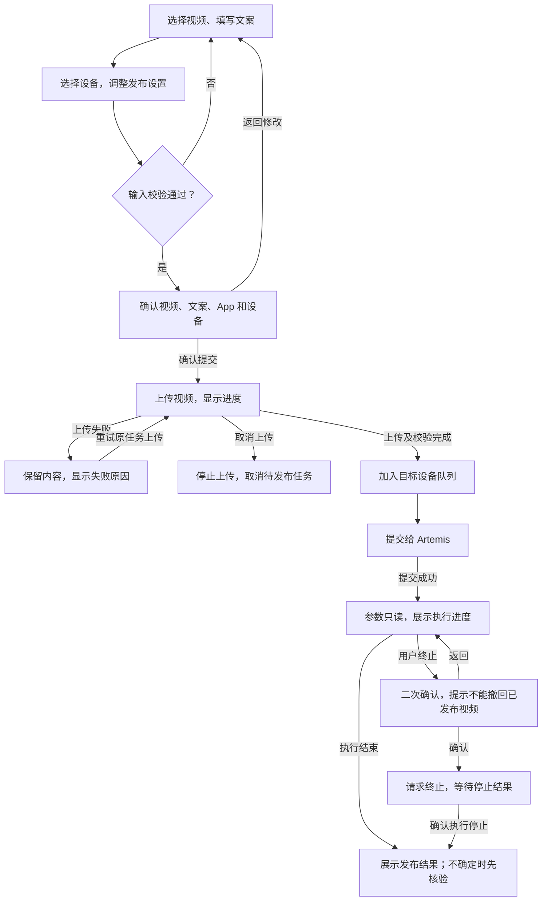
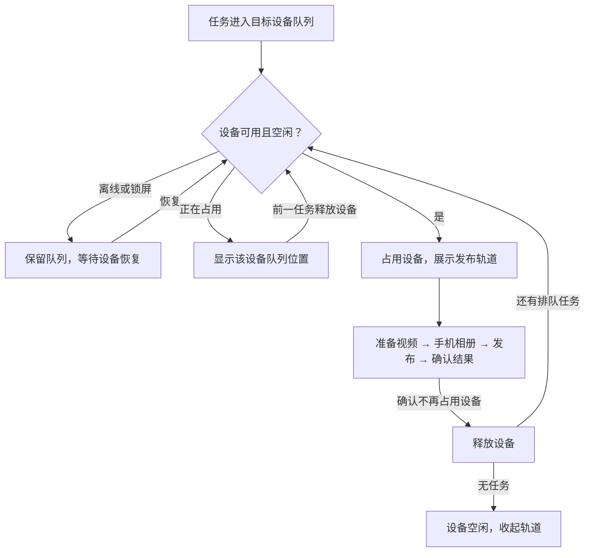
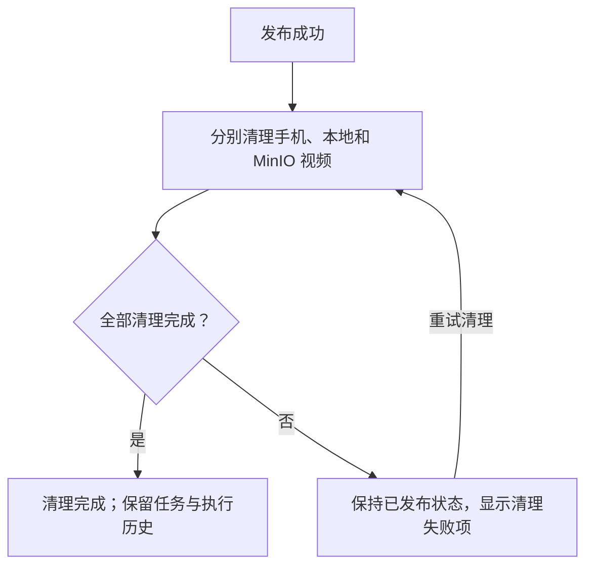
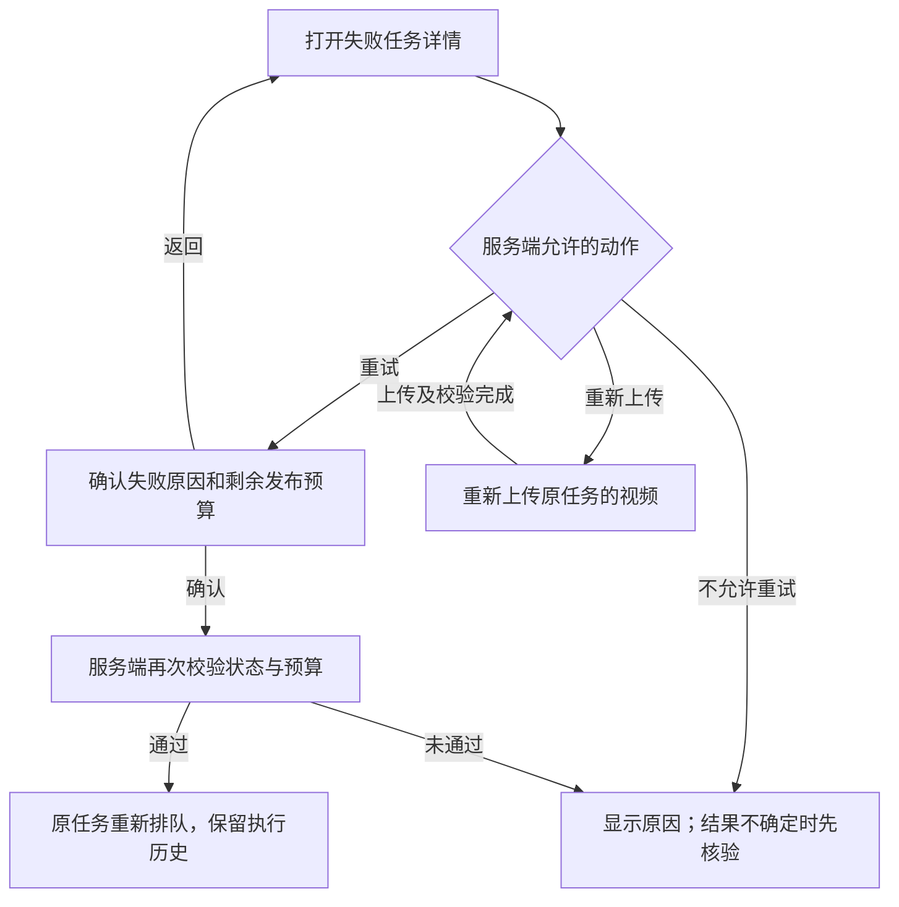
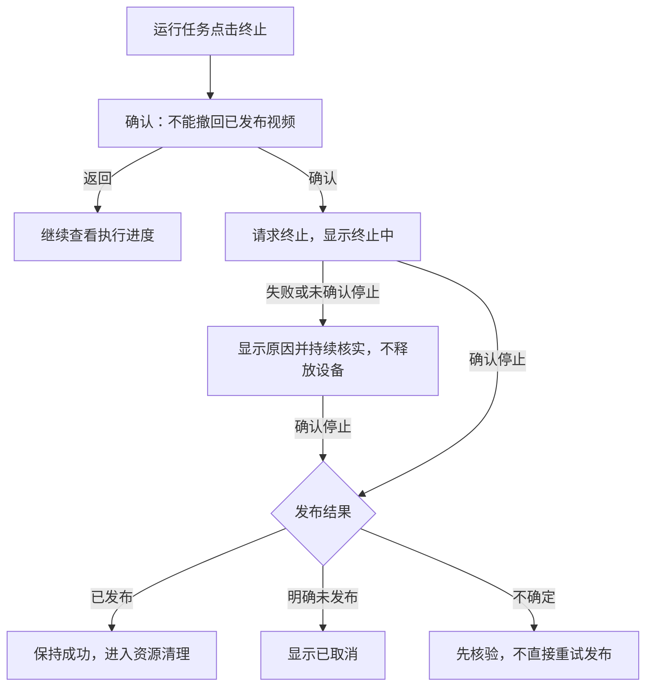
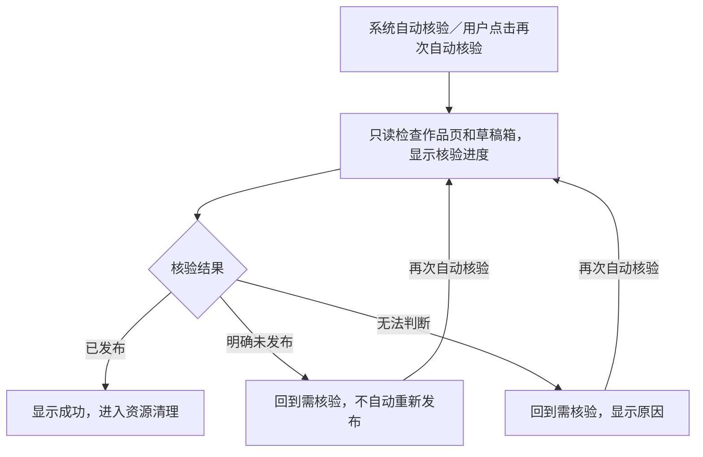
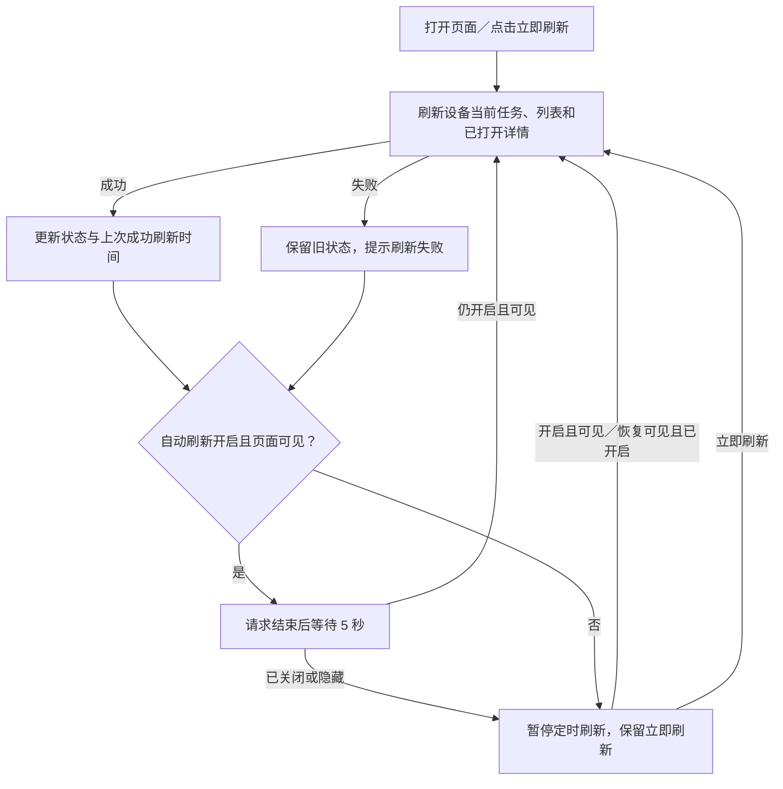

# TikTok 视频发布：产品方案

> **文档导航**：[产品方案](01-product-proposal.md) · [技术设计](02-technical-design.md) · [实施计划](03-implementation-plan.md) · [测试计划和结果](04-test-plan-and-results.md)

> 来源基线：`docs/video-publish-design@b88b26c` 中的 `docs/design/tiktok-video-publish.md`。
> 本目录按职责拆分原 2781 行单体文档；四个文件共同构成当前项目文档集。

## 文档职责

本文说明目标产品行为、页面交互、权限和验收要求。配套技术设计、实施计划和测试文档须同步本次需求修订；本文不代表功能已实现。

## 产品验收摘要

| 目标 | 验收结果 |
| --- | --- |
| 安全投递 | 同一次确认最多创建一个任务；上传重试不重复发布 |
| 状态可信 | 状态、允许动作、队列位置和 Artemis ID 以服务端为准 |
| 可恢复 | 上传中断、Worker 重启、设备离线和外部依赖失败有恢复路径 |
| 可解释 | 错误说明发生位置、影响和下一步动作 |
| 可操作 | 桌面与移动端均可创建、续传、查看、核验、终止和重试清理 |
| 权限安全 | readonly/readwrite/admin 边界清晰；不暴露凭据和任意 ADB 命令 |

## 1. 背景与目标

运营人员上传视频、填写文案并选择设备。ttsERP 保存任务与媒资，按设备串行调度 Artemis 操作 TikTok；不同设备可并行。确认发布成功后清理视频。

本方案的核心边界是：

- **ttsERP 是业务任务与状态真相源**：管理上传、队列、重试、核验、审计和清理；
- **Artemis 是手机操作执行器**：按提交的 Prompt、设备和 App 执行自动化；
- **MinIO 是临时媒资存储**：保存对象引用，不把预签名 URL 当作永久字段；
- **浏览器只调用 ttsERP**：不直接调用 Artemis 或 ADB，不自行判定发布结果。

### 1.1 已确认需求

1. 一个任务上传一个视频并填写一份文案。
2. 视频保存到 MinIO；数据库保存文案与对象引用。
3. 后台通过 ADB 把视频放入手机专用相册，再调用 Artemis。
4. 每台设备同一时间只执行一个发布任务；多台设备可并行。
5. Prompt 明确 App、视频来源、文案和成功/失败条件；保存每次执行的快照。
6. Artemis 支持按 `session_id` 查询状态，通过 `device_serial` 指定设备。
7. 明确失败后可重试原任务，保留全部执行历史。
8. 优先自动核验；仍无法判定时才进入人工处理。
9. 前端默认每 5 秒刷新，可关闭自动刷新或立即刷新；不提供智能模式。
10. 每次执行展示完整 Artemis session ID，并支持一键复制。
11. 发布成功后清理手机、本地临时文件和 MinIO 视频。
12. 普通运营可在 Artemis 提交成功前编辑 Prompt、App package 和设备序列号；提交成功后不可编辑，但可终止正在执行的任务。

### 1.2 非目标

- v1 不支持一个任务发布多个视频；
- v1 不允许修改已成功提交给 Artemis 的任务参数；
- v1 不实现 TikTok Shop Open API 发帖；发布仍通过手机 UI；
- v1 不暴露任意 ADB shell 命令；
- v1 不保证设备或 TikTok 完全不可用时零人工介入。

## 2. 领域术语与不变量

| 术语 | 含义 |
| --- | --- |
| 发布任务（publish task） | 发布一个视频和一份文案的业务意图；重试不新建任务 |
| 执行记录（attempt） | 一次 Artemis session；一个任务可保留多条记录 |
| 正式发布执行（publish attempt） | 最多点击一次最终发布按钮 |
| 核验执行（verify attempt） | 只查看作品页/草稿箱，不进入上传页面或点击发布 |
| 设备暂存文件 | ADB 放入 `/sdcard/Movies/TTSERP/` 的任务专属文件 |
| 业务成功 | Artemis 返回成功，或核验确认目标视频已发布 |
| 结果不确定 | 无法证明最终发布动作是否发生 |

必须始终成立：

1. 一个发布任务引用一个 MinIO 视频对象和一份文案。
2. 一个 Artemis `session_id` 只属于一条执行记录；网络重试复用该 ID。
3. 同一个任务不能同时存在两条运行中的执行记录。
4. 同一设备不能被两个任务同时占用；不同设备互不阻塞。
5. 正式发布执行最多点击一次最终发布按钮。
6. 结果不确定时先核验，不能直接重试发布。
7. 发布成功与清理独立；清理失败不改变业务成功。
8. 终止不等于撤回视频；确认执行停止前不能释放设备给下一个任务。

## 10. 前端 UI 与交互设计

### 10.1 页面定位

| 项目 | 说明 |
| --- | --- |
| 入口 | 数据工具 → 视频发布；`GET /v2/pages/video-publish` |
| 用户与权限 | 内容运营；`page:video-publish` |
| 页面目标 | 创建发布任务，查看进度和结果 |
| 视觉 | 沿用全站颜色、字体和状态样式 |
| 标志性元素 | 保留“单线发布轨道”：每台设备一条，表达同设备串行、多设备并行 |

### 10.2 桌面信息架构

```text
视频发布

正在发布
手机 A · video-a.mp4 · 发布中                         [查看]
准备视频 ━━ 手机相册 ━━ 发布 ◉ ━━ 确认结果 ○
手机 B · video-b.mp4 · 核验中                         [查看]
准备视频 ━━ 手机相册 ━━ 发布 ━━ 确认结果 ◉

新建任务
[选择视频 / 预览]            目标设备 [手机 A ▾]
[文案输入]                  [发布设置 ▾]
                            [上传并加入发布队列]

任务记录
[状态筛选 ▾] [设备筛选 ▾]    自动刷新 [开启] · 每5秒 [立即刷新]
视频             设备       状态        创建时间       操作
video-c.mp4      手机 A     排队中       10:42         查看
video-d.mp4      手机 B     发布失败     10:31         重试
```

不设重复的“本次投递”摘要面板。技术字段放详情；完整内容仅在提交确认时复核。

### 10.3 移动端布局

| 区域 | 布局 |
| --- | --- |
| 正在发布 | 按设备纵向排列；轨道保留文字 |
| 新建任务 | 视频 → 文案 → 设备 → 发布设置 → 提交 |
| 任务记录 | 卡片显示视频、设备、状态、时间和主要动作 |
| 任务详情 | 桌面侧栏、移动端全屏；关闭后保留筛选和滚动位置 |

### 10.4 创建任务交互

#### 创建与执行流程



#### 交互规则

| 环节 | 页面反馈 | 操作与限制 |
| --- | --- | --- |
| 初始 | 显示格式、大小和文案上限 | 校验通过前禁用提交 |
| 选择视频 | 文件名、大小、静音预览、时长和分辨率 | 可重新选择；不自动上传；前后端均校验文件 |
| 输入文案 | 字符计数；超限提示 | 保留换行、emoji、标签，不改写文案 |
| 发布设置 | 目标设备；展开查看 Prompt、App package、设备序列号 | Artemis 提交成功前可编辑；服务端校验目标与参数 |
| 确认提交 | 展示视频、完整文案、App、设备；提示空闲设备可能立即执行 | 一次确认只创建一个业务任务 |
| 上传中 | 真实百分比；取消上传 | 文件和文案暂时锁定；离开页面提示上传未完成 |
| 上传完成 | 校验通过后显示排队状态 | 清空表单，任务进入列表 |
| 上传失败 | 保留文件、文案，显示原因和重试入口 | 续传原任务，不重复创建 |
| 刷新后续传 | 重新选择文件继续，或取消任务 | 浏览器不能恢复本地文件；前端检查文件名/大小，后端校验对象 |
| Artemis 提交中/成功 | 提交中暂时锁定；成功后只读 | 提交结果不确定时先核实，不重复提交；运行中可终止 |

### 10.5 当前发布轨道

各设备独立执行下列流程，可并行发布；每台设备只展示一个占用中的任务，空闲时不画轨道。



| 阶段 | 显示内容 |
| --- | --- |
| 准备视频 | 正在下载并校验视频 |
| 手机相册 | 正在写入手机相册 |
| 发布 | 正在提交 Artemis / 正在操作 TikTok |
| 确认结果 | 正在核验是否已发布 |
| 完成 | 收起轨道，保留任务记录；清理结果单独显示 |

轨道旁只显示设备、视频、当前阶段和“查看”。运行中的可终止任务在详情提供终止入口；完整 Artemis ID、执行次数和耗时放详情。

### 10.6 队列与任务列表

| 项目 | 内容 |
| --- | --- |
| 筛选 | 设备；全部、排队、执行中、失败、需核验、成功、已取消 |
| 主列表 | 视频、设备、状态、创建时间、主要动作 |
| 排队信息 | 目标设备的队列位置；其他设备队列不计入 |
| 详情信息 | 完整文案、文件元数据、创建人、执行历史和 Artemis ID |
| 动作来源 | 只显示服务端允许的动作；写入时再次校验状态和权限 |

### 10.7 状态与操作矩阵

| 状态 | 可执行操作 | 限制 |
| --- | --- | --- |
| 待上传（awaiting_upload） | 继续上传、取消 | 不可发布重试 |
| 排队（queued） | 查看队列、编辑发布设置、取消 | 不修改已确认上传的视频/文案 |
| 等待设备（waiting_device） | 查看原因、编辑发布设置、取消 | 变更目标须校验并更新队列位置 |
| 执行中（running） | 查看；Artemis 已提交且仍在执行时可终止 | 提交中暂时锁定，提交成功后不可编辑；不可重试或再次提交 |
| 失败且可重试（failed） | 重试原任务、查看历史 | 不新建重复任务 |
| 结果不确定（needs_review） | 再次自动核验、查看原因 | 不直接重试发布 |
| 已发布（succeeded） | 查看；清理失败时重试清理 | 不再次发布 |
| 已取消（cancelled） | 查看 | 不恢复原执行记录 |

### 10.8 任务详情

| 区域 | 内容与动作 |
| --- | --- |
| 状态与操作 | 当前结果、失败原因、下一步；运行中终止需二次确认 |
| 发布内容 | 视频元数据、完整文案、App、设备和 Prompt；提交成功后只读 |
| 执行历史 | 倒序展示每次发布/核验的类型、状态、设备、起止时间、错误 |
| Artemis ID | 每次执行展示完整 ID 并一键复制；未创建时明确标注；不只保留最后一次 |
| 资源清理 | 手机、本地、MinIO 独立结果；清理失败可重试 |
| 诊断输出 | 原始 Artemis output 默认折叠，仅 admin 或诊断权限可查看 |

#### 资源清理流程



### 10.9 重试与终止

#### 重试流程



#### 终止流程



#### 交互规则

| 场景 | 交互 | 结果与限制 |
| --- | --- | --- |
| 明确失败且允许重试 | 确认框显示失败原因、已消耗发布预算/上限 | 原视频、原文案重新排队；新增执行记录，不新增业务任务；执行记录总数不等于预算消耗 |
| 视频对象丢失或已清理 | 要求重新上传 | 不创建必然失败的执行记录 |
| 运行中终止 | 二次确认，提示“终止不能撤回已发布视频” | 显示终止处理中；确认执行停止后才释放设备 |
| 终止失败或结果不确定 | 显示原因并持续核实执行状态 | 不提前显示已取消；停止后若发布结果仍不确定，先核验 |
| 终止时已发布 | 显示已发布 | 不把成功改成取消 |

### 10.10 自动核验



| 场景/结果 | 页面行为 | 限制 |
| --- | --- | --- |
| 系统自动核验 | 轨道显示“确认结果” | 只查看作品页/草稿箱，不发布 |
| 需再次核验 | 提供“再次自动核验”，说明不会发布内容 | 不显示普通发布重试 |
| 确认已发布 | 显示成功 | 进入清理流程 |
| 单次确认未发布或仍不确定 | 回到“需核验”，显示原因 | 不自动重新发布；v1 不提供强制跳过核验 |

### 10.11 自动刷新



| 项目 | 规则 |
| --- | --- |
| 默认 | 每 5 秒刷新各设备当前任务、列表和已打开详情；无智能模式和多档频率 |
| 控制 | 自动刷新开关、立即刷新；记住刷新偏好，不保存任务内容或凭据 |
| 关闭 | 停止定时刷新，显示“自动刷新已暂停”；仍可手动刷新 |
| 页面隐藏 | 暂停自动刷新；重新可见且开关开启时立即刷新 |
| 刷新失败 | 保留上次状态和成功刷新时间，提示失败并重试；不清空正在编辑的内容 |
| 一致性 | 不重叠请求、不用旧响应覆盖新状态、不抢焦点；只查询 ttsERP |

### 10.12 空态与错误提示

| 场景 | 提示与下一步 |
| --- | --- |
| 无任务/无排队任务 | “还没有发布任务”并提供创建入口 / “当前没有等待中的视频” |
| 设备离线或锁屏 | 说明目标设备不可用；保留队列，恢复后继续，不阻塞其他设备 |
| 上传中断 | “视频上传中断，文件和文案已保留” → 重试上传 |
| 对象校验失败 | 说明不匹配项 → 重新上传 |
| 发布结果不确定 | “无法确认是否已发布” → 自动核验，避免重复发布 |

错误只显示发生位置、原因和下一步，不展示堆栈或笼统的“操作失败”。

### 10.13 可访问性与安全

| 项目 | 要求 |
| --- | --- |
| 输入与导航 | 文件选择不只依赖拖放；支持键盘操作、弹窗焦点管理和关闭后焦点恢复 |
| 状态与进度 | 文字和图形共同表达状态；播报关键变化，上传进度有数值；尊重减少动画偏好 |
| 内容安全 | 文件名、文案、Prompt、错误和 output 按纯文本展示 |
| 凭据与控制 | 浏览器不获取 MinIO/Artemis 凭据，不直接控制设备或输入任意 ADB 命令 |

## 11. 权限

所有页面操作均须 `page:video-publish`；写操作还须对应角色和服务端状态校验。

| 操作 | 最低角色 |
| --- | --- |
| 查看任务、执行历史、Artemis ID | readonly |
| 创建、确认上传、取消待执行任务 | readwrite |
| Artemis 提交成功前编辑 Prompt、App package、设备序列号 | readwrite |
| 终止运行任务、重试、核验、重试清理 | readwrite |
| 查看原始 Artemis output | admin 或诊断权限 |
| 编辑已成功提交的任务参数、强制跳过核验 | v1 不提供 |

页面权限默认只授予 admin；运营人员在发布门禁通过后由 admin 手工授权，viewer 默认不授权。
