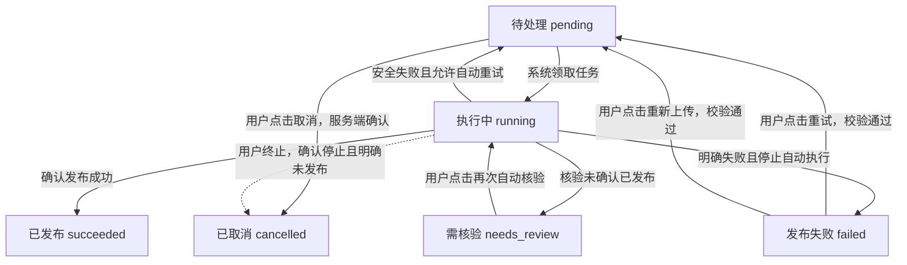
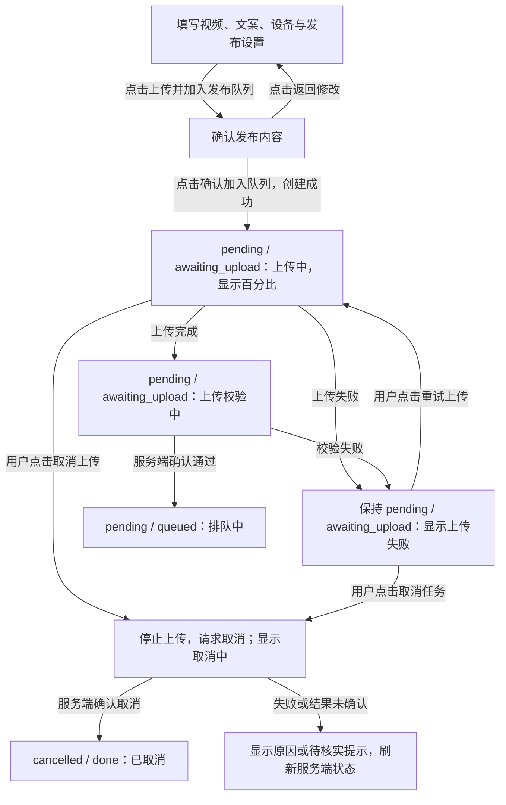
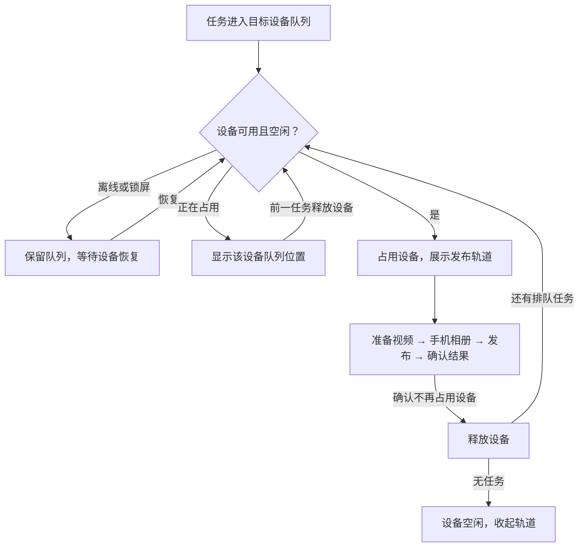
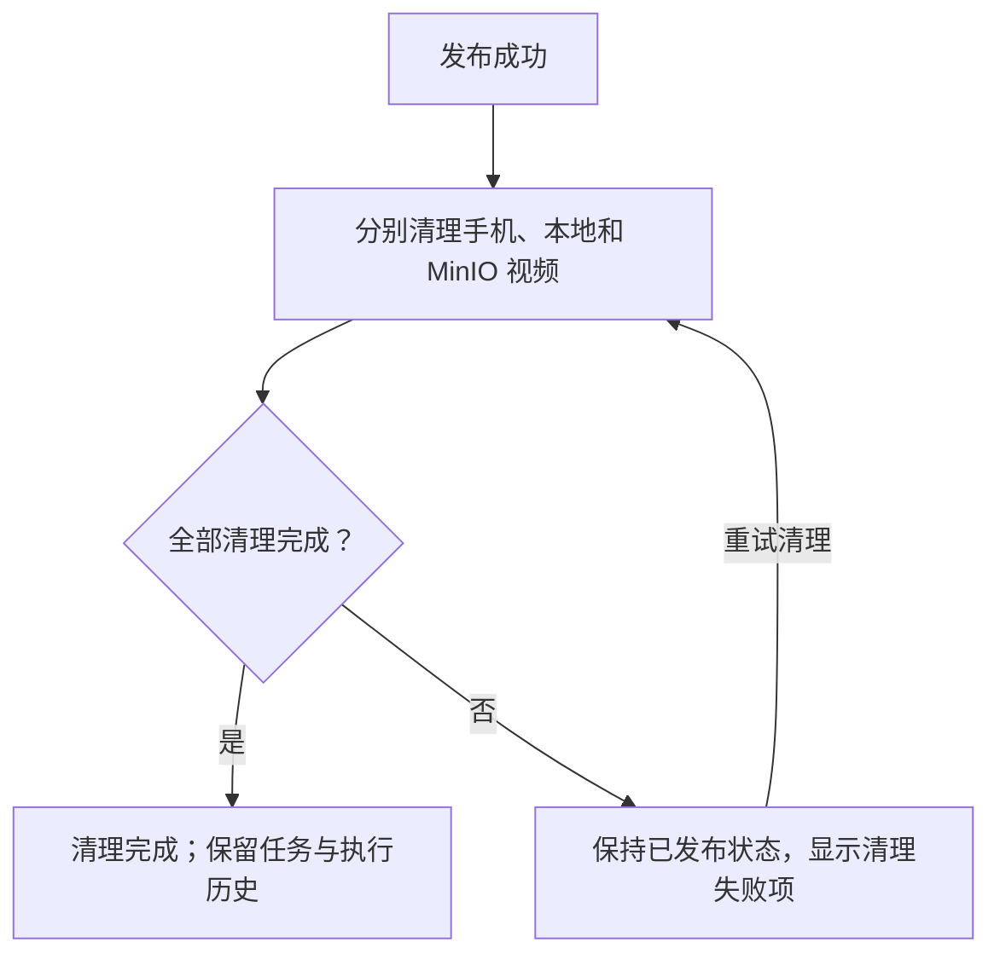
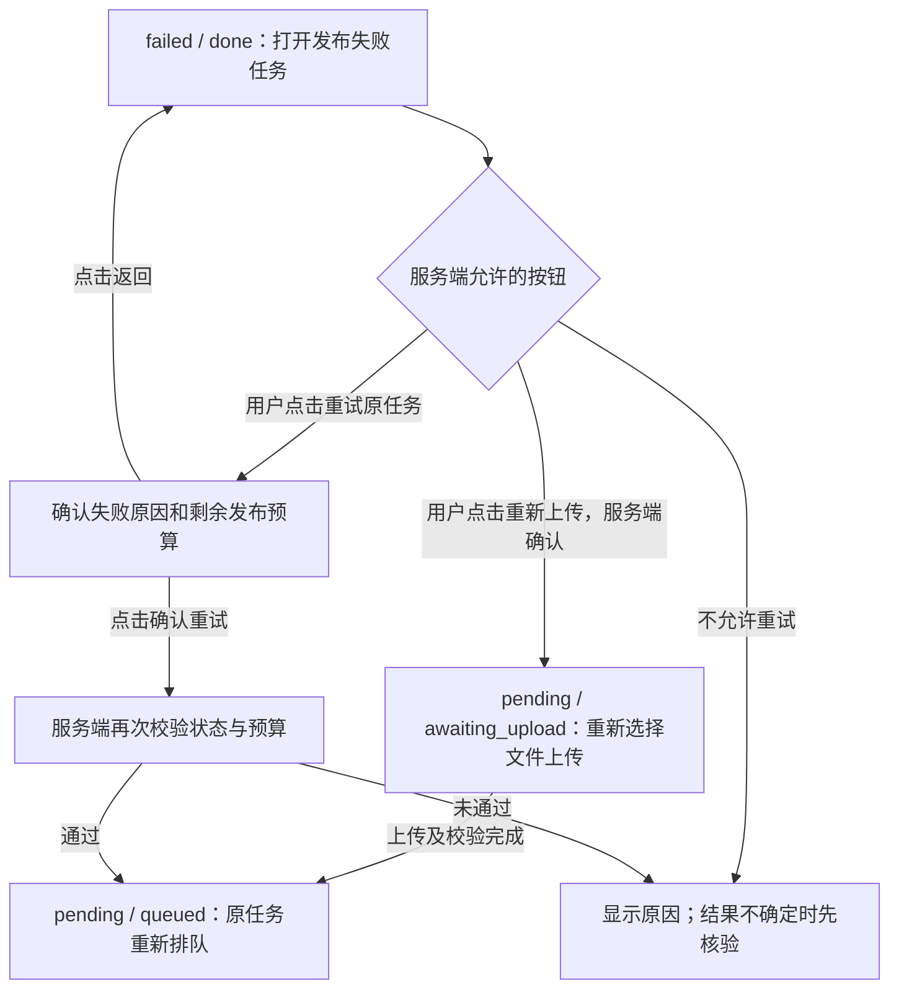
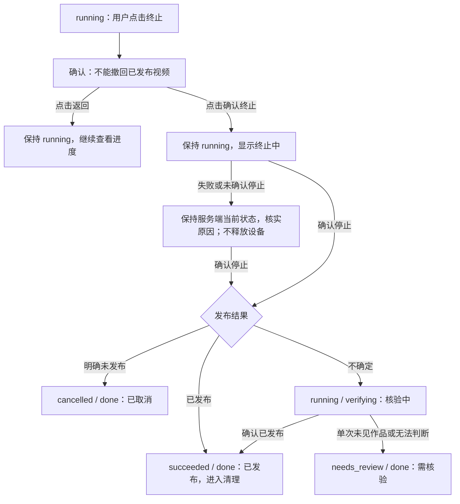
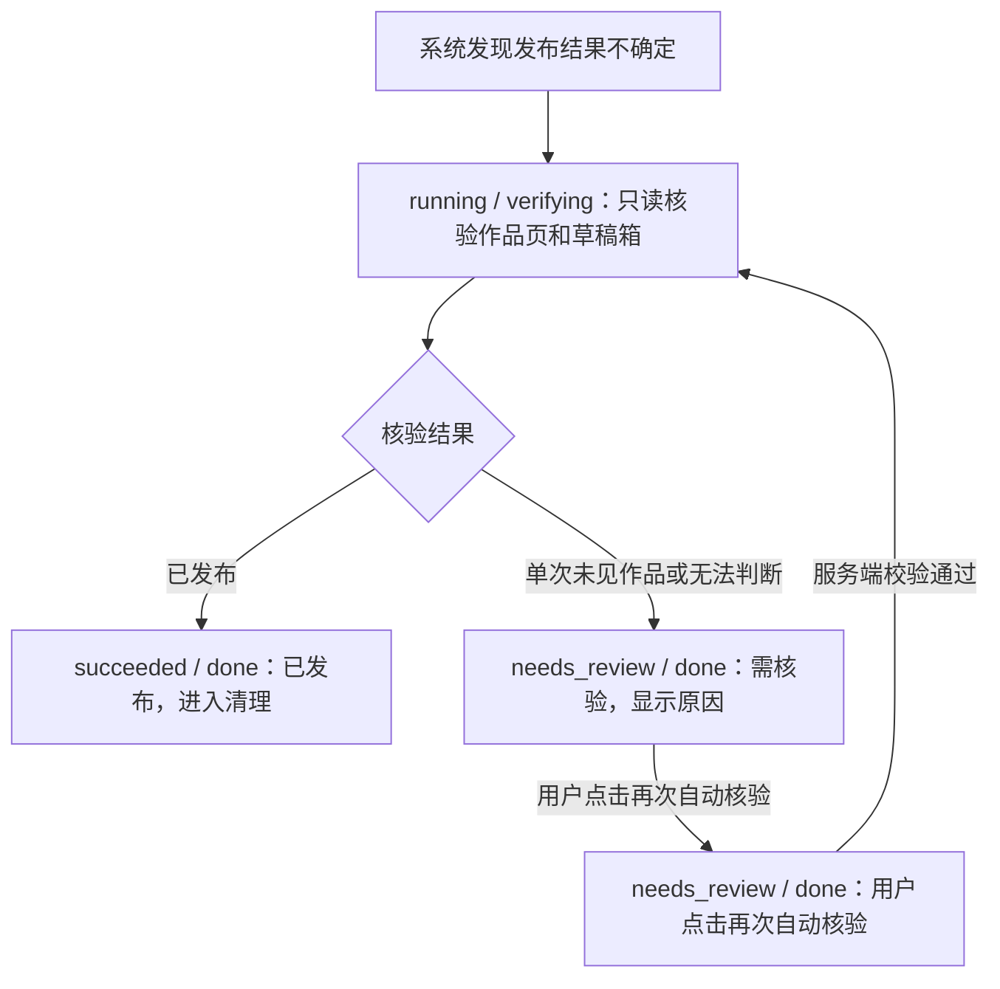
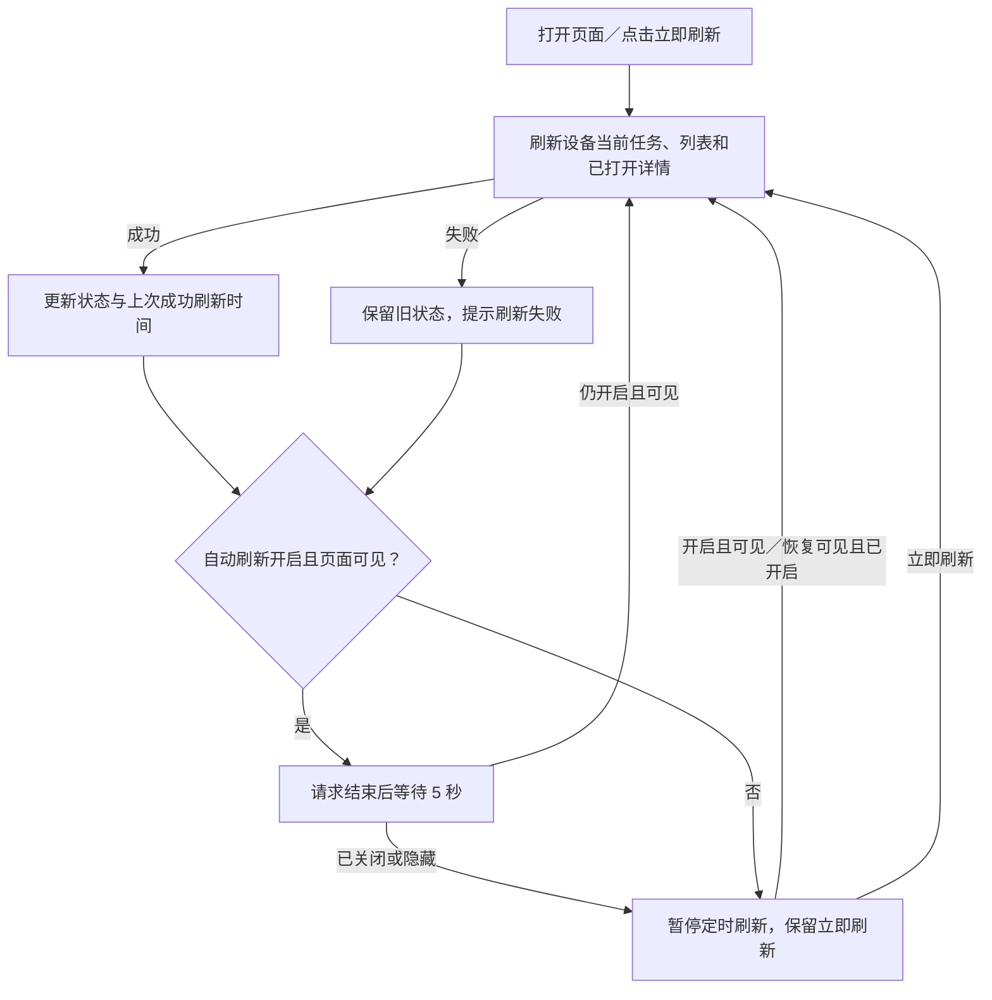

# TikTok 视频发布：产品方案

> **文档导航**：[产品方案](01-product-proposal.md) · [技术设计](02-technical-design.md) · [实施计划](03-implementation-plan.md) · [测试计划和结果](04-test-plan-and-results.md)

> 来源基线：`docs/video-publish-design@b88b26c` 中的 `docs/design/tiktok-video-publish.md`。
> 本目录按职责拆分原 2781 行单体文档；四个文件共同构成当前项目文档集。

## 文档职责

本文说明目标产品行为、页面交互、权限和验收要求。配套技术设计、实施计划和测试文档须同步本次需求修订；本文不代表功能已实现。

## 1. 背景

TikTok 手机 UI 发布涉及准备视频、写入相册、填写文案和确认发布。手机自动化的执行状态并不总能直接证明视频是否已发布；浏览器中断、设备离线或结果不确定时，还需要追踪任务、判断结果并恢复执行。

运营关注的是“是否发布、卡在哪里、下一步怎么处理”，仅凭单次手机执行日志不足以回答这些问题。

## 2. 目标

### 2.1 定性目标

| 目标 | 预期效果 |
| --- | --- |
| 统一投递 | 在一个入口提交视频、文案和设备，查看从上传、排队到发布及清理的全过程 |
| 状态可信 | 发布结果、进度和允许动作以 ttsERP 为准；不把“执行结束”误当成“发布成功” |
| 可控可恢复 | 普通运营在成功提交前按允许动作编辑 Prompt、App package 和设备；成功提交后只读但可终止。明确失败重试原任务，结果不确定先自动核验，仍无法判断时再人工处理 |
| 易用且安全 | 桌面和移动端均可完成主要操作；错误说明原因和下一步；按角色授权，不暴露凭据或任意 ADB 命令 |

### 2.2 定量目标

以下是 v1 验收目标，不代表已经达到。次数和覆盖率以对应验收场景统计，不作为未经测量的线上发布成功率或耗时承诺。

| 指标 | 目标值 | 验证方式 |
| --- | --- | --- |
| 任务粒度 | 每个任务 1 个视频、1 份文案 | 创建任务并核对详情 |
| 防重复投递 | 同一次确认创建任务数 ≤1；上传重试新增任务数为 0 | 重复点击、请求重发和上传失败重试后核对任务数 |
| 设备并发 | 同一设备同时执行任务数 ≤1；至少 2 台不同设备可并行 | 两台设备各排入两个任务，检查同设备串行、跨设备并行 |
| 页面刷新 | 默认刷新间隔设置为 5 秒；提供关闭和立即刷新操作，不提供智能模式 | 检查默认设置、关闭后自动轮询停止、手动刷新仍可用 |
| 执行留痕 | 已创建 Artemis session 的执行记录完整 ID 展示/复制覆盖率 100%；每次执行保留参数快照和历史 | 核对首次发布、重试及核验记录的 ID、Prompt、App 和设备快照 |
| 参数与权限安全 | 成功提交 Artemis 后参数修改成功次数为 0；越权写入成功次数为 0 | 提交后尝试修改参数，并验证各角色操作边界 |
| 取消/终止确认 | 未确认取消或执行停止时，误显示“已取消”或提前释放设备的次数为 0 | 验证请求拒绝、超时和确认延迟场景 |
| 资源清理 | 手机、本地临时文件、MinIO 共 3 处分别展示清理结果；清理失败导致发布成功变为失败的次数为 0 | 模拟各处清理失败，核对独立结果、重试入口和发布状态 |

### 2.3 非目标

- v1 不支持一个任务发布多个视频；
- v1 不允许修改已成功提交给 Artemis 的任务参数；
- v1 不实现 TikTok Shop Open API 发帖；发布仍通过手机 UI；
- v1 不暴露任意 ADB shell 命令；
- v1 不保证设备或 TikTok 完全不可用时零人工介入。

## 3. 领域术语与不变量

本方案的核心边界是：

- **ttsERP 是业务任务与状态真相源**：管理上传、队列、重试、核验、审计和清理；数据库保存文案与视频对象引用；
- **Artemis 是手机操作执行器**：按 Prompt、设备和 App 执行自动化；Prompt 明确 App、视频来源、文案和成功/失败条件；通过 `device_serial` 指定设备，通过 `session_id` 查询执行；
- **MinIO 是临时媒资存储**：保存对象引用，不把预签名 URL 当作永久字段；
- **浏览器只调用 ttsERP**：不直接调用 Artemis 或 ADB，不自行判定发布结果。

视频先上传到 MinIO，再由后台通过 ADB 放入手机专用相册，最后由 Artemis 执行 TikTok UI 发布。

| 术语 | 含义 |
| --- | --- |
| 发布任务（publish task） | 发布一个视频和一份文案的业务意图；重试不新建任务 |
| 执行记录（attempt） | 一次 Artemis session；一个任务可保留多条记录 |
| 正式发布执行（publish attempt） | 最多点击一次最终发布按钮 |
| 核验执行（verify attempt） | 只查看作品页/草稿箱，不进入上传页面或点击发布 |
| 设备暂存文件 | ADB 放入 `/sdcard/Movies/TTSERP/` 的任务专属文件 |
| 业务成功 | Artemis 返回成功，或核验确认目标视频已发布 |
| 结果不确定 | 无法证明最终发布动作是否发生 |

必须始终成立：

1. 一个发布任务引用一个 MinIO 视频对象和一份文案。
2. 一个 Artemis `session_id` 只属于一条执行记录；网络重试复用该 ID。
3. 同一个任务不能同时存在两条运行中的执行记录。
4. 同一设备不能被两个任务同时占用；不同设备互不阻塞。
5. 正式发布执行最多点击一次最终发布按钮。
6. 结果不确定时先核验，不能直接重试发布。
7. 发布成功与清理独立；清理失败不改变业务成功。
8. 终止不等于撤回视频；确认执行停止前不能释放设备给下一个任务。

## 4. 任务状态与流转

### 4.1 六个业务主状态

**业务主状态共 6 个。** 页面同时显示主状态和执行阶段；上传进度、取消中、终止中是操作反馈，不增加业务主状态。

| 主状态 | 页面名称 | 含义 |
| --- | --- | --- |
| `pending` | 待处理 | 等待上传、排队或等待设备 |
| `running` | 执行中 | 准备视频、写入手机、提交 Artemis、发布或核验 |
| `succeeded` | 已发布 | 已确认发布成功；清理可尚未完成 |
| `failed` | 发布失败 | 本轮执行结束，不再自动执行；是否可重试以服务端允许动作为准 |
| `needs_review` | 需核验 | 核验尚未确认已发布，不能直接重新发布 |
| `cancelled` | 已取消 | 服务端确认取消，或确认执行已停止且明确未发布 |

### 4.2 主状态流转



虚线是运行中终止的目标新增转换，现有实现与配套技术设计尚需补齐。终止请求被接收不等于任务已取消；已发布保持成功，发布结果不确定时先核验。

### 4.3 执行阶段与页面名称

有效执行阶段共 9 个，不是 9 个额外业务状态。历史枚举中的 `cleaning` 不用于当前任务阶段，资源清理单独展示。

| 主状态 | 阶段 | 页面阶段名称 |
| --- | --- | --- |
| `pending` | `awaiting_upload` | 待上传 |
| `pending` | `queued` | 排队中 |
| `pending` | `waiting_device` | 等待设备 |
| `running` | `downloading` | 准备视频 |
| `running` | `staging_device` | 写入手机相册 |
| `running` | `dispatching_artemis` | 提交 Artemis |
| `running` | `waiting_artemis` | 发布中 |
| `running` | `verifying` | 核验中 |
| `succeeded/failed/needs_review/cancelled` | `done` | 显示对应主状态，不额外显示“done” |

主状态和阶段以服务端为准；例如列表显示“待处理 · 排队中”“执行中 · 核验中”。清理失败不把“已发布”改成“发布失败”。

## 10. 前端 UI 与交互设计

### 10.1 页面定位

| 项目 | 说明 |
| --- | --- |
| 入口 | 数据工具 → 视频发布；`GET /v2/pages/video-publish` |
| 用户与权限 | 内容运营；`page:video-publish` |
| 页面目标 | 创建发布任务，查看进度和结果 |
| 视觉 | 沿用全站颜色、字体和状态样式 |
| 标志性元素 | 保留“单线发布轨道”：每台设备一条，表达同设备串行、多设备并行 |

### 10.2 桌面信息架构

```text
视频发布

正在发布
手机 A · video-a.mp4 · 发布中                         [查看]
准备视频 ━━ 手机相册 ━━ 发布 ◉ ━━ 确认结果 ○
手机 B · video-b.mp4 · 核验中                         [查看]
准备视频 ━━ 手机相册 ━━ 发布 ━━ 确认结果 ◉

新建任务
[选择视频 / 预览]            目标设备 [手机 A ▾]
[文案输入]                  [发布设置 ▾]
                            [上传并加入发布队列]

任务记录
[状态筛选 ▾] [设备筛选 ▾]    自动刷新 [开启] · 每5秒 [立即刷新]
视频             设备       状态        创建时间       操作
video-c.mp4      手机 A     排队中       10:42         查看
video-d.mp4      手机 B     发布失败     10:31         重试
```

不设重复的“本次投递”摘要面板。技术字段放详情；完整内容仅在提交确认时复核。

### 10.3 移动端布局

| 区域 | 布局 |
| --- | --- |
| 正在发布 | 按设备纵向排列；轨道保留文字 |
| 新建任务 | 视频 → 文案 → 设备 → 发布设置 → 提交 |
| 任务记录 | 卡片显示视频、设备、状态、时间和主要动作 |
| 任务详情 | 桌面侧栏、移动端全屏；关闭后保留筛选和滚动位置 |

### 10.4 创建任务交互

#### 创建与上传流程

填写表单时尚无业务任务；服务端创建成功后进入 `pending/awaiting_upload`。



#### 交互规则

| 环节 | 页面反馈 | 操作与限制 |
| --- | --- | --- |
| 初始 | 显示格式、大小和文案上限 | 校验通过前禁用提交 |
| 选择视频 | 文件名、大小、静音预览、时长和分辨率 | 可重新选择；不自动上传；前后端均校验文件 |
| 输入文案 | 字符计数；超限提示 | 保留换行、emoji、标签，不改写文案 |
| 发布设置 | 目标设备；展开查看 Prompt、App package、设备序列号 | Artemis 提交成功前可编辑；服务端校验目标与参数 |
| 确认提交 | 展示视频、完整文案、App、设备；提示空闲设备可能立即执行 | 一次确认只创建一个业务任务 |
| 上传中 | 真实百分比；“取消上传”按钮 | 主状态仍为 pending；文件和文案暂时锁定 |
| 上传完成 | 先显示“上传校验中”，确认通过后显示“待处理 · 排队中” | 确认通过后清空表单，任务进入列表 |
| 上传失败 | 保留文件、文案，显示原因及“重试上传”“取消任务”按钮 | 不自动重试；点击重试后重新上传原视频，复用原任务 |
| 刷新后继续上传 | “重新选择文件继续”“取消任务”按钮 | 浏览器不能恢复本地文件；前后端重新校验所选文件 |
| Artemis 提交中/成功 | 提交中暂时锁定；成功后只读 | 提交结果不确定时先核实，不重复提交；运行中可终止 |

### 10.5 当前发布轨道

各设备独立执行下列流程，可并行发布；每台设备只展示一个占用中的任务，空闲时不画轨道。



| 阶段 | 显示内容 |
| --- | --- |
| 准备视频 | 正在下载并校验视频 |
| 手机相册 | 正在写入手机相册 |
| 发布 | 正在提交 Artemis / 正在操作 TikTok |
| 确认结果 | 正在核验是否已发布 |
| 完成 | 收起轨道，保留任务记录；清理结果单独显示 |

轨道旁只显示设备、视频、当前阶段和“查看”。运行中的可终止任务在详情提供终止入口；完整 Artemis ID、执行次数和耗时放详情。

### 10.6 队列与任务列表

| 项目 | 内容 |
| --- | --- |
| 筛选 | 设备；全部、待处理、执行中、发布失败、需核验、已发布、已取消 |
| 主列表 | 视频、设备、主状态＋阶段/操作反馈、创建时间、主要动作 |
| 排队信息 | 目标设备的队列位置；其他设备队列不计入 |
| 详情信息 | 完整文案、文件元数据、创建人、执行历史和 Artemis ID |
| 动作来源 | 只显示服务端允许的动作；写入时再次校验状态和权限 |

### 10.7 状态与操作矩阵

主状态和阶段定义见 §4。所有按钮以服务端允许动作为准；下表明确是用户点击还是系统自动触发。

#### 操作流转

| 当前状态/阶段 | 触发方式 | 下一状态/阶段 | 页面展示与按钮 |
| --- | --- | --- | --- |
| pending/awaiting_upload | 用户点击“继续上传”或“重试上传” | 保持 pending/awaiting_upload | 上传中、百分比、“取消上传” |
| pending/awaiting_upload | 上传或校验失败 | 保持 pending/awaiting_upload | 上传失败、原因、“重试上传”“取消任务”；不自动重试 |
| pending/awaiting_upload | 系统确认上传校验通过 | pending/queued | 待处理 · 排队中、队列位置、“取消任务” |
| pending/queued | 系统发现设备不可用 | pending/waiting_device | 待处理 · 等待设备、原因、“取消任务” |
| pending/waiting_device | 系统确认设备恢复 | pending/queued | 待处理 · 排队中 |
| pending/queued | 系统领取任务 | running/downloading | 执行中 · 准备视频；不提供发布重试 |
| 任一 pending | 用户点击取消，服务端确认成功 | cancelled/done | 已取消；不恢复原执行记录 |
| running/waiting_artemis | 系统判定安全失败且预算允许，自动重试 | pending/queued | 待处理 · 排队中；显示自动重试原因 |
| running | 系统确认发布成功 | succeeded/done | 已发布；清理结果独立展示 |
| running | 系统确认失败且不再自动执行 | failed/done | 发布失败、原因；允许时显示“重试原任务” |
| running/verifying | 核验未确认已发布 | needs_review/done | 需核验、原因、“再次自动核验” |
| failed/done | 用户点击“重试原任务”，再次校验通过 | pending/queued | 待处理 · 排队中；复用原任务，不新建任务 |
| failed/done | 用户点击“重新上传”，服务端允许替换视频对象 | pending/awaiting_upload | 待处理 · 待上传；上传校验通过后进入队列 |
| needs_review/done | 用户点击“再次自动核验”，服务端允许执行 | running/verifying | 执行中 · 核验中；不可直接重新发布 |
| running | 用户确认终止，执行停止已确认且明确未发布 | cancelled/done | 已取消；这是目标新增转换 |

#### 操作反馈（不增加主状态）

| 页面反馈 | 当前业务状态 | 进入条件 | 结束条件/页面动作 |
| --- | --- | --- | --- |
| 上传中 | pending/awaiting_upload | 上传请求进行中 | 成功进入上传校验中；失败显示“重试上传”按钮 |
| 上传校验中 | pending/awaiting_upload | 上传完成，等待服务端对象校验 | 通过后排队；失败显示原因和重试按钮 |
| 上传失败 | pending/awaiting_upload | 上传或对象校验失败 | 用户点击“重试上传”后恢复上传进度 |
| 取消中 | 保持最近确认的 pending 状态 | 用户点击取消，等待服务端确认 | 确认取消后显示已取消；未确认时刷新核实，不假定已取消 |
| 终止中 | 保持 running，保留原阶段 | 用户确认终止，等待执行停止 | 停止后按发布结果收敛；失败/未确认时显示原因并持续核实 |

取消/终止请求处理中禁用重复操作。终止进度须能通过服务端刷新恢复，不能仅依赖本地按钮 busy；请求超时或拒绝不把任务改成 failed/cancelled。只有确认执行停止后才能释放设备。

Artemis 提交中暂时锁定参数；提交成功后不可编辑，重试也不解锁原提交参数。待执行任务可在未成功提交 Artemis 且服务端允许时编辑发布设置，变更设备后更新队列位置。

### 10.8 任务详情

| 区域 | 内容与动作 |
| --- | --- |
| 状态与操作 | 当前结果、失败原因、下一步；运行中终止需二次确认 |
| 发布内容 | 视频元数据、完整文案、App、设备和 Prompt；提交成功后只读 |
| 执行历史 | 倒序展示每次发布/核验的类型、状态、设备、起止时间、错误 |
| Artemis ID | 每次执行展示完整 ID 并一键复制；未创建时明确标注；不只保留最后一次 |
| 资源清理 | 手机、本地、MinIO 独立结果；清理失败可重试 |
| 诊断输出 | 原始 Artemis output 默认折叠，仅 admin 或诊断权限可查看 |

#### 资源清理流程



### 10.9 重试与终止

#### 重试流程



#### 终止流程



#### 交互规则

| 场景 | 交互 | 结果与限制 |
| --- | --- | --- |
| 明确失败且允许重试 | 确认框显示失败原因、已消耗发布预算/上限 | 原视频、原文案重新排队；新增执行记录，不新增业务任务；执行记录总数不等于预算消耗 |
| 视频对象丢失或已清理 | 要求重新上传 | 不创建必然失败的执行记录 |
| 运行中终止 | 二次确认，提示“终止不能撤回已发布视频” | 显示终止处理中；确认执行停止后才释放设备 |
| 终止失败或结果不确定 | 显示原因并持续核实执行状态 | 不提前显示已取消；停止后若发布结果仍不确定，先核验 |
| 终止时已发布 | 显示已发布 | 不把成功改成取消 |

### 10.10 自动核验



| 场景/结果 | 页面行为 | 限制 |
| --- | --- | --- |
| 系统自动核验 | 轨道显示“确认结果” | 只查看作品页/草稿箱，不发布 |
| 需再次核验 | 提供“再次自动核验”，说明不会发布内容 | 不显示普通发布重试 |
| 确认已发布 | 显示成功 | 进入清理流程 |
| 单次确认未发布或仍不确定 | 回到“需核验”，显示原因 | 不自动重新发布；v1 不提供强制跳过核验 |

### 10.11 自动刷新



| 项目 | 规则 |
| --- | --- |
| 默认 | 每 5 秒刷新各设备当前任务、列表和已打开详情；无智能模式和多档频率 |
| 控制 | 自动刷新开关、立即刷新；记住刷新偏好，不保存任务内容或凭据 |
| 关闭 | 停止定时刷新，显示“自动刷新已暂停”；仍可手动刷新 |
| 页面隐藏 | 暂停自动刷新；重新可见且开关开启时立即刷新 |
| 刷新失败 | 保留上次状态和成功刷新时间，提示失败并重试；不清空正在编辑的内容 |
| 一致性 | 不重叠请求、不用旧响应覆盖新状态、不抢焦点；只查询 ttsERP |

### 10.12 空态与错误提示

| 场景 | 提示与下一步 |
| --- | --- |
| 无任务/无排队任务 | “还没有发布任务”并提供创建入口 / “当前没有等待中的视频” |
| 设备离线或锁屏 | 说明目标设备不可用；保留队列，恢复后继续，不阻塞其他设备 |
| 上传中断 | “视频上传中断，文件和文案已保留” → 重试上传 |
| 对象校验失败 | 说明不匹配项 → 重新上传 |
| 发布结果不确定 | “无法确认是否已发布” → 自动核验，避免重复发布 |

错误只显示发生位置、原因和下一步，不展示堆栈或笼统的“操作失败”。

### 10.13 可访问性与安全

| 项目 | 要求 |
| --- | --- |
| 输入与导航 | 文件选择不只依赖拖放；支持键盘操作、弹窗焦点管理和关闭后焦点恢复 |
| 状态与进度 | 文字和图形共同表达状态；播报关键变化，上传进度有数值；尊重减少动画偏好 |
| 内容安全 | 文件名、文案、Prompt、错误和 output 按纯文本展示 |
| 凭据与控制 | 浏览器不获取 MinIO/Artemis 凭据，不直接控制设备或输入任意 ADB 命令 |

## 11. 权限

所有页面操作均须 `page:video-publish`；写操作还须对应角色和服务端状态校验。

| 操作 | 最低角色 |
| --- | --- |
| 查看任务、执行历史、Artemis ID | readonly |
| 创建、确认上传、取消待执行任务 | readwrite |
| Artemis 提交成功前编辑 Prompt、App package、设备序列号 | readwrite |
| 终止运行任务、重试、核验、重试清理 | readwrite |
| 查看原始 Artemis output | admin 或诊断权限 |
| 编辑已成功提交的任务参数、强制跳过核验 | v1 不提供 |

页面权限默认只授予 admin；运营人员在发布门禁通过后由 admin 手工授权，viewer 默认不授权。
