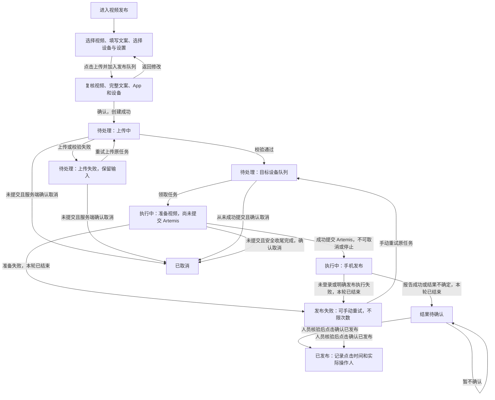
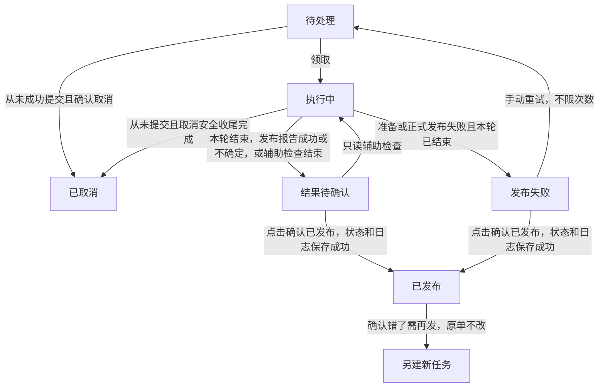
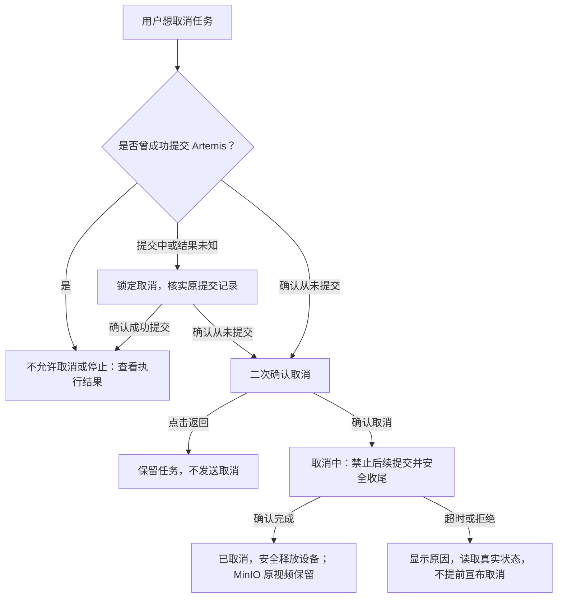

# 《TikTok 视频发布》产品方案

> [产品方案](01-product-proposal.md) · [技术设计](02-technical-design.md) · [实施计划](03-implementation-plan.md) · [测试计划和结果](04-test-plan-and-results.md)
>
> 版本：2026-10-08 确认按钮与执行规则修订稿。状态：**产品评审草案，未批准上线**。
> 本文描述用户操作、业务规则与验收，不代表功能已实现。已确认规则与现有实现可能不同；技术设计、实施和测试须后续对齐。

## 1. 决策摘要

**背景与问题**：内容运营要把一个视频和一份文案发布到指定手机上的 TikTok，并知道是否发布成功。AI 报告执行成功不等于视频真的发布成功，不能直接把任务标成成功。

**目标用户与结果**：能进入视频发布页面的人，可使用全部设备、查看和操作所有人的任务。人员自行核验后，点击唯一的人工确认按钮 **“确认已发布”**；系统把任务改成成功，同时记录点击时间和实际操作人。不设计人员在哪看、怎样检查、怎样证明未发布，也不要求上传截图或作品链接。

**首版范围与取舍**：一任务一视频一文案，同设备串行、不同设备并行。成功提交 Artemis 后参数永久只读，不能取消或停止；失败可一直手动重试，不设次数上限。确认错了不修改原单，重新提单、重新发布。手机事先登录 TikTok，执行时发现未登录就直接失败，这条要求必须写进提交 Artemis 的 Prompt。

**资料怎么保存**：所有 MinIO 原视频都不删除，成功、失败、待确认、取消和重试都不例外。只清理不再使用的手机/服务器临时副本；任务和日志暂不设置自动删除。

**开发完成后怎么改进**：功能验证通过后实际使用，发现问题及时处理、修复并回测。不设置“好不好用”的定量评分、效果指标、固定试用周期或额外效果统计。

## 2. 事实、目标与边界

### 2.1 已确认信息及来源

| 类型 | 信息 | 来源与限制 |
| --- | --- | --- |
| 已确认需求 | 一任务一视频一文案；同设备串行、不同设备并行；默认每轮请求结束后等 5 秒刷新，可关闭或立即刷新 | 当前对话；是目标约束，不表示已经实现 |
| 已确认需求 | 成功提交 Artemis 前可编辑 Prompt、App package、设备；提交中短暂锁定；成功提交后永久只读，不能取消或停止 | 用户最新确认取代旧“提交后可终止”要求 |
| 已确认需求 | 页面授权是本页唯一人员权限门槛；进入者可看全部设备、所有人的任务及完整业务执行记录，并执行合法操作 | 用户已确认；不按创建人、角色或设备归属再分权，服务凭据仍不展示 |
| 已确认需求 | 人员核验后只点“确认已发布”；点击后任务改成功，记录点击时间和实际操作人；不规定人工检查过程或证据 | 用户最新确认；不是 AI 回调自动成功，也不是仅记日志而不改状态 |
| 已确认需求 | 失败可以无限次手动重试；人工确认错了重新提单，不更正原单的成功结论 | 用户已确认；无限次数不取消设备互斥，也不表示系统自动重试 |
| 已确认需求 | 手机事先登录 TikTok；发现未登录直接失败，并在提交 Artemis 的 Prompt 中明确要求 | 用户已确认；不新增账号选择、账号管理或自动登录流程 |
| 已确认需求 | 所有 MinIO 原视频不删除；任务、文案、执行及按钮操作日志暂不自动删除 | 用户最新确认；手机/服务器临时副本与 MinIO 原视频分开 |
| 已确认需求 | 开发完成后实际使用，发现问题及时修复，不做效果评分或定量试用要求 | 用户已确认；功能验收和日常业务记录仍保留 |
| 已确认事实 | 现有代码可根据执行 success 或自动核验 published 直接设为 succeeded 并安排成功对象清理，与本稿目标不同 | [当前状态转换](../../tts_erp_v2/publishing/repository.py)的 `commit_publish_transition()`；本次未改代码 |
| 已确认事实 | 当前领取任务仍有全局运行任务及设备清理互斥，不等于按设备独立调度 | [当前领取规则](../../tts_erp_v2/publishing/repository.py)的 `claim_one()`；多设备目标仍需实现 |
| 已确认事实 | 当前有 6 个业务主状态，普通取消仅支持未运行任务 | [状态定义](../../tts_erp_v2/publishing/domain.py)及[技术设计](02-technical-design.md)；本稿须对齐提交前后的新取消边界 |
| 已确认事实 | 现有测试不能证明真实设备、外部服务及完整新规则均已通过 | [测试计划和结果](04-test-plan-and-results.md)；不是本稿的新测试结果 |
| 待验证假设 | 外部执行器可按设备独立执行，真实双设备链路满足产品要求 | 必须由研发验证，不自行假定支持，也不默默降级全局串行 |

### 2.2 定性目标

| 目标 | 用户能够观察到的结果 |
| --- | --- |
| 一处完成发布任务 | 提交、上传、排队、执行、失败恢复和确认成功均在同一页完成 |
| AI 报告与人工确认分开 | AI 成功先显示结果待确认，点击确认按钮后才显示已发布及操作人/时间 |
| 操作规则简单 | 提交前可取消，成功提交后不可取消/停止；失败手动重试，确认错了新建任务 |
| 设备有序、记录可追查 | 同设备不同时执行两单，不同设备可并行；执行参数、完整 ID 和确认操作保留 |

### 2.3 功能验收要求

一任务 1 个视频、1 份文案；同设备同时执行任务数 ≤1；至少两台不同设备能并行；默认请求结束后等 5 秒刷新。确认按钮只有一个，失败手动重试无次数上限。具体检查条件见 §5。

这些检查功能是否按要求工作，不给使用效果打分，不设置发布成功率或提升百分比等效果目标。

### 2.4 首版边界

- **包含**：单条上传、设备队列、多设备并行、提交前编辑、提交后参数锁定、单按钮确认及日志、无限次失败手动重试、提交前取消、只读辅助检查、临时副本清理、记录及刷新。
- **排除**：AI 或自动检查直接标成功；成功提交 Artemis 后取消/停止或解锁参数；更正已确认成功的原单；要求人员提交核验证据；自动重试；账号管理/自动登录；批量或定时发布；TikTok Shop Open API 发帖；任意 ADB 命令。
- 已确认规则不再列为产品未决。真实并行和环境支持由研发验证；本稿不批准实际发布、存储配置变更或上线。

## 3. 场景与方案选择

### 3.1 核心场景

| 场景 | 用户动机与限制 | 成功结果 |
| --- | --- | --- |
| 正常发布 | 有视频和文案，选择已登录 TikTok 的手机 | AI 执行结束后人员自行核验、点击确认；任务成功并保存点击日志 |
| 多设备发布 | 一台离线或忙不能拖住其他手机 | 每台手机独立排队，可用设备继续执行 |
| 执行失败 | 需要恢复，不希望次数用完就无法继续 | 查看错误，手动重试原任务，不限次数且历史保留 |
| 改变计划或确认错误 | 提交前可取消；已交给 Artemis 后不能停止；确认错了不能改原单 | 清楚显示允许的操作；需要重新发布时新建任务，旧记录不覆盖 |

发布方式已确定为手机 UI 执行，不再比较新的技术路线。系统记录执行和按钮操作，不把人的检查方法设计成额外审批流程。

### 3.2 需求清单

P0：缺失会中断核心链或违反已确认规则。P1：首版已确认的查看/操作能力，交付顺序可后置但不得遗漏。

| 需求编号 | 用户任务或问题 | 对应能力 | 优先级 | 优先级理由 | 依赖 | 所属版本 |
| --- | --- | --- | --- | --- | --- | --- |
| R-001 | 提交视频，上传失败后继续 | 创建、校验、上传进度、重试原任务上传 | P0 | 发布链起点与防重复建单 | 页面授权、上传服务及配置 | v1 |
| R-002 | 等待指定手机，多设备互不拖累 | 独立设备队列、串行/并行和占用提示 | P0 | 安全调度 | 真机并行与设备释放确认 | v1 |
| R-003 | 提交前改设置，提交后保持执行一致 | Prompt/App/设备编辑、快照和永久锁定、未登录失败要求 | P0 | 已确认参数及登录边界 | 参数校验、提交结果 | v1 |
| R-004 | 看任务、执行结果和历史 | 六状态、设备轨道、AI 报告和确认日志 | P0 | 区分执行报告与任务成功 | 可靠状态和执行记录 | v1 |
| R-005 | 失败后一直可以再试 | 无限次手动重试原任务、只读辅助检查 | P0 | 不因次数上限阻断恢复 | 本轮结束、合法状态及有效视频 | v1 |
| R-006 | 提交前取消，提交后不再停止 | 取消及提交竞争校验；提交后禁止取消/停止 | P0 | 不发出无法兑现的停止承诺 | Artemis 提交结果与设备安全收尾 | v1 |
| R-007 | 原视频都保存，只清临时副本 | MinIO 不删除、任务日志不自动删除、独立副本清理 | P0 | 防误删与记录丢失 | 资源归属和安全释放 | v1 |
| R-008 | 自动刷新，也能暂停或立即刷新 | 默认 5 秒、开关和立即刷新 | P1 | 方便查看 | 查询顺序保护 | v1 |
| R-009 | 找到任务并提供执行编号 | 状态/设备筛选、完整 ID 复制 | P1 | 定位与沟通 | 任务与执行历史 | v1 |
| R-010 | 进入页面后操作全部任务，不泄露凭据 | 统一页面授权、全量业务可见与合法操作 | P0 | 已确认人员权限 | 页面/接口授权及服务端校验 | v1 |
| R-011 | 核验后点一下，把任务确认成功 | 唯一确认按钮、成功状态、点击时间及实际操作人日志 | P0 | 最新明确要求 | 本轮结束、认证用户和状态更新 | v1 |

## 4. 用户路径与产品结构

### 4.1 从进入到得到结果



图中的失败必须是已结束的本轮结果，查询超时不等于执行失败。失败任务重试沿用原任务；人工确认错了是另建新任务，不能撤销或改写原成功结论。提交资格须由服务端复核，重试不会清除第一次成功提交后的永久锁定。

### 4.2 页面组织（布局建议）

```text
视频发布
  正在执行：每台设备一条轨道 · 视频/阶段 · [查看详情]
  新建任务：视频预览 → 文案 → 设备 → 可展开的发布设置 → [上传并加入发布队列]
  任务记录：[状态筛选] [设备筛选]  自动刷新[开/关] 每5秒 [立即刷新]
            视频 · 设备 · 状态/阶段 · 创建时间 · 主要动作
  任务详情：原视频/文案 · 执行报告与历史 · [确认已发布] · 确认日志 · 副本清理
```

| 区域 | 职责与入口 | 出口或关系 |
| --- | --- | --- |
| 新建任务 | 输入内容、提交前复核；选文件不自动上传 | 创建后上传原任务，校验通过才排队 |
| 设备轨道 | 每台设备一个任务，区分准备与已提交执行 | 本轮结束且设备安全释放后收起，等待确认不挂住设备 |
| 任务记录 | 状态/设备筛选；AI 报告与人工确认记录分开 | 打开详情或执行合法动作；队列位置只针对本设备 |
| 任务详情 | 原内容、完整执行 ID、参数快照、单一人工确认按钮及日志 | 桌面侧栏、移动端全屏；关闭保留筛选与位置 |

人工确认区域只保留“确认已发布”，不增加“确认未发布”“仍无法确定”、核验证据表单或核验终端安排。上传、重试、取消和只读辅助检查是独立操作，不是额外人工结论按钮。

## 5. 功能规格

界面动作以服务端状态为准。上传到 100%、Artemis 提交成功、AI 报告成功都不能由浏览器自行判定任务成功；确认按钮须在服务端保存状态和日志后才展示成功。

### 5.1 页面权限（R-010）

**只要能进入这个页面，就可以操作所有、看到所有。**

- 已登录且获 `page:video-publish` 授权的用户，可查看全部设备、所有人的任务、完整业务执行输出、参数快照及 ID；不按角色、创建人或设备归属再次分权。
- 进入者可执行本页合法创建、上传、编辑、提交前取消、失败重试、只读辅助检查、确认成功及副本清理。服务端仍检查状态、设备占用及参数；授权不允许提交后取消/停止、解锁参数或删除 MinIO 原视频。
- 未获授权时页面和相关接口都拒绝，不能只隐藏菜单；本页授权不提升其他模块权限。
- 服务凭据不属于可见业务数据；执行输出屏蔽敏感认证内容，文件名、文案、Prompt、错误按纯文本展示，不允许任意脚本或 ADB 命令。

任务保留创建人作追溯，确认日志记录实际点击人，不默认用任务创建人替代。MinIO 原视频是保留资料，只有不再使用的手机/服务器临时副本可清理。

| 验收编号 | 需求编号 | 前置条件 | 操作或触发事件 | 可观察的预期结果 |
| --- | --- | --- | --- | --- |
| AC-001 | R-010 | 未获页面授权 | 打开页面或调用接口 | 页面/接口均拒绝，不返回业务内容、不修改任务 |
| AC-002 | R-010 | 两名获授权用户、不同创建人的任务 | 查看全部设备/任务并合法操作另一人的任务 | 全部业务可见且可操作，不因创建人或角色额外拒绝，非法状态仍被拒绝 |
| AC-003 | R-010 | 获授权用户查看详情 | 加载快照、输出及特殊字符 | 无额外诊断角色门槛，敏感认证内容屏蔽，内容纯文本，不泄露凭据 |

### 5.2 提交与发布设置（R-001、R-003）

填写表单时尚无任务；服务端创建成功后才进入待处理。

| 输入 | 必填、默认与校验 | 失败提示/处理 |
| --- | --- | --- |
| 视频 | 1 个非空 MP4；大小上限从服务端配置读取并显示；文件名、大小、静音预览及可读的时长/分辨率 | 类型/大小错误不提交；服务端检查实际对象，不只信本地元数据 |
| 文案 | 1 份非空文案；字符上限取服务端配置并显示计数；保留换行、emoji 和标签 | 空值/超限指出字段，不偷偷截断或改写 |
| 设备 | 必选；显示名称、可用性和本设备队列，序列号来自选定设备 | 无设备禁提交；忙/离线可排队且说明原因，不增加账号选择 |
| Prompt | 默认发布模板，可在成功提交前编辑；明确 App、视频来源、原文案及未登录失败要求 | 必须保留下面的登录检查要求；文案是发布内容，不当控制指令 |
| App package | 默认来自配置，成功提交前可编辑 | 不接受空值或不符合服务端配置规则的参数 |

**提交 Artemis 的每次正式发布 Prompt 必须说明**：“使用该手机当前已登录的 TikTok 账号发布，不切换或选择账号。先检查 TikTok 是否已登录；如果未登录，直接报告执行失败并说明原因，不继续上传或点击发布，不尝试自动登录。” 默认模板和用户编辑后的实际提交 Prompt 都要保留这条要求；不需要人员另行指定账号。

| 操作/事件 | 界面反馈与规则 |
| --- | --- |
| 上传并加入队列 | 完整复核视频/文案/App/设备，可返回修改；提示空闲设备可能立即执行 |
| 确认加入队列 | 防重复确认和请求重发；同一次确认最多创建一个任务，再开始上传 |
| 上传中/完成 | 真实百分比、取消上传；100% 后先校验，通过才排队并清空创建表单 |
| 上传失败/重试 | 仍为待处理，保留输入；手动重试同一任务，不自动重试或另建单 |
| 刷新/离开后回来 | 提醒上传未完成；回来重新选择原文件继续或取消，重新校验，不假装恢复本地文件选择 |
| 提交前编辑 | Prompt/App/设备可编辑；准备阶段变更设备须重新核对占用与队列、处理原设备副本，不携带过期参数提交；视频/文案不随设置修改改变 |
| 提交中或结果未知 | 暂时锁定编辑/取消，查询原提交记录；不把超时当未提交，不重复投递或发送停止 |
| 成功提交后 | 参数永久只读，后续失败重试或人工确认都不解锁；不能取消或停止；成功提交不等于任务成功 |
| 保存时状态变化 | 拒绝旧页面不再合法的修改，显示新状态，不覆盖已经提交的快照 |

| 验收编号 | 需求编号 | 前置条件 | 操作或触发事件 | 可观察的预期结果 |
| --- | --- | --- | --- | --- |
| AC-004 | R-001 | 合法视频/文案/设备 | 确认并上传校验 | 一个任务、校验通过才排队、原内容可查、表单清空 |
| AC-005 | R-001 | 无效文件、空/超限文案、实际对象不匹配 | 选择/提交/校验 | 说明字段或对象错误，不入队、不把失败请求当成功 |
| AC-006 | R-001 | 上传中断或许可失效 | 手动重试，或刷新后重选文件 | 原任务上传校验，不新增任务，不自动重试 |
| AC-007 | R-001 | 同次确认处理中 | 重复点击/重发请求 | 同一任务，不产生第二单 |
| AC-008 | R-003 | 提交前可编辑或已经成功提交 | 保存 Prompt/App/设备 | 前者更新目标与快照；后者拒绝，重试/确认后仍只读 |
| AC-009 | R-003 | 保存期间任务进入提交或已经提交 | 保存过期设置 | 拒绝过期写入，展示真实状态，不静默换设备或覆盖提交参数 |

### 5.3 设备队列与占用（R-002）

任务按进入目标设备队列的先后等待，显示设备、清理或占用原因；未完成上传不计入可发布队列。

- 同一任务不同时执行两次，同设备只被一个发布或只读检查占用。
- 不同设备独立运行；一台离线、锁屏或清理等待不拖住其他设备。
- 本轮结束且设备副本已安全收尾/隔离后才能接同设备下一单。不能仅凭 AI 报告成功就提前释放设备。
- 等待人员点击确认本身不占设备；服务器副本清理或 MinIO 保留不锁住已安全释放的设备。
- 只读辅助检查使用设备时仍遵守互斥，不作为绕过提交后禁止停止的入口。

| 验收编号 | 需求编号 | 前置条件 | 操作或触发事件 | 可观察的预期结果 |
| --- | --- | --- | --- | --- |
| AC-010 | R-002 | 同设备两单 | 第一单执行并安全收尾 | 同时执行数 ≤1，释放后第二单开始 |
| AC-011 | R-002 | 两设备各有任务，一台后来离线 | 调度与刷新 | 可用时真并行；离线只影响本设备，队列位置不混计 |
| AC-012 | R-002 | 执行未结束或设备副本清理不安全 | 下一单等待 | 不提前占用，说明原因，其他可用设备不受影响 |
| AC-013 | R-002 | 结果待确认，本轮结束且设备已释放 | 同设备下一单入队 | 可继续执行，不要求先点击原任务确认按钮 |

### 5.4 结果、历史与查看（R-004、R-008、R-009）

**AI 执行报告和人员点击确认分开显示。** `succeeded` 表示系统收到人员的“确认已发布”操作并保存日志，不表示系统验证了人员的检查方法。

| 主状态编码 | 页面名称 | 含义 | 下一步 |
| --- | --- | --- | --- |
| `pending` | 待处理 | 待上传、排队或等待设备 | 继续上传/等待；从未成功提交时可编辑或取消 |
| `running` | 执行中 | 准备视频、Artemis 手机执行或只读检查 | 等本轮结束；从未提交且可安全收尾时可取消，提交后不可取消/停止 |
| `succeeded` | 已发布 | 人员点击确认，服务端已保存成功状态和操作日志 | 查看点击时间/操作人；不更正原单、不在原单重发，确认错了新提单 |
| `failed` | 发布失败 | 准备或正式发布执行明确失败且本轮已结束，包括 TikTok 未登录；辅助检查报告不作为发布失败结论 | 手动重试原任务，不限次数；如人员核验发现已发布，可在未重试执行时点击确认 |
| `needs_review` | 结果待确认 | 本轮结束、报告成功或发布结果不确定，尚未点击确认 | 核验后点确认；不确认就保持该状态，不因查询超时自动重发 |
| `cancelled` | 已取消 | 从未成功提交 Artemis，服务端确认取消及必要收尾完成 | 查看记录，不恢复已取消原单 |

仍为 6 个主状态；上传失败、取消中和副本清理进度不增加状态。没有“终止中”目标能力。`done` 仅表示本轮结束，不代表人员已确认；查询超时不能当成本轮结束。



详情展示原视频/文案、AI 报告、可用动作、确认日志、执行历史与副本清理。每次执行/只读检查保留类型、起止时间、结果、错误和实际参数快照；所有已创建 session 的完整 Artemis ID 可复制，未创建时说明。确认日志单独显示实际操作人和点击时间，不能把执行结束时间、AI 姓名或任务创建人冒充为确认记录。

自动刷新默认开启，**前一轮请求结束后等 5 秒**刷新轨道、列表及打开的详情，无智能模式。关闭后仍可立即刷新；只记开关偏好，不把任务内容/凭据存入偏好。页面隐藏暂停定时刷新，重新可见且已开启时立即刷新。失败保留旧数据与上次成功刷新时间，提示可能过期；不重叠请求、不让旧响应覆盖新状态、不破坏输入或焦点。

初次加载、无任务、筛选无匹配和读取失败分别提示，失败提供立即刷新，不能把失败当无记录。状态筛选使用六名称，设备筛选独立保留，关闭详情保持位置。

| 验收编号 | 需求编号 | 前置条件 | 操作或触发事件 | 可观察的预期结果 |
| --- | --- | --- | --- | --- |
| AC-014 | R-004 | 已保存确认按钮操作 | 刷新或重进详情 | 已发布，显示实际点击人/时间，与 AI 报告分开；无确认记录不冒充人工确认 |
| AC-015 | R-004 | 初次加载/无匹配/失败或执行记录 | 查看列表与详情 | 四类反馈可区分，执行类型/未创建 session 有提示，仍六主状态 |
| AC-016 | R-008 | 页面可见且刷新开启 | 请求结束、关开关、立即刷新、隐藏返回 | 默认结束后等 5 秒，关闭/隐藏停定时，手动有效，返回且开启即刷新 |
| AC-017 | R-008 | 已有数据、查询失败或旧响应迟到 | 刷新 | 保留数据和成功刷新时间、提示过期，旧响应不覆盖新状态，输入/焦点不破坏 |
| AC-018 | R-009 | 多设备/状态及多个 ID | 筛选、开关详情、复制 | 范围与选择一致、位置保留、复制完整 ID |

### 5.5 单按钮确认与失败重试（R-005、R-011）

**人工确认只有“确认已发布”一个按钮。** 人员怎样核验由其自行处理，系统不规定终端、检查步骤、等待时长或证明要求，不提供“确认未发布”“仍无法确定”，也不要求填写说明、上传截图或作品链接。

按钮用于本轮已结束且当前可确认的结果待确认/失败任务；有正在进行的发布、重试或检查时不能确认。点击后服务端在一次一致的保存中把主状态改为 `succeeded`，更新任务的更新时间，并写入操作日志：任务、确认动作、变更前后状态、**本次确认点击时间、实际操作人**。时间由服务端接收确认操作时记录，人员来自当前已认证的本系统用户，不是手机 TikTok 账号、任务创建人或 AI 自报名，不能由客户端任选姓名或由 AI/执行器填写；页面把该操作时间显示为点击时间。

保存完成才显示“已发布”。请求失败显示原因并重新读取状态，不先在浏览器改成功；重复点击或请求重发不重复变更成功、不覆盖首次确认人/时间。并发确认只有第一笔有效保存，其余返回已确认事实或刷新，不覆盖原记录。所有页面进入者都可执行合法确认，不增加审核角色或创建人限制。

**确认错了，不修改原单。** 已保存的成功结论、点击人和时间不更正，不提供撤销成功或改回失败的入口。需要重新发布时重新提单，旧任务及其记录保留。失败原任务继续重试不属于更正已确认成功的原单；已成功提交的参数仍永久锁定。

**失败可无限次手动重试。** 本轮已结束、任务仍为失败且视频有效时，点击“重试原任务”再次确认，原任务重新排队；不要求先登记“确认未发布”，没有次数上限或“次数已用完”。不自动重试，也不并发执行同一任务。每轮正式发布最多触发一次最终发布动作；无限重试指人员另发起新一轮，不是一轮内反复点击发布。次数和历史可用于记录，但不能作为重试次数门槛。AI 报告失败也可能有误，重试存在重复发布风险，人员自行核验后决定是否操作，系统不增加核验证据流程。

查询/提交结果未知、执行尚未结束时继续查原执行记录，不新发第二次发布。结果待确认不提供直接重试发布，未确认不自动重发。原视频异常不可用时先恢复同一任务的有效视频并校验；恢复不删除已有 MinIO 原视频。只读辅助检查是可选排查操作，只看作品/草稿，不上传、不发布，结束仍回结果待确认，仅提供线索，不自动标成功。

等待确认不占用已释放设备；按钮点击不操作手机、不消耗发布执行次数，确认成功也不触发 MinIO 删除。

| 验收编号 | 需求编号 | 前置条件 | 操作或触发事件 | 可观察的预期结果 |
| --- | --- | --- | --- | --- |
| AC-019 | R-005 | 失败且本轮已结束、视频有效，已有多次重试历史 | 反复手动重试，或确认期间状态改变 | 合法时同一任务排队、历史保留，无次数上限；状态已不合法则拒绝，不并发、不自动重试 |
| AC-020 | R-005 | Artemis 发现 TikTok 未登录或本轮明确执行失败 | 本轮结束，或查询仅超时 | 未登录直接失败并提示原因；Prompt 含未登录不继续发布要求；仅超时不伪造结束或盲重发 |
| AC-021 | R-005 | 待确认、可只读检查，或设备忙 | 辅助检查 | 不上传/发布，结束仍待确认，不自动成功；忙时拒绝冲突会话 |
| AC-022 | R-005 | 失败可重试但有效原视频不可用 | 恢复同一任务视频并校验 | 无有效视频不执行，恢复后原任务排队，不新增任务、不删除已有 MinIO 原视频 |
| AC-029 | R-011 | 本轮结束，AI 报告成功 | 刷新详情 | 结果待确认、提供唯一确认按钮；不自动成功、不删原视频，不要求人工检查证据 |
| AC-030 | R-011 | 本轮已结束，可确认任务，实际点击人为非创建人也可 | 点击确认已发布并重进页面 | 状态成功、任务更新时间更新，日志保存实际点击人/时间及状态变更；不得用创建人或 AI 报告代替 |
| AC-031 | R-011 | 已确认成功，但人员确认错了 | 尝试撤销/更正，或重新提单发布 | 原成功结论及人/时间不能修改；可另建新任务重新发布，原内容和日志保留 |
| AC-032 | R-011 | 重复/并发点击或保存期间任务已开始重试 | 提交确认请求 | 不重复登记、不覆盖首次确认人/时间；已运行拒绝确认，过期请求读取新状态；未授权仍拒绝 |
| AC-033 | R-011 | 旧自动成功任务没有确认点击日志 | 查看来源 | 如实展示旧来源，不伪造点击人/时间，不冒充本次人工确认 |
| AC-034 | R-011 | AI 返回成功并自称某人已核验 | 执行/检查回调 | 不创建虚假点击日志、不自动成功；只有实际认证用户的按钮请求可保存人工确认 |

### 5.6 仅提交前可取消，提交后不可停止（R-006）

“取消上传/取消任务”只用于**从未成功提交 Artemis**且可安全取消的任务，包括尚未提交的准备阶段。上传先停本地上传并请求取消；准备中的任务须确认不再提交、完成必要安全收尾，才显示已取消并释放设备。

一旦曾成功提交 Artemis，**不允许取消，不允许停止**。失败重试排队时也不清除这段提交历史或永久参数锁定。页面不提供终止按钮，接口同样拒绝取消/停止，不以高级角色或设备异常绕过。提交正在处理或接收结果不明时先锁定取消、核实原记录；不能因一次超时就声称未提交并取消。

取消需二次确认，点击返回不发请求；请求中禁重复操作、显示取消中。超时/拒绝显示原因并读真实状态，不提前显示已取消，不把取消请求失败改成发布失败。



| 验收编号 | 需求编号 | 前置条件 | 操作或触发事件 | 可观察的预期结果 |
| --- | --- | --- | --- | --- |
| AC-023 | R-006 | 从未提交的上传/排队/准备任务 | 返回或确认取消 | 返回不发请求；确认完成才已取消、停止后续提交且安全释放，MinIO 保留 |
| AC-024 | R-006 | 已成功提交 Artemis，包括失败后重新排队的原任务 | 页面或接口尝试取消/停止 | 无可用取消/终止按钮，接口拒绝，不发停止请求，不改结果或提前释放设备 |
| AC-025 | R-006 | 取消与提交竞争、提交结果不明或取消超时 | 确认取消、刷新/重进 | 服务端复核提交历史；未知先核实，已提交拒绝，不能把请求失败当已取消；进度可恢复 |

### 5.7 资源清理与保存（R-007）

**所有系统原视频都不删除，清理只针对手机和服务器临时副本。** 成功、失败、待确认、取消以及重试改变结果都不例外。

| 资源 | 保存与处理规则 |
| --- | --- |
| MinIO 原视频 | 所有任务状态下保留，不做成功/取消删除、过期回收或手动删除；重试/恢复上传不顺带删除已保存原视频 |
| 手机临时副本 | 本轮结束且不再使用后安全清理或隔离；不删 TikTok 已发布作品、其他任务或用户视频 |
| 服务器临时副本 | 下载/处理等生成的副本不再使用后可清；不能把 MinIO 原对象当本地临时文件 |
| 任务、文案及日志 | 任务、执行报告、错误、重试、点击时间和实际操作人记录继续保留，暂不设自动删除时间或到期回收 |

手机/服务器清理分别显示未开始/处理中/成功/失败，合法失败项可重试清理；MinIO 显示“已保留（不删除）”，无删除或重试删除入口。设备副本未安全收尾影响本设备下一单，服务器副本清理失败或正常保存 MinIO 不锁住已释放设备。清理失败不改业务结果，不增加主状态。

MinIO 保留覆盖页面操作、后台任务和存储过期规则，不能因角色、空间压力、取消、点击确认成功或重试成功绕过。任务日志暂不自动删不等于新增“记录永久保存”承诺；本次没有修改实际清理代码或存储配置。

| 验收编号 | 需求编号 | 前置条件 | 操作或触发事件 | 可观察的预期结果 |
| --- | --- | --- | --- | --- |
| AC-026 | R-007 | 已保存原视频，任何状态或重试后的结果 | 清副本或尝试删除原视频 | MinIO 始终保留、无删除入口且删除被拒；副本结果独立，失败不改发布结果，不删 TikTok 作品/其他资源 |
| AC-027 | R-007 | 设备不安全，或仅服务器副本清理失败/MinIO 正常保留 | 下一单调度、重试清理 | 前者同设备等待；后者不锁住已释放设备，只重试合法临时副本 |
| AC-028 | R-007 | 原视频、任务及执行/确认日志已保存 | 时间经过或任务结果变化 | MinIO 各状态均不删除；任务日志及点击时间/操作人不因过期自动删，不因副本清理丢失 |

## 6. 功能质量要求

| 方面 | 要求 | 验证方式 |
| --- | --- | --- |
| 可靠性 | 重复请求不重复建单/确认/发布；关闭浏览器不取消后台执行；恢复查询沿用原执行记录 | 重放请求、退出/重进、重启与外部超时场景，核对记录及状态 |
| 兼容与可访问性 | 桌面/移动端完成同一链；键盘能选文件、提交、开关详情；状态不只靠颜色，弹窗焦点恢复，减少动画偏好有效 | 多视口、键盘/读屏走查；支持矩阵由真实验证记录，不用 mock 冒充 |
| 权限与安全 | 页面统一授权，未授权页面/接口拒绝；凭据隔离；日志操作人来自认证用户 | 跨创建人合法操作、未授权、特殊字符、凭据泄露及伪造操作人检查 |
| 状态与日志一致 | 确认成功同时保存状态、点击时间和实际操作人，不展示部分成功 | 保存失败/请求重发/并发与刷新重进场景 |
| 刷新 | 默认结束后等 5 秒，手动可用，旧响应不覆盖新状态 | 慢请求、失败、隐藏页面和开关测试，问题及时修复 |

业务记录用于日常操作和排查，不增加效果评分或采集平台。

## 7. 交付与后续决策

### 7.1 交付阶段

| 阶段 | 产物 | 完成条件 |
| --- | --- | --- |
| 产品规则对齐 | 单按钮成功、真实操作日志、提交后禁取消/停止、无限失败重试、未登录失败、统一权限与保存规则 | 本稿表达已确认要求；技术/实施/测试尚需同步，不能视为上线批准 |
| 核心链开发 | R-001～R-007、R-010、R-011；正式 Prompt 登录要求及服务端状态校验 | 正常/失败/取消竞争/确认日志有验证证据，旧自动成功/对象删除/次数上限不能代替新规则 |
| 查看与操作完善 | R-008、R-009、响应式和可访问性 | 刷新、筛选、完整 ID、移动端/键盘均可用，不遗漏首版能力 |
| 实际使用与反馈 | 开发完成、功能验证通过后由获授权人员使用 | 具体问题及时处理修复回测，不规定试用评分、人数、样本量或周期 |

### 7.2 研发验证项（不是产品未决）

| 验证内容 | 通过标准 |
| --- | --- |
| 双设备真实发布（R-002） | 获真实发布授权的账号/手机，同设备串行、不同设备真正同时执行，一台异常不拖另一台；不是新增人员设备分权 |
| 确认按钮及日志（R-011） | 只有认证用户的有效点击可转成功，保存实际人/时间；AI 自述、请求重发及并发不造假日志；不要求提交人工检查证据 |
| 提交、重试及登录（R-003、R-005、R-006） | 真提交后无取消/停止；失败多次仍可手动重试、参数不解锁；实际 Prompt 有未登录失败要求，在授权环境验证未登录不继续发布 |
| 保存与环境（R-007） | 任何结果 MinIO 都不删；临时副本安全收尾与设备释放分开，任务日志无自动过期；记录手机、TikTok 界面及浏览器支持范围 |

证据写入[测试计划和结果](04-test-plan-and-results.md)。无法满足已确认要求时报告具体限制和方案，不默默降级。模拟或文档检查不代替真机/外部服务验证；真实发布须另获明确授权。

开发完成后实际使用，发现问题及时修复回测。发生严重问题时暂停新增投递并核实在途执行，**不发送已提交任务的取消/停止，不删除历史或撤回 TikTok 作品**。这不是恢复旧终止能力的例外。

## 8. 未决事项与文档维护

本轮讨论的产品规则已确认：人工仅保留“确认已发布”，点击转成功、记录点击时间和实际操作人；误确认不改原单而新提单；提交 Artemis 后不取消/停止；失败无限次手动重试；未登录直接失败并写入 Prompt；所有 MinIO 原视频不删、任务日志暂不自动删。原 Q-02、Q-03、Q-05 不再作为待确认问题。

不新增核验终端、证据、账号选择、试用评分或记录过期要求。功能输入的具体大小/字符及参数规则取服务端配置并显示，真实兼容和并行能力由研发验证；若发现新限制须提出具体问题，不假定已批准。

**本次修订**：R-001～R-011、AC-001～AC-034 的编号保留，内容按新规则更新；三张图分别表达发布路径、六状态及提交前取消边界。旧“已提交可终止”“失败重试次数上限”“三个人工结论入口及证明未发布步骤”不再是目标规则。本文只交付产品草案，不改应用代码、配置、旧任务或真实账号。

**历史与实现边界**：现有自动成功、成功对象删除、全局互斥及动作/次数实现尚未全部对齐；[技术设计](02-technical-design.md)、[实施计划](03-implementation-plan.md)、[测试计划和结果](04-test-plan-and-results.md)须后续同步。旧自动成功记录不伪造点击人/时间，不擅自改状态、批量重发或删除资料；来源展示及过渡在技术交付中明确。产品规则确定不等于功能已经实现或上线通过。
