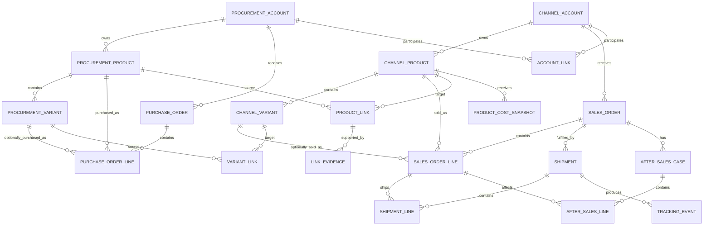

# TikTok Shop 销售与妙手采购数据模型重构方案

版本：V3  
状态：领域模型方案（**已落地**，2026-08-29 切流；as-built 补记见文末附录 A）  
系统定位：TikTok Shop 销售数据与妙手采购数据的整合分析系统

## 1. 系统定位

本系统不是完整 ERP，也不拥有独立的商品、采购或库存主数据。

系统的职责是：

- 同步 TikTok Shop 的商品、订单、物流、售后和财务数据；
- 同步妙手的采购商品、采购订单和采购成本数据；
- 保存妙手提供的“采购商品与 TikTok 商品/SPU”关联；
- 以 TikTok 商品为连接点分析销售、采购、成本和利润；
- 管理关联缺失、冲突和人工修正；
- 为经营报表提供稳定、可解释的数据口径。

## 2. 数据所有权

| 数据事实 | 权威来源 |
| --- | --- |
| TikTok 店铺 | TikTok Shop |
| TikTok 商品/SPU与SKU | TikTok Shop |
| TikTok 订单与订单行 | TikTok Shop |
| TikTok 物流、退货、取消、结算 | TikTok Shop |
| 妙手采购商品与规格 | 妙手 |
| 妙手采购订单与采购行 | 妙手 |
| 采购商品与 TikTok 商品的关系 | 妙手 |
| 人工纠错与覆盖规则 | 本系统 |
| 成本、利润和经营指标 | 本系统派生 |

核心原则：

> TikTok Shop 是销售业务主干；妙手是采购事实来源，并提供采购商品与 TikTok 商品之间的桥梁。

妙手不负责 TikTok 订单与采购订单之间的关联，因此系统不能建立这样的来源事实。

## 3. 业务主链

真实数据关系是：

```text
妙手采购订单
  └─ 妙手采购行
      └─ 妙手采购商品/SPU
          └─ 妙手提供的商品关联
              └─ TikTok 商品/SPU
                  ├─ TikTok SKU
                  └─ TikTok 订单行
                      ├─ 物流
                      ├─ 售后
                      └─ 财务结算
```

注意：

- TikTok 订单行和 TikTok 商品的关系来自 TikTok Shop。
- 妙手采购行和妙手采购商品的关系来自妙手。
- 妙手采购商品和 TikTok 商品的关系来自妙手。
- 采购订单与销售订单之间不存在直接事实关系。
- 销售成本只能根据商品关系和成本方法推导，不能表述为精确采购批次归因。

## 4. 数据分层

### 4.1 原始接入层

Schema：

```text
integration
```

建议表：

```text
credentials
raw_records
sync_jobs
sync_cursors
sync_issues
```

职责：

- 保存 TikTok 和妙手原始 JSON；
- 支持重复同步、乱序数据和重新解析；
- 管理同步游标、分页状态和运行日志；
- 原始表允许暂时没有业务外键。

### 4.2 规范化事实层

Schema：

```text
commerce
procurement
fulfillment
after_sales
finance
```

职责：

- 将来源数据转为结构化关系模型；
- 每张表仍保留外部平台 ID；
- 核心关系使用数据库外键；
- 来源原始状态和标准状态同时保留。

### 4.3 商品关联层

Schema：

```text
linkage
```

职责：

- 保存妙手提供的商品关系；
- 保存关联证据和历史版本；
- 管理人工覆盖、冲突和未解析关系；
- 不保存采购订单到销售订单的伪关联。

### 4.4 分析层

Schema：

```text
reporting
```

职责：

- 生成采购成本快照；
- 聚合商品销量和采购数据；
- 计算估算成本和利润；
- 保存计算方法和版本；
- 所有结果均可由事实表重建。

---

# 5. 销售域模型

## 5.1 `commerce.shops`

表示 TikTok Shop 店铺账户。

```text
id bigint PK
platform text
external_account_id text
account_name text
region text
seller_type text
status text
credential_id bigint FK
source_updated_at timestamptz
synced_at timestamptz
```

约束：

```text
UNIQUE (platform, external_account_id)
```

现有 `shops` 应迁移到这张表。

OAuth Token 不应存放在店铺表中，而应属于 `integration.credentials`（经 `credential_id` 关联）。

## 5.2 `commerce.products_spu`

表示 TikTok Shop 商品/SPU。

这不是系统内部商品主数据，而是 TikTok 商品的规范化副本。

```text
id bigint PK
shop_pk bigint FK
external_product_id text
title text
category_id text
status text
main_image_url text
source_created_at timestamptz
source_updated_at timestamptz
raw_record_id bigint
synced_at timestamptz
```

约束：

```text
UNIQUE (shop_pk, external_product_id)
```

## 5.3 `commerce.products_sku`

表示 TikTok SKU。

```text
id bigint PK
spu_pk bigint FK
external_variant_id text
seller_sku text
variant_name text
attributes jsonb
image_url text
status text
source_updated_at timestamptz
raw_record_id bigint
synced_at timestamptz
```

约束：

```text
UNIQUE (spu_pk, external_variant_id)
```

## 5.4 `commerce.sales_orders`

```text
id bigint PK
shop_pk bigint FK
order_id text
status text
currency text
payment_amount numeric(20,4)
total_amount numeric(20,4)
fulfillment_type text
source_created_at timestamptz
source_updated_at timestamptz
paid_at timestamptz
shipped_at timestamptz
delivered_at timestamptz
cancelled_at timestamptz
raw_record_id bigint
synced_at timestamptz
```

约束：

```text
UNIQUE (shop_pk, order_id)
```

## 5.5 `commerce.sales_order_lines`

```text
id bigint PK
order_pk bigint FK
external_line_id text
spu_pk bigint FK NULL
sku_pk bigint FK NULL
external_product_id_snapshot text
external_variant_id_snapshot text
product_name_snapshot text
variant_name_snapshot text
image_url_snapshot text
quantity numeric(20,4)
unit_price numeric(20,4)
currency text
line_status text
raw_record_id bigint
synced_at timestamptz
```

约束：

```text
UNIQUE (order_pk, external_line_id)
```

订单行同时关联 TikTok 商品和 SKU。

如果同步订单时商品尚未同步完成，允许正式外键暂时为空，但必须保留外部 ID，并写入 `integration.sync_issues`。后续通过精确外部 ID 补齐，不允许通过标题自动绑定。

---

# 6. 妙手采购域模型

## 6.1 `procurement.procurement_accounts`

```text
id bigint PK
provider text
external_account_id text
account_name text
status text
credential_id bigint FK
source_updated_at timestamptz
synced_at timestamptz
```

约束：

```text
UNIQUE (provider, external_account_id)
```

## 6.2 `procurement.procurement_products`

表示妙手中的采购商品或 SPU。

```text
id bigint PK
procurement_account_id bigint FK
external_product_id text
product_type text
title text
source_platform text
source_item_id text
source_item_url text
status text
raw_record_id bigint
source_updated_at timestamptz
synced_at timestamptz
```

约束：

```text
UNIQUE (procurement_account_id, external_product_id)
```

`product_type` 可以区分：

```text
COLLECTED_PRODUCT
PROCUREMENT_PRODUCT
SPU
```

## 6.3 `procurement.procurement_product_variants`

仅当妙手采购数据确实存在规格级对象时建立。

```text
id bigint PK
procurement_product_id bigint FK
external_variant_id text
variant_name text
attributes jsonb
supplier_sku text
status text
raw_record_id bigint
synced_at timestamptz
```

不要因为 TikTok 存在 SKU，就假设妙手也一定能提供一一对应的采购规格。

## 6.4 `procurement.purchase_orders`

```text
id bigint PK
procurement_account_id bigint FK
external_purchase_order_id text
supplier_id text
status text
currency text
total_amount numeric(20,4)
source_created_at timestamptz
source_updated_at timestamptz
paid_at timestamptz
completed_at timestamptz
raw_record_id bigint
synced_at timestamptz
```

约束：

```text
UNIQUE (procurement_account_id, external_purchase_order_id)
```

## 6.5 `procurement.purchase_order_lines`

```text
id bigint PK
purchase_order_id bigint FK
external_line_id text
procurement_product_id bigint FK
procurement_product_variant_id bigint FK NULL
quantity numeric(20,4)
unit_cost numeric(20,4)
currency text
line_status text
raw_record_id bigint
synced_at timestamptz
```

约束：

```text
UNIQUE (purchase_order_id, external_line_id)
```

采购行必须关联妙手采购商品；只有妙手明确提供规格关系时才关联采购规格。

---

# 7. 商品关联模型

## 7.1 `linkage.account_links`

保存妙手账户与 TikTok 店铺的关系。

```text
id bigint PK
procurement_account_id bigint FK
shop_pk bigint FK
external_relation_id text NULL
status text
valid_from timestamptz
valid_to timestamptz NULL
source_updated_at timestamptz
raw_record_id bigint
```

该关系不能依赖店铺名称猜测。

## 7.2 `linkage.product_links`

这是系统最关键的桥梁表。

```text
id bigint PK
procurement_product_id bigint FK
spu_pk bigint FK
external_relation_id text
relation_type text
status text
is_primary boolean
valid_from timestamptz
valid_to timestamptz NULL
source_updated_at timestamptz
raw_record_id bigint
created_at timestamptz
updated_at timestamptz
```

`relation_type` 示例：

```text
MIAOSHOU_PUBLISHED_TO_TIKTOK
MIAOSHOU_BOUND_TO_TIKTOK
MIAOSHOU_PROCUREMENT_SOURCE
```

这张表表达：

> 妙手中的某个采购商品对应 TikTok Shop 中的某个商品/SPU。

允许的基数是 N:M：

- 一个妙手采购商品可能发布到多个 TikTok 店铺；
- 一个 TikTok 商品可能更换或绑定多个采购来源。

不能强制一对一。

## 7.3 `linkage.variant_links`

仅在妙手明确提供规格级关系时启用。

```text
id bigint PK
procurement_product_variant_id bigint FK
sku_pk bigint FK
external_relation_id text
status text
valid_from timestamptz
valid_to timestamptz NULL
raw_record_id bigint
```

如果妙手只提供 SPU 级关系，则这张表可以为空。

系统不得通过颜色、尺码名称自行生成正式 SKU 关系。

## 7.4 `linkage.link_evidence`

保存关联的来源证据。

```text
id bigint PK
product_link_id bigint FK NULL
variant_link_id bigint FK NULL
evidence_type text
source_table text
source_external_id text
evidence_payload jsonb
observed_at timestamptz
```

证据可能来自：

- 妙手搬家或刊登任务；
- 妙手商品绑定记录；
- 妙手返回的 TikTok product ID；
- 妙手返回的规格映射。

## 7.5 `linkage.link_overrides`

保存人工修正，不覆盖妙手原始关系。

```text
id bigint PK
procurement_product_id bigint FK
spu_pk bigint FK
decision text
reason text
valid_from timestamptz
valid_to timestamptz NULL
created_by text
created_at timestamptz
```

`decision`：

```text
ALLOW
DENY
PRIMARY
```

有效关系由视图计算：

```text
linkage.effective_product_links
```

优先级：

```text
有效人工覆盖
→ 有效妙手关系
→ 无结果并进入异常队列
```

## 7.6 `linkage.link_issues`

```text
id bigint PK
issue_type text
procurement_product_id bigint NULL
spu_pk bigint NULL
candidate_count integer
status text
details jsonb
created_at timestamptz
resolved_at timestamptz NULL
```

问题类型：

```text
PRODUCT_LINK_MISSING
MULTIPLE_PRIMARY_LINKS
SOURCE_LINK_CONFLICT
ACCOUNT_LINK_MISSING
VARIANT_LINK_MISSING
```

---

# 8. 物流模型

现有模型隐含“一单一物流”，需要改为包裹模型。

## 8.1 `fulfillment.shipments`

```text
id bigint PK
order_pk bigint FK
external_package_id text
tracking_number text
provider_id text
provider_name text
status text
shipped_at timestamptz
delivered_at timestamptz
raw_record_id bigint
synced_at timestamptz
```

## 8.2 `fulfillment.shipment_lines`

```text
shipment_id bigint FK
sales_order_line_id bigint FK
quantity numeric(20,4)
PRIMARY KEY (shipment_id, sales_order_line_id)
```

## 8.3 `fulfillment.tracking_events`

```text
id bigint PK
shipment_id bigint FK
external_event_key text
action_code integer
event_at timestamptz
description text
location text
synced_at timestamptz
```

现有 `logistics_tracking` 应改成视图或可重建投影：

```text
reporting.shipment_tracking_summary
```

---

# 9. 售后模型

## 9.1 `after_sales.cases`

统一取消、仅退款和退货退款业务入口。

```text
id bigint PK
shop_pk bigint FK
order_pk bigint FK
external_case_id text
case_type text
status text
reason_code text
reason_text text
created_at_source timestamptz
updated_at_source timestamptz
raw_record_id bigint
synced_at timestamptz
```

`case_type`：

```text
CANCELLATION
REFUND_ONLY
RETURN_AND_REFUND
```

## 9.2 `after_sales.case_lines`

```text
id bigint PK
case_id bigint FK
sales_order_line_id bigint FK
external_case_line_id text
quantity numeric(20,4)
refund_amount numeric(20,4)
currency text
should_replenish_stock boolean NULL
```

当前藏在 JSON 中的 `return_line_items` 和 `cancel_line_items` 必须拆出，否则无法计算商品级退款和退货率。

---

# 10. 财务模型

## 10.1 核心表

```text
finance.payouts
finance.settlement_statements
finance.settlement_transactions
finance.settlement_components
```

关系：

```text
payout
  └─ settlement_statement
      └─ settlement_transaction
          └─ settlement_component
```

`settlement_transactions` 可选关联：

```text
order_pk
sales_order_line_id
after_sales_case_id
```

## 10.2 金额组成

现有 `statement_transactions` 的 58 个金额字段保留在 TikTok 原始接入层。

规范化财务表采用：

```text
settlement_components
├─ transaction_id
├─ component_code
├─ amount
└─ currency
```

例如：

```text
GROSS_SALES
SELLER_DISCOUNT
PLATFORM_COMMISSION
SHIPPING_COST
REFUND
SETTLEMENT_AMOUNT
```

这样平台增加费用类型时无需不断增加列。

---

# 11. 分析与成本模型

## 11.1 不能建立的关系

系统不得建立：

```text
purchase_order_line
    → sales_order_line
```

因为妙手没有提供该关系。

也不能声称：

```text
订单 A 由采购单 B 履约
```

## 11.2 可以计算的关系

通过商品关系，可以计算：

```text
TikTok 商品销量
↔ 对应妙手采购商品
↔ 采购数量和采购金额
```

允许的分析包括：

- 商品销量；
- 商品采购数量；
- 最近采购价；
- 期间平均采购价；
- 加权平均采购价；
- 估算销售成本；
- 估算商品毛利；
- 采购销售数量差异；
- 商品退货率和退款率。

## 11.3 `reporting.product_cost_snapshots`

```text
id bigint PK
spu_pk bigint FK
cost_method text
unit_cost numeric(20,4)
currency text
valid_from timestamptz
valid_to timestamptz
source_purchase_quantity numeric(20,4)
source_purchase_amount numeric(20,4)
source_line_count integer
calculation_version integer
calculated_at timestamptz
```

`cost_method`：

```text
MANUAL_ENTRY              -- 人工填写（本系统事实源，优先级最高）
LATEST_PURCHASE_COST      -- 妙手采购单
PERIOD_AVERAGE_COST       -- 妙手采购单
WEIGHTED_AVERAGE_COST     -- 妙手采购单
```

注意：1688 采集标价**不是**成本口径（标价 ≠ 实际采购价）。无人工填写且无采购单的
SPU 不生成成本快照，进入异常/待填队列。

## 11.4 利润口径

```text
estimated_cogs
= sold_quantity × applicable_unit_cost
```

```text
estimated_gross_profit
= sales_revenue
- estimated_cogs
- platform_fees
- shipping_cost
- refunds
```

必须在字段和报表名称中使用“估算成本”“估算利润”，不能包装成精确订单利润。

## 11.5 防止重复计算

一个 TikTok 商品可能存在多个采购商品关系。分析时不能直接多表 JOIN，否则会放大销量和金额。

必须先生成唯一的有效成本结果：

```text
linkage.effective_product_links
→ reporting.product_cost_snapshots
→ reporting.product_profit_daily
```

存在多个有效采购来源且无法确定口径时：

- 不生成成本；
- 标记为 `AMBIGUOUS_SOURCE`；
- 进入 `linkage.link_issues`。

---

# 12. 总体关系图



---

# 13. 现有表迁移映射

| 现有表 | 目标模型 |
| --- | --- |
| `shops` | `commerce.shops` |
| `orders` | `commerce.sales_orders` |
| `order_items` | `commerce.sales_order_lines` |
| 缺失的 TikTok 商品数据 | `commerce.products_spu` |
| 缺失的 TikTok SKU 数据 | `commerce.products_sku` |
| `order_shippings` | `fulfillment.shipments` |
| `logistics_tracking_events` | `fulfillment.tracking_events` |
| `logistics_tracking` | `reporting.shipment_tracking_summary` |
| `logistics_sync_targets` | `integration.sync_cursors/targets` |
| `returns` | `after_sales.cases/case_lines` |
| `cancellations` | `after_sales.cases/case_lines` |
| `payments` | `finance.payouts` |
| `statements` | `finance.settlement_statements` |
| `statement_transactions` | 原始镜像 + `finance.settlement_transactions/components` |
| `miaoshou_shops` | `procurement.procurement_accounts` |
| `miaoshou_collect_box_details` | `procurement.procurement_products` 或原始采集表 |
| `miaoshou_move_collect_tasks` | `linkage.link_evidence`，并生成 `product_links` |
| 妙手采购订单 | `procurement.purchase_orders` |
| 妙手采购订单行 | `procurement.purchase_order_lines` |
| `analytics_*` | `integration` 接入状态 + 独立广告分析模型 |
| `oauth_tokens` | `integration.credentials` |
| `sync_log` | `integration.sync_jobs` |
| `api_keys` | `security.api_keys` |

---

# 14. 数据库规范

- 内部代理主键使用 `bigint generated always as identity`。
- TikTok 和妙手外部 ID 全部使用 `text`。
- 时间统一转换为 `timestamptz`。
- 金额统一使用 `numeric(20,4)`，并显式保存币种。
- 原始 JSON 只承担追溯和低频扩展，不承担核心关系。
- 规范化事实表使用真实外键。
- 接入原始表可以不设置业务外键。
- 所有外部对象设置账户范围内的唯一约束。
- 订单行保留名称、价格和图片历史快照。
- 业务数据默认禁止级联删除。
- 关联表必须保存来源、状态、生效时间和证据。
- 不允许使用标题、图片 URL 或店铺名称作为正式关系。
- 派生数据必须保存计算方法和版本。

---

# 15. 重构实施顺序

## 阶段一：补齐 TikTok 销售主干

1. 建立 `shops`。
2. 同步 TikTok 商品。
3. 同步 TikTok SKU。
4. 将订单行关联到 TikTok 商品和 SKU。
5. 检查未解析订单行。

完成标准：

```text
订单行商品解析率接近 100%
订单行 SKU 解析率可量化
不存在通过标题绑定的订单行
```

## 阶段二：建立妙手采购模型

1. 导入妙手账户。
2. 导入妙手采购商品和规格。
3. 导入采购订单和采购行。
4. 校验采购行商品关联。

## 阶段三：建立商品桥梁

1. 导入妙手提供的 TikTok 商品关系。
2. 使用搬家、刊登或绑定记录作为证据。
3. 建立商品级有效关系视图。
4. 仅在有明确证据时建立 SKU 级关系。
5. 建立关联缺失和冲突队列。

## 阶段四：规范化物流、售后和财务

1. 将订单物流改为多包裹模型。
2. 拆出退货和取消行项目。
3. 将财务宽表拆成交易和金额组成。
4. 校验订单、退款和结算金额。

## 阶段五：建立成本与利润报表

1. 确定采购成本计算方法。
2. 生成商品成本快照。
3. 生成商品日销量和采购量。
4. 计算估算成本和利润。
5. 对多采购来源商品设置冲突规则。

## 阶段六：切换

1. 新旧模型并行。
2. 建兼容视图支持旧接口。
3. 对比数量、金额和关联覆盖率。
4. 查询切换到新模型。
5. 旧表降级为只读镜像。

不建议直接修改现有表并一次性切换。

---

# 16. 验收指标

重构后至少应持续监控：

```text
TikTok订单行商品解析率
TikTok订单行SKU解析率
妙手采购行商品解析率
TikTok商品采购关联覆盖率
商品关联冲突率
SKU级关联覆盖率
可计算成本的销售额占比
不可计算成本的销售额占比
财务结算金额一致率
售后行项目解析率
物流包裹解析率
```

其中最核心的指标是：

```text
商品采购关联覆盖率
= 已关联妙手采购商品的 TikTok 商品数
  / 有销售记录的 TikTok 商品总数
```

以及：

```text
可计算成本销售额占比
= 能取得有效成本快照的销售额
  / 总销售额
```

---

# 17. 最终架构结论

本系统的核心不是内部 SPU，也不是订单与采购单撮合，而是三类数据：

1. TikTok Shop 提供的销售事实；
2. 妙手提供的采购事实；
3. 妙手提供的采购商品与 TikTok 商品关系。

最终分析链路是：

```text
TikTok订单行
→ TikTok商品/SPU
→ 妙手商品关联
→ 妙手采购商品
→ 妙手采购记录
→ 商品级成本与利润分析
```

系统可以形成商品级经营分析，但在没有订单—采购批次关系的情况下，不应声称能够追踪某个订单的真实采购批次或精确成本。

---

## 附录 A：As-built 补记（落地后与正文的差异）

正文 §5-§11 的表结构已按本文落地（九 schema + `linkage.effective_product_links` VIEW）。
实施过程中新增了两张正文未含的表：

1. **`procurement.manual_product_costs`**（2026-08-29，refactor plan V2 §3.2 / 决策 12）：
   人工填写的 SPU 成本——`id identity PK、spu_pk FK、unit_cost numeric(20,4)、
   currency、valid_from、valid_to NULL、note、created_by、created_at`；同一 SPU 同时只有
   一条有效记录（新提交自动关闭上一条的 `valid_to`），填写历史全保留。成本口径中
   `MANUAL_ENTRY` 优先级最高。
2. **`procurement.spu_images`**（2026-08-31，`tech-doc/procurement-ui-redesign.md` §4）：
   SPU 参考图（MinIO 对象键 + 状态机 `awaiting_upload/ready/failed` + 软删 `deleted_at`），
   配合 `/v2/spu-images/*` 端点与人工成本填写页使用。

另：§8.3 的 `reporting.shipment_tracking_summary` 按「可重建投影」选项落地为**表**（不是视图），
与 refactor plan V2 §3.2「reporting.* 用可重建表」一致。
