# tts-erp Database Schema Design

> **Canonical 真理源**:本文档是 `tts_erp` PostgreSQL 数据库的领域模型与字段设计规范。
> 每次 schema / persist 函数 / `/db/*` 端点的修改,**必须先在这里更新 → 再动 schema.sql**。
> 文档位置 `tech-doc/database-schema-design.md`,由 git 跟踪。

## 0. 维护协议(读这段先)

1. **本文档是设计意图的真理源**。`schema.sql` 是当前实现 — 两者必须保持一致;
   如果实现领先于设计,更新本文档;如果设计领先于实现,标注 `[TODO schema]`。
2. **修改任何数据库相关内容前**(加表、加列、改持久化函数、拆 raw 字段、改 FK):
   - **先**在本文件 §1 (ER 图) / §2 (字段提列规则) / §3 (待建表) 反映新设计
   - **然后**改 `schema.sql`
   - **最后**改 `tts_erp.py:persist_*` / `tdd/tts_erp_fastapi.py:/db/*` 端点
3. **本文件的 mermaid 块是机器可解析的**。grep / ripgrep 解析方便;CI 可在未来加一道
   `mermaid` lint 检查图和 schema.sql 的同步性。
4. **schema 评审的产出** 进入本文档的 §4 (Migration Roadmap),不要留在 handoff.md / 聊天记录里。

---

## 1. 关系图(Mermaid ER)

### 1.1 总体鸟瞰

```mermaid
erDiagram
    direction LR

    %% ─── OAuth / Shops ─────────────────────────────────────────────
    oauth_receiver_oauth_tokens ||--o{ shops : "shop_id (denormalized metadata copy)"

    shops ||--o{ orders : "shop_id ❌ no FK"
    shops ||--o{ order_items : "shop_id ❌ no FK"
    shops ||--o{ order_shippings : "shop_id ❌ no FK"
    shops ||--o{ payments : "shop_id ❌ no FK"
    shops ||--o{ statements : "shop_id ❌ no FK"
    shops ||--o{ returns : "shop_id ❌ no FK"
    shops ||--o{ cancellations : "shop_id ❌ no FK"
    shops ||--o{ logistics_tracking : "shop_id ❌ no FK"
    shops ||--o{ logistics_sync_targets : "shop_id ❌ no FK"
    shops ||--o{ logistics_tracking_events : "via order_id ❌ no FK"

    %% ─── Order aggregate ───────────────────────────────────────────
    orders ||--o{ order_items : "order_id (composite PK) ❌ no FK"
    orders ||--|| order_shippings : "order_id (PK on shippings) ❌ no FK"
    orders ||--o| order_recipients : "order_id ⚠️ TABLE NOT YET CREATED"
    orders ||--o{ returns : "order_id ❌ no FK"
    orders ||--o{ cancellations : "order_id ❌ no FK"
    orders ||--|| logistics_tracking : "order_id (PK) ❌ no FK"
    logistics_tracking ||--o{ logistics_tracking_events : "order_id+action_code+event_time (PK)"

    %% ─── Finance ───────────────────────────────────────────────────
    statements ||--o{ statement_transactions : "statement_id ❌ no FK"
    payments ||..|| statements : "payments.payment_id ↔ statements.payment_id ⚠️ logical FK, not enforced"

    %% ─── Returns & Cancellations (decomposed arrays) ────────────────
    returns ||--o{ return_line_items : "return_id ⚠️ TABLE NOT YET CREATED"
    cancellations ||--o{ cancellation_line_items : "cancel_id ⚠️ TABLE NOT YET CREATED"

    %% ─── Miaoshou (independent SaaS, no FK to TikTok side) ──────────
    miaoshou_shops ||..o{ miaoshou_move_collect_tasks : "platform+shop_id ❌ type mismatch (bigint vs text)"

    %% ─── Sync log ──────────────────────────────────────────────────
    sync_log }o..|| shops : "shop_id ❌ no FK"

    %% ─── Entity definitions ────────────────────────────────────────
    shops {
        text shop_id PK
        text shop_name
        text shop_region
        text seller_type
        timestamptz last_seen_at "exists but no writer"
        timestamptz created_at
        timestamptz updated_at
    }

    orders {
        text order_id PK
        text shop_id "FK planned, not enforced"
        text order_status_name
        numeric payment_amount
        text payment_currency
        numeric total_amount
        text buyer_email
        text buyer_message
        bigint create_time "epoch sec"
        bigint update_time
        bigint paid_time
        bigint shipped_time
        bigint delivered_time
        bigint cancelled_time
        text fulfillment_type
        jsonb raw "contains payment[], recipient_address[], packages[], 12 missing cols"
        timestamptz synced_at
        timestamptz updated_at "trigger touch_updated_at"
    }

    order_items {
        text order_id PK
        text item_id PK
        text shop_id
        text sku_id
        text product_id
        text product_name
        text sku_name
        text sku_image
        int quantity
        numeric sku_price
        jsonb raw "8 cols to extract: is_gift, sku_type, package_id, display_status, seller_discount, platform_discount, gift_retail_price, original_price"
    }

    order_shippings {
        text order_id PK
        text shop_id
        text tracking_number
        text shipping_provider_id
        text shipping_provider_name
        jsonb raw "W2.5 subset but old data still full order JSON (~2KB duplicate)"
        timestamptz synced_at
    }

    order_recipients {
        text order_id PK "⚠️ proposed table"
        text shop_id "FK shops planned"
        text name
        text first_name
        text last_name
        text phone_number "PII — GDPR subject"
        text postal_code
        text region_code
        text address_line1
        text address_line2
        text address_line3
        text address_line4
        text full_address
        jsonb district_info "array of {iso_code, address_name, address_level, address_level_name}"
        timestamptz synced_at
    }

    returns {
        text return_id PK
        text shop_id
        text order_id "FK planned"
        text return_status
        text return_reason
        text return_type
        text role
        bigint create_time
        bigint update_time
        numeric refund_amount "P0 extract from raw.refund_amount.refund_total"
        text refund_currency "P0 extract from raw.refund_amount.currency"
        numeric refund_subtotal "P0"
        numeric refund_tax "P0"
        numeric refund_shipping_fee "P0"
        jsonb raw "6 more cols to extract + return_line_items array"
        timestamptz synced_at
    }

    return_line_items {
        text return_line_item_id PK "⚠️ proposed table"
        text return_id "FK returns"
        text order_line_item_id
        text sku_id
        text sku_name
        text product_name
        jsonb product_image
        numeric refund_amount "P0 — per-item refund"
        text refund_currency
        numeric refund_subtotal
        numeric refund_tax
        numeric refund_shipping_fee
        jsonb raw
    }

    cancellations {
        text cancel_id PK
        text shop_id
        text order_id "FK planned"
        text cancel_status
        text cancel_reason
        text cancel_reason_text
        text cancel_type
        text role
        boolean should_replenish_stock
        bigint create_time
        bigint update_time
        numeric refund_amount "P0 extract, NULL for non-closed (135/149 currently NULL)"
        text refund_currency "P0"
        jsonb raw "cancel_line_items array → split to child table"
        timestamptz synced_at
    }

    cancellation_line_items {
        text cancel_line_item_id PK "⚠️ proposed table"
        text cancel_id "FK cancellations"
        text order_line_item_id
        text sku_id
        text sku_name
        text product_name
        jsonb product_image
        jsonb raw
    }

    payments {
        text payment_id PK
        text shop_id
        text status
        text currency
        numeric amount_value
        numeric settlement_amount_value
        numeric payment_amount_before_value
        numeric reserve_amount_value
        text exchange_rate
        text bank_account
        bigint create_time
        bigint paid_time
        jsonb raw "fully extracted — no missing cols"
        timestamptz synced_at
    }

    statements {
        text statement_id PK
        text shop_id
        text payment_id "logical link to payments"
        text currency
        text payment_status
        bigint statement_time
        bigint payment_time
        numeric revenue_amount
        numeric fee_amount
        numeric net_sales_amount
        numeric shipping_cost_amount
        numeric adjustment_amount
        numeric settlement_amount
        jsonb raw "fully extracted"
        timestamptz synced_at
    }

    statement_transactions {
        text txn_id PK
        text statement_id "FK statements planned"
        text shop_id
        text order_id
        bigint order_create_time
        text type
        text currency
        numeric actual_return_shipping_fee_amount
        numeric actual_shipping_fee_amount
        numeric adjustment_amount
        numeric affiliate_ads_commission_amount
        numeric affiliate_commission_amount
        numeric affiliate_commission_before_pit
        numeric affiliate_partner_commission_amount
        numeric after_seller_discounts_subtotal_amount
        numeric customer_order_refund_amount
        numeric customer_paid_shipping_fee_amount
        numeric customer_paid_shipping_fee_refund_amount
        numeric customer_payment_amount
        numeric customer_refund_amount
        numeric customer_shipping_fee_amount
        numeric customer_shipping_fee_offset_amount
        numeric fbm_shipping_cost_amount
        numeric fbt_fulfillment_fee_amount
        numeric fbt_fulfillment_fee_reimbursement_amount
        numeric fbt_shipping_cost_amount
        numeric fee_amount
        numeric gross_sales_amount
        numeric gross_sales_refund_amount
        numeric isr_income_tax_amount
        numeric iva_vat_amount
        numeric net_sales_amount
        numeric pit_amount
        numeric platform_commission_amount
        numeric platform_discount_amount
        numeric platform_discount_refund_amount
        numeric platform_refund_subsidy_amount
        numeric platform_shipping_fee_discount_amount
        numeric promo_shipping_incentive_amount
        numeric referral_fee_amount
        numeric refund_administration_fee_amount
        numeric refund_shipping_cost_discount_amount
        numeric retail_delivery_fee_amount
        numeric retail_delivery_fee_payment_amount
        numeric retail_delivery_fee_refund_amount
        numeric return_shipping_fee_amount
        numeric revenue_amount
        numeric sales_tax_amount
        numeric sales_tax_payment_amount
        numeric sales_tax_refund_amount
        numeric seller_discount_amount
        numeric seller_discount_refund_amount
        numeric settlement_amount
        numeric shipping_cost_amount
        numeric shipping_cost_discount_amount
        numeric shipping_fee_amount
        numeric shipping_fee_subsidy_amount
        numeric shipping_insurance_fee_amount
        numeric signature_confirmation_fee_amount
        numeric transaction_fee_amount
        jsonb raw
        timestamptz synced_at
    }

    logistics_tracking {
        text order_id PK
        text shop_id
        text tracking_number
        int n_events
        bigint first_event_at "epoch ms"
        bigint last_event_at
        int last_action_code
        text last_description
        text final_status
        boolean arrived_overseas
        bigint arrived_at
        bigint origin_departed_at
        bigint import_cleared_at
        bigint delivered_at
        bigint returned_at
        jsonb raw
        timestamptz synced_at
    }

    logistics_tracking_events {
        text order_id PK
        int action_code PK
        bigint event_time PK
        text description
        text location "extracted from description by _extract_location()"
        timestamptz synced_at
    }

    logistics_sync_targets {
        text order_id PK
        text shop_id
        timestamptz last_synced_at
        int last_n_events
        boolean needs_resync
    }

    oauth_receiver_oauth_tokens {
        text shop_id "UNIQUE(shop_id, provider) — external schema, not in tts_erp"
        text provider
        text shop_name
        text shop_region
        text seller_type
        bytea access_token_encrypted "Fernet/AES-128-CBC"
        bytea refresh_token_encrypted
        bytea shop_cipher_encrypted
        text_array granted_scopes
        bigint access_token_expires_at
        bigint refresh_token_expires_at
    }

    sync_log {
        bigint id PK
        text shop_id
        text sync_type "enum: orders_search / payments / returns / statements / cancellations / logistics_tracking / statement_transactions / miaoshou_* — needs CHECK"
        text status "enum: ok / error / partial — needs CHECK"
        timestamptz started_at
        timestamptz finished_at
        int rows_affected
        text error_message "consider split to error_count + warning_count"
    }

    miaoshou_shops {
        bigint shop_id PK
        text platform PK "PK = (platform, site, shop_id)"
        text site PK
        text platform_shop_name
        text shop_nick
        bigint parent_shop_id
        int is_cb
        int is_cnsc
        text status
        text gmt_expire "⚠️ should be timestamptz, not text"
        text gmt_last_auth "⚠️ should be timestamptz"
        jsonb raw "naming: should be 'raw' for consistency with TikTok tables"
        timestamptz synced_at
    }

    miaoshou_collect_box_details {
        text platform PK
        bigint common_collect_box_detail_id PK
        bigint app_account_id
        bigint sub_app_account_id
        text item_num
        text title
        text thumbnail
        text list_thumbnail
        numeric price
        numeric min_sku_price
        numeric max_sku_price
        int stock
        text remark
        text status
        text reason
        text gmt_create "⚠️ timestamptz"
        text gmt_modified "⚠️ timestamptz"
        numeric weight
        numeric max_sku_weight
        numeric min_sku_weight
        bigint common_collect_box_group_id
        text common_collect_box_group_name
        text owner_sub_account_alias_name
        text is_mark
        int is_cb
        int is_cnsc
        jsonb raw_json "⚠️ rename to 'raw'"
        timestamptz synced_at
    }

    miaoshou_move_collect_tasks {
        text platform PK
        text move_collect_task_detail_id PK
        text collect_box_detail_id
        text shop_id "⚠️ should be bigint to match miaoshou_shops.shop_id"
        text item_num
        text cid
        text source
        text source_site
        text source_item_id
        text title
        text thumbnail
        text is_timing
        text status
        text reason
        text gmt_create "⚠️ timestamptz"
        text gmt_modified "⚠️ timestamptz"
        text platform_item_id
        boolean is_renew_item
        text shop_name
        text site_name
        text site
        text source_item_url
        text item_edit_url
        text breadcrumb
        bigint owner_sub_app_account_id
        text owner_sub_account_alias_name
        jsonb raw_json "⚠️ rename to 'raw'"
        timestamptz synced_at
    }

    miaoshou_price_templates {
        bigint price_template_id PK
        bigint app_account_id
        bigint sub_app_account_id
        text platform
        text site
        text name
        text remark
        text currency
        text display_weight_unit
        text profit_type
        numeric profit_percent
        numeric fixed_profit_amount
        numeric exchange_rate
        numeric discount
        text price_tail_compute_type
        text price_tail
        text price_process_decimal_type
        text logistics_compute_type
        text weight_ref_type
        numeric first_weight_charge
        numeric first_weight_interval
        numeric continued_weight_charge
        numeric continued_weight_interval
        numeric logistics_charge
        numeric platform_charge_percent
        numeric payment_charge_percent
        numeric activity_charge_percent
        numeric withdraw_charge_percent
        numeric other_charge
        int is_cal_light_cargo
        int light_cargo_coefficient
        text weight_logistics_charge_list
        text domestic_logistics_compute_type
        numeric domestic_logistics_first_weight_charge
        numeric domestic_logistics_first_weight_interval
        numeric domestic_logistics_continued_weight_charge
        numeric domestic_logistics_continued_weight_interval
        numeric domestic_logistics_charge
        numeric buyer_logistic_charge
        numeric seller_logistic_charge
        int has_seller_logistic_charge
        text official_tpl_mode
        text official_tpl_logistics_channel
        bigint snapshot_id
        text gmt_create "⚠️ timestamptz"
        text gmt_modified "⚠️ timestamptz"
        jsonb raw_json "⚠️ rename to 'raw'"
        timestamptz synced_at
    }
```



### 1.2 关系图例

| 标记 | 含义 |
| --- | --- |
| `\|\|--o{` | **existing FK** — 一对多,有外键约束 |
| `\|\|--\|\|` | **existing FK** — 一对一 |
| `..` 虚线 | **missing or planned FK** — 业务上有关系,但 schema 没约束 |
| `❌ no FK` | **FK 缺失** — 需要补,见 §4 P3 |
| `⚠️ TABLE NOT YET CREATED` | **待建表** — 业务已有数据(在 raw jsonb 里),需要拆出来 |
| `⚠️ should be X` | **类型/命名问题** — 需要修 |

### 1.3 OAuth / shops 关系

```
oauth_receiver (separate schema, separate service)
└── oauth_tokens (PK = id, UNIQUE(shop_id, provider))
       │ encrypted tokens; plaintext metadata: shop_name / shop_region / seller_type
       │
       │  one-way denormalized copy (no FK — cross-schema)
       ▼
tts_erp.shops (PK = shop_id)
       │
       └── last_seen_at: 字段存在但无写入代码(P3 待修)
```

**Important**: `tts_erp.shops` 是 `oauth_receiver.oauth_tokens` 的 **denormalized metadata copy**。
跨 schema FK 不实际,所以一致性靠 `/admin/shops/backfill` 端点(Wave 3 Slice 2 + Wave 4 强化)
维护。`/admin/shops/backfill` 是 **idempotent** 的,可以随时重跑。

---

## 2. 字段提列规则(Eliminating JSONB)

`raw` jsonb 列保留**完整保真**,但**所有业务上需要 SQL 聚合/过滤/排序的字段必须独立成列**。

### 2.1 决策树

```
字段在 raw jsonb 里 ─┬─ 出现率 ≥ 95% ────► 必须提列
                     │
                     ├─ 出现率 50–95% ───► 看 dashboard 是否要按这字段过滤;是 → 提列,NULLable
                     │
                     ├─ 出现率 < 50% ────► 保留 raw,除非 PII / GDPR 考虑
                     │
                     └─ array of 子实体 ───► 拆子表(见 §3)
```

### 2.2 已确认要提列的字段

| 表 | raw 中字段 | 出现率 | 类型 | 优先级 | 备注 |
| --- | --- | --- | --- | --- | --- |
| `returns` | `refund_amount.refund_total` | 23/23 | `numeric(18,2)` | **P0** | 现在 `/db/returns` 端点 jsonb 穿透,见 `tts_erp_fastapi.py:737` |
| `returns` | `refund_amount.currency` | 23/23 | `text` | **P0** | 同上 |
| `returns` | `refund_amount.refund_subtotal` | 23/23 | `numeric` | P0 | |
| `returns` | `refund_amount.refund_tax` | 23/23 | `numeric` | P0 | |
| `returns` | `refund_amount.refund_shipping_fee` | 23/23 | `numeric` | P0 | |
| `returns` | `return_method` | 23/23 | `text` | P1 | |
| `returns` | `return_provider_id` | 23/23 | `text` | P1 | |
| `returns` | `is_combined_return` | 23/23 | `boolean` | P1 | |
| `returns` | `shipment_type` | 23/23 | `text` | P1 | |
| `returns` | `discount_amount` | 23/23 | `numeric` | P1 | |
| `returns` | `return_reason_text` | 23/23 | `text` | P1 | |
| `cancellations` | `refund_amount.refund_total` | 14/149 | `numeric NULLABLE` | **P0** | NULL for non-closed cancellations |
| `cancellations` | `refund_amount.currency` | 14/149 | `text NULLABLE` | **P0** | |
| `orders` | `is_cod` | 670/670 (600 true) | `boolean` | **P1** | dashboard 第一筛选条件 |
| `orders` | `user_id` | 670/670 | `text` | **P1** | buyer FK 候选 |
| `orders` | `commerce_platform` | 670/670 (single value) | `text` + CHECK | P1 | |
| `orders` | `shipping_type` | 670/670 (single value) | `text` + CHECK | P1 | |
| `orders` | `order_type` | 670/670 (single value) | `text` + CHECK | P1 | |
| `orders` | `payment_method_name` | 670/670 | `text` | P1 | |
| `orders` | `delivery_option_id` + `_name` | 670/670 | `text` × 2 | P1 | |
| `orders` | `warehouse_id` | 670/670 (single value) | `text` | P1 | |
| `orders` | `is_replacement_order` | 670/670 (0 true) | `boolean` | P1 | 即使现在 0 true 也要提(否则 `WHERE` 走 jsonb) |
| `orders` | `is_on_hold_order` | 670/670 (0 true) | `boolean` | P1 | 同上 |
| `orders` | `has_updated_recipient_address` | 670/670 (2 true) | `boolean` | P1 | 风控信号 |
| `orders` | `payment.tax` | 670/670 | `numeric` | P1 | 财务对账 |
| `orders` | `payment.sub_total` | 670/670 | `numeric` | P1 | |
| `orders` | `payment.shipping_fee` | 670/670 | `numeric` | P1 | |
| `orders` | `payment.seller_discount` | 670/670 | `numeric` | P1 | |
| `orders` | `payment.platform_discount` | 670/670 | `numeric` | P1 | |
| `orders` | `payment.original_shipping_fee` | 670/670 | `numeric` | P1 | |
| `orders` | `payment.shipping_fee_tax` | 670/670 | `numeric` | P1 | |
| `orders` | `payment.product_tax` | 670/670 | `numeric` | P1 | |
| `orders` | `payment.original_total_product_price` | 670/670 | `numeric` | P1 | |
| `orders` | `payment.shipping_fee_seller_discount` | 670/670 | `numeric` | P1 | |
| `orders` | `payment.shipping_fee_cofunded_discount` | 670/670 | `numeric` | P1 | |
| `order_items` | `is_gift` | 670/670 | `boolean` | P1 | 礼物单 GMV 计算 |
| `order_items` | `sku_type` | 670/670 | `text` | P1 | NORMAL / BUNDLE 等 |
| `order_items` | `package_id` | 684/697 | `text` | P1 | 多 package 订单 |
| `order_items` | `display_status` | 670/670 | `text` | **P1** | **item 级别独立状态 ≠ 订单状态** |
| `order_items` | `seller_discount` | 670/670 | `numeric` | P1 | item 级卖家折扣 |
| `order_items` | `platform_discount` | 670/670 | `numeric` | P1 | item 级平台折扣 |
| `order_items` | `gift_retail_price` | 670/670 | `numeric` | P1 | |
| `order_items` | `original_price` | 670/670 | `numeric` | P1 | sale_price 是现价 |

### 2.3 应该**保留 raw** 的字段(不要提列)

| 表 | 字段 | 理由 |
| --- | --- | --- |
| `orders.raw.packages[]` | array of `{id}` | `package_id` 已在 `order_items` 提列,packages array 几乎冗余 |
| `payments.raw.*` | 全部 | 4 个嵌套对象已经全部 `value` 提取;currency 在 `payments.currency` 列 |
| `statements.raw.*` | 全部 | 6 个金额字段全部提列 |
| `miaoshou_*` 表的 `raw_json` | 全部 | **这是正确的设计** — 完整保真;TikTok 表该学它 |
| `statement_transactions.raw` | 全部 | 47 个金额字段全部提列 |

---

## 3. 待建表(Proposed)

### 3.1 `order_recipients`

**业务理由**:`orders.raw.recipient_address` 是 rich nested object,670 行都有,包含
PII(姓名/电话/地址)。端点 `GET /orders/<id>/recipient` 是 hot path,但现在每次都从 raw
整行读 + Python 解析。**独立建表后可**:

- 加速端点(只查一行)
- PII 隔离(GDPR / 删除权)
- 解耦生命周期(改地址时只 touch recipients 表)

**字段来源**:`orders.raw.recipient_address` 的所有 keys + `district_info[]` 保留为 jsonb。

**Cascading delete**:`order_recipients.order_id` FK → `orders.order_id` ON DELETE CASCADE
(订单硬删除时自动清理 PII,但保留金额数据)。

### 3.2 `return_line_items`

**业务理由**:`returns.raw.return_line_items` 是 array,每行有 `refund_amount` 嵌套对象 —
**这是 item 级别的退款金额**,跟 return-level refund 区分。SQL 不能 `WHERE return_line_items.sku_id = 'X'`。

**关键字段**:`return_line_item_id` PK,`return_id` FK,`refund_amount` + `refund_currency` + `refund_subtotal` + `refund_tax` + `refund_shipping_fee`(从 raw.refund_amount 提列)。

### 3.3 `cancellation_line_items`

**业务理由**:`cancellations.raw.cancel_line_items` 是 array,每行有 `cancel_line_item_id` /
`order_line_item_id` / `sku_id` / `product_image` 等。**没有 refund_amount**(取消不直接退款,
但 cancellations-level 退款金额要独立成列,见 §2.2)。

### 3.4 dashed 节点在 mermaid 中

`order_recipients` / `return_line_items` / `cancellation_line_items` 在 §1.1 ER 图里已经
标了 `⚠️ TABLE NOT YET CREATED`。**新建表后,需要回到 §1.1 删掉警告标记并把虚线关系变成实线**。

---

## 4. Migration Roadmap

| 优先级 | 改动 | 文件 | 验证 |
| --- | --- | --- | --- |
| **P0** | `returns` 加 5 列 refund_amount 子字段;`/db/returns` 端点去 jsonb 穿透 | `migrations/wave3_returns_refund_columns.sql` + `tts_erp_fastapi.py` | `tests/test_returns_endpoints.py` 验证字段值不变 |
| **P0** | `cancellations` 加 2 列 refund_amount (NULLable);`/db/cancellations` 端点去 jsonb 穿透 | 同上 wave3 同一个 migration | 同上 |
| **P0** | 建 `order_recipients` 表 + backfill 老数据 + 改 `persist_order` + 改 `/orders/<id>/recipient` 端点 | `migrations/wave3_order_recipients.sql` | 端点 E2E 测试 + PII 数据完整性 |
| **P1** | 建 `return_line_items` + `cancellation_line_items` + backfill 老数据 + 改 `persist_*` | `migrations/wave3_line_item_tables.sql` | |
| **P1** | `orders` 加 12 个 payment amount 列 + 12 个业务字段;`order_items` 加 8 列;`returns` 加 6 列 | `migrations/wave3_business_columns.sql` | 每个字段回填 backfill SQL |
| **P1** | `orders` + `order_items` + `returns` raw 字段提取测试 | `tests/test_schema_extraction.py` | 100% 数据 round-trip |
| **P2** | `order_shippings.raw` 收缩:UPDATE 老数据去掉 `payment` / `line_items` 副本,只保留 shipping subset | `migrations/wave3_order_shippings_raw_compact.sql` | 验证 `pg_column_size(raw)` 从 2103 → ~200 bytes |
| **P2** | 给所有 status / sync_type 加 CHECK 约束 | `migrations/wave3_check_constraints.sql` | |
| **P2** | `miaoshou_*`:`gmt_* text` 改 `timestamptz`;`raw_json` 改 `raw`;`miaoshou_move_collect_tasks.shop_id text` 改 `bigint` | `migrations/wave3_miaoshou_normalize.sql` | |
| **P3** | FK 约束:`orders.shop_id → shops.shop_id`,`order_items.order_id → orders.order_id` CASCADE,`statement_transactions.statement_id → statements.statement_id`,`returns.order_id → orders.order_id`,`cancellations.order_id → orders.order_id` | `migrations/wave3_foreign_keys.sql` | |
| **P3** | `shops.last_seen_at` 自动更新机制(cron 同步 oauth_receiver.refresh_token_expires_at) | `sync_cron.py` + `oauth_receiver` | |

---

## 5. Schema 历史 / 版本

- **2026-08-16 (Wave 1)**:schema.sql baseline(20 张表)
- **2026-08-18 (Wave 2 Slice 2)**:`logistics_events` 表 drop;`shops.shop_cipher` 列 drop(改 oauth_receiver 独占)
- **2026-08-19 (Wave 2)**:raw 字段子集化(`order_shippings.raw` 应只存 shipping subset — 但老数据未清理)
- **2026-08-25 (Wave 4)**:healthz token count 修复;`/admin/shops/backfill` 端点
- **2026-08-27 (W2 migration draft)**:删冗余索引 + boolean 全索引改 partial + keyset 复合索引 (orders);`logistics_events` drop 计划;FK 约束只有 1 个且马上要 drop

---

## 6. 实际 schema 与本文档的差异追踪

| 实际 schema.sql | 本文档 §1.1 ER 图 | 状态 |
| --- | --- | --- |
| `logistics_events` 表还在(还没 drop) | 图里没画 | 等 W2 migration 执行后对齐 |
| `shops.shop_cipher` 已删 | 图里没画 | ✓ 已对齐 |
| `miaoshou_*.raw_json` | 图里也用 `raw_json` 但标注 ⚠️ | 等 P2 migration 后对齐 |
| `miaoshou_move_collect_tasks.shop_id text` | 图里标 ⚠️ should be bigint | 等 P2 migration 后对齐 |
| `miaoshou_*.gmt_* text` | 图里标 ⚠️ should be timestamptz | 等 P2 migration 后对齐 |
| `idx_orders_shop_ct` 复合 keyset 已建 | 图里没特别标索引 | 索引是性能优化,不在 ER 图范畴 |
| 没有 `order_recipients` 表 | 图里 dashed 节点 | 等待 P0 建表后删除 dashed |
| 没有 `return_line_items` / `cancellation_line_items` 表 | 图里 dashed 节点 | 等待 P1 建表后删除 dashed |

---

## 7. 相关文档

- [`api-key-auth-design.md`](api-key-auth-design.md) — auth / 角色 / key 管理
- [`external-api.md`](external-api.md) — `/db/*` 端点契约
- [`../AGENTS.md`](../AGENTS.md) §3 端点速查,§6 文件清单
- [`../schema.sql`](../schema.sql) — 当前 DDL 实现
- [`../migrations/wave2_schema_housekeeping.sql`](../migrations/wave2_schema_housekeeping.sql) — 计划中的索引清理
